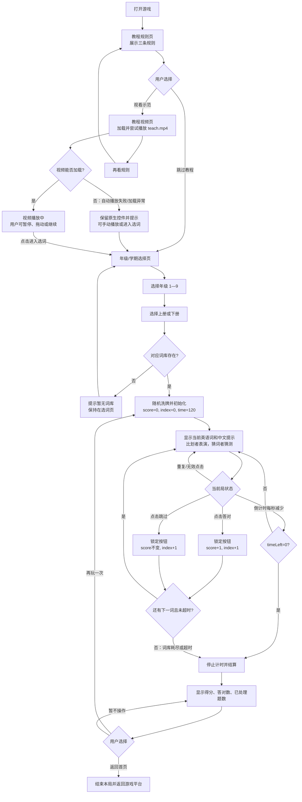

# 你比划我来猜 · 单词版 PRD

## 1. 游戏概述

- **游戏名称**：你比划我来猜 · 单词版
- **一句话玩法**：两人一组，一人查看平板上的英语单词并用动作表演，另一人根据表演猜词，在 120 秒内尽可能答对更多单词。
- **学习目标**：
  - 识别并理解所选年级、学期词库中的英语单词或短语。
  - 将英语单词的意义转化为肢体动作、表情和拟声表达。
  - 通过同伴猜词强化英语词义提取和口语互动场景中的词汇回忆。
  - 本游戏不要求朗读、拼写或听辨单词音频；示范视频用于说明玩法，不作为词汇听力材料。

## 2. 学习内容配置

### 2.1 内容范围

词库按“上册/下册 × 1—9 年级”组织。每次开始游戏只加载一个年级和一个学期的词库，并将该词库随机打乱后逐题呈现。

完整词条以当前项目 `index.html` 中的 `WORD_BANK` 为准；每条数据至少包含：

```text
word：英语单词或短语
meaning：对应的中文意义提示
```

当前词条数量与示例：

| 学期 | 年级 | 词条数 | 示例词条 |
|---|---:|---:|---|
| 上册 | 1 | 47 | pencil、new、book、bag、ruler |
| 上册 | 2 | 42 | bread、breakfast、carrot、computer、cola |
| 上册 | 3 | 70 | listen carefully、ask a question、learn、ruler、show me |
| 上册 | 4 | 71 | beautiful、flower、glad、seat、fine |
| 上册 | 5 | 60 | model、stamp、collect、animal、country |
| 上册 | 6 | 50 | cow、grass、goat、river、goose |
| 上册 | 7 | 52 | guitar、confident、courage、friendship、respect |
| 上册 | 8 | 48 | amazing、incredible、fascinating、brilliant、outstanding |
| 上册 | 9 | 40 | wake up、giraffe、wealth、write down、firework |
| 下册 | 1—9 | 每个 40 | 例如 baby、motorbike、see、grow、ski、win、run、pain、wake up |

上册共 480 条，下册共 360 条。词库增加或修订时，必须同步维护英语词条与中文意义，不能只更新其中一项。

### 2.2 教学规则与示范

游戏首次打开时，先展示以下规则，再进入示范视频：

1. 两人一组，一人看平板上显示的单词然后比划表演，另一人猜词。
2. 比划者看到平板上的单词后，只能用肢体动作、表情、拟声来表达，不能说话、不能口型、不能写字。
3. 猜词者根据表演猜出正确的单词。

示范视频资源为 `assets/teach.mp4`。视频页提供播放控件；视频播放失败或自动播放被浏览器阻止时，用户仍可使用原生控件播放，或进入选词页。

## 3. 页面与关键元素

### 3.1 教程规则页（首次入口）

- 显示游戏教程标题和三条规则。
- “观看示范视频”进入视频页。
- “跳过教程”进入年级/学期选择页。
- 页面按窗口尺寸自动缩放，不出现滚动条或内容裁切。

### 3.2 教程视频页

- 播放 `assets/teach.mp4`，支持暂停、进度调整、全屏和音量控制。
- “再看规则”返回规则页。
- “进入选词”进入年级/学期选择页。

### 3.3 选词页

- 年级按钮：1 年级至 9 年级，默认选中 1 年级。
- 学期按钮：上册、下册，默认选中上册。
- “开始游戏”使用当前选中的年级和学期初始化一局。

### 3.4 游戏页

- 顶部显示当前年级和学期。
- 显示得分与剩余时间。
- 中央显示当前英语单词及中文意义提示；该屏幕应交给比划者查看。
- “答对”：猜中时点击。
- “跳过”：无法猜出或不想继续时点击。
- 音乐开关位于计分栏上方靠右，不得遮挡得分或倒计时。
- 页面按窗口大小整体缩放，保证主要内容完整可见。

### 3.5 结算页

- 显示本局得分、答对数量、已处理题目总数。
- “再玩一次”沿用当前年级/学期，重新洗牌并重置本局状态。
- “返回首页”结束当前会话并返回游戏平台首页。

## 4. 核心玩法

1. 用户打开游戏，系统进入教程规则页。
2. 用户观看或跳过教程后选择年级与学期。
3. 点击“开始游戏”后，系统读取对应词库、随机洗牌，并初始化：`score = 0`、`currentWordIndex = 0`、`timeLeft = 120`。
4. 系统显示当前单词和中文提示；比划者只能使用肢体动作、表情和拟声，禁止说话、口型提示和写字。
5. 猜词者根据表演给出答案，由操作平板的人点击“答对”或“跳过”。
6. “答对”使得分加 1，并进入下一词；“跳过”不加分，但同样进入下一词。
7. 每个词在同一局中最多出现一次；词库耗尽或倒计时归零时进入结算。
8. 正式游戏不播放单词朗读音频；背景音乐可由用户独立开关。

## 5. 轮次与进度

- **时间限制**：每局 120 秒，从第一题显示后开始倒计时。
- **轮次顺序**：从洗牌后的词库头部开始，按顺序处理。
- **答对**：`score + 1`，`currentWordIndex + 1`。
- **跳过**：`score` 不变，`currentWordIndex + 1`。
- **已处理题数**：答对数 + 跳过数，即 `currentWordIndex`。
- **正常结束**：词库没有下一条词时结束。
- **超时结束**：`timeLeft` 归零时结束；当前未完成的词不计入已处理题数。
- **重新开始**：只在结算页点击“再玩一次”时发生；重新洗牌、清零得分、重置索引和 120 秒倒计时。

## 6. 反馈与操作限制

- **规则反馈**：规则页使用编号列表明确展示三项限制；视频页显示“观看示范视频”状态。
- **正确反馈**：得分立即加 1，更新得分显示，并显示下一词。
- **跳过反馈**：不增加得分，立即显示下一词。
- **超时反馈**：停止倒计时并进入结算页。
- **词库结束反馈**：停止游戏并进入结算页。
- **背景音乐**：默认开启；点击音乐按钮切换 ON/OFF。音乐按钮状态变化只影响背景音乐，不影响计时或词题进度。
- **输入处理**：切换词条时按钮应短暂锁定，重复点击不得让索引连续跳过多题；进入下一词后解锁。
- **无效操作**：教程规则页之外的游戏按钮不可触发；词库缺失时保留在选词页并提示“暂无词库”。
- **视频异常**：自动播放失败不阻塞流程；显示原生播放控件，用户可手动播放或进入选词。

## 7. 完成

- **完成触发**：倒计时归零，或当前词库全部处理完毕。
- **结算内容**：最终得分、答对数量、已处理题目总数。
- **完成后的入口**：可选择“再玩一次”开始干净的新局，或“返回首页”退出当前游戏。
- **会话终点**：点击返回首页后本局结束；不自动继续下一局。

## 8. 游戏流程图



## 9. 验收要点

- 打开游戏时首先看到规则页，而不是年级选择页。
- 从规则页进入视频页，视频资源路径为 `assets/teach.mp4`；自动播放失败时仍有可用的手动播放和进入选词路径。
- 进入选词页后可选择 1—9 年级和上册/下册，默认值为 1 年级上册。
- 点击开始后，第一词可见，得分为 0，倒计时为 120 秒。
- 点击“答对”后得分加 1 且只进入下一词；点击“跳过”后得分不变且只进入下一词。
- 快速重复点击不会连续跳过多题。
- 倒计时归零和词库耗尽都能准确进入结算页。
- 最后一题处理后不会生成不存在的下一题；结算只触发一次。
- “再玩一次”会重置得分、题目索引、倒计时并重新洗牌。
- 音乐按钮不会遮挡得分或倒计时；窗口尺寸变化时页面不出现滚动条，主要内容保持可见。
