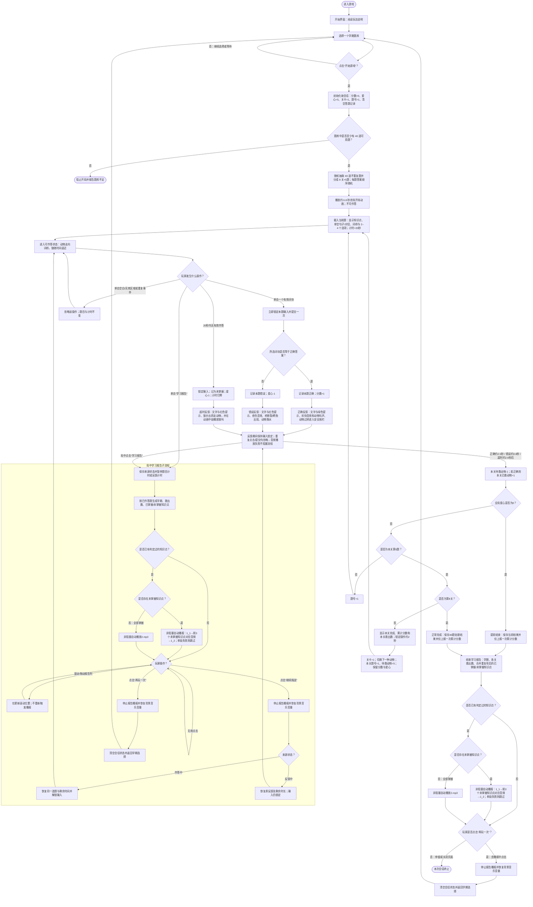

# 游戏名称：农场大逃亡
# 学习目标

玩家在所选学期的英语语法题库中，阅读带一个空缺的英文句子或对话，并从 2–4 个单词、短语或句块中选出唯一正确项，使句子在语法、词形和语境上成立。

- 学习行为：阅读题干与知识点提示；辨析正确答案和相近干扰项；单击词块完成填空。
- 训练维度：语法结构、词形与时态、代词和限定词、介词与连词、疑问句与感叹句、非谓语、被动语态、从句及形容词/副词用法。
- 不属于本游戏的考查：不要求拼写输入、口语作答、听音辨义或发音判断；学习报告语音只用于播报结果、鼓励语和待复习知识点，不参与答题判定。
- 内容范围：开局选择七年级上、七年级下、八年级上、八年级下或九年级上中的一个题库。每局从该题库的可用题目中随机抽取 40 道不重复题，分配到 8 关，每关 5 道。

各题库的现有内容如下，具体题干、答案和干扰项以 `question_bank/runtime_bank.js` 为准：

| 题库 | 原始题量 | 知识点（完整分类） |
| --- | ---: | --- |
| 七年级上 | 70 | wh-特殊疑问句；含实义动词的一般现在时结构；含 be 动词的一般现在时结构；频度副词；形容词的功能；there be 的句型结构；there be 句型 be 动词的选用；一般将来时 will；一般将来时 be going to；if 引导条件状语从句；一般过去时的用法；含 be 动词的一般过去时结构；含实义动词的一般过去时结构；人称代词；形容词性物主代词；名词性物主代词；形物代和名物代的辨析 |
| 七年级下 | 98 | 定冠词；基础连词；现在进行时的用法；现在进行时的句型结构；现在进行时和一般现在时的辨析；反身代词；方位介词 in/on/under；方位介词表示在……上/下；方位介词表示在……前/后；方位介词表示在……旁/间；many/much；how 短语特殊疑问句；few/a few/little/a little；情态动词 can；情态动词 may/might；情态动词 must 和 have to；What 感叹句；How 感叹句；肯定祈使句；否定祈使句；when 引导时间状语从句；while/as 引导时间状语从句；as soon as 引导时间状语从句；until/till 引导时间状语从句；情态动词 used to |
| 八年级上 | 81 | 复合不定代词；some/any；序数词；基数词；形容词最高级的用法；形容词比较级的用法；if 引导条件状语从句；形容词副词的同级比较；现在完成时表示过去持续的动作或状态；现在完成时句式变换；have gone to/have been to/have been in；瞬间动词和持续动词的现在完成时；现在完成时与一般现在时、一般过去时的辨析；unless 引导条件状语从句；副词；副词与形容词；形容词副词同形；副词比较级最高级 |
| 八年级下 | 78 | 不定式作宾语；不定式作补语；不定式作状语；疑问词+不定式；常见省略 to 的不定式；动名词作主语；动名词作宾语；-ed/-ing 结尾的形容词；一般现在时的被动语态；一般过去时的被动语态；一般将来时的被动语态；形容词的功能；too + 形容词、(not +) 形容词 + enough；It's + 形容词 + of/for sb. to do sth.；情态动词 should；情态动词 had better；过去进行时的用法；when 引导时间状语从句；过去进行时的结构；while/as 引导时间状语从句；because、because of 辨析 |
| 九年级上 | 114 | 陈述句；一般疑问句；wh-特殊疑问句；what 常考句型；how 特殊疑问句；how 短语特殊疑问句；选择疑问句；What 感叹句；How 感叹句；系动词；让步状语从句；宾语从句的引导词；宾语从句的否定前移；宾语从句的语序；宾语从句的时态；关系代词 that/which 引导的定语从句；关系代词 who/whom 引导的定语从句；定语从句注意事项 |

# 玩法流程图

以下流程图是玩法规则的来源；正文若与图不一致，以图为准。

# 游戏 PRD

## 1. 游戏概述

- 游戏名称：农场大逃亡（FARM ESCAPE）。
- 一句话玩法：在狼逼近前选择正确词块修好词桥，每道题决定一只农场动物能否安全过河。
- 核心成功条件：在全局 5 颗爱心耗尽前处理完 8 关共 40 道题。
- 单题成功条件：20 秒内单击唯一正确词块。

## 2. 学习内容配置

每道源题至少包含以下字段：

| 字段 | 规则 |
| --- | --- |
| `id` | 题目唯一标识，用于会话去重和答题记录。 |
| `knowledgePoint` | 学习报告中的知识点分类；为空时显示为“综合语法”。 |
| `stem` | 含且仅含一个连续下划线空缺的英文句子或对话。 |
| `correctOption` | 唯一正确答案。 |
| `wrongOptions` | 与正确答案不同的干扰项；运行时去重并最多取 3 个。 |

学习报告语音配置：

| 资源 | 用途 |
| --- | --- |
| `assets/report/1_1.mp3` | 存在未掌握知识点时的开场鼓励语。 |
| `assets/report/1_2.mp3` | 未掌握知识点播报结束后的收尾鼓励语。 |
| `assets/report/2.mp3` | 已判定知识点全部掌握时的结果语音。 |
| `assets/report_point/farm-0001.mp3`～`farm-0091.mp3` | 各知识点名称语音；文件与知识点的对应关系以 `assets/report_point/知识点.txt` 为准。 |

运行时只接纳能够形成单空词桥的题目：正确答案必须非空，不能是 `/`，不能含分号；至少存在 1 个有效干扰项；抽取出的目标句段须能形成 2–24 个词桥词块，普通词块长度不得超过 24 个字符。每道可玩题最终显示 1 个正确选项和最多 3 个干扰项。若长句含逗号，词桥可只呈现空缺所在分句；完整题干仍用于语境提示。

每次开始新会话时：

1. 只从玩家选定的一个学期题库取题。
2. 将可用题随机打乱，抽取前 40 道，不在同一会话内重复。
3. 按顺序切成 8 组，每组 5 道，对应小羊、大鹅、小鸭子、小兔子、小牛、小鸡、小猪、小马。
4. 每道题的答案词块顺序独立随机。
5. 若可用题少于 40 道，必须阻止开局并给出可诊断的题库不足错误，不得生成残缺关卡。

## 3. 页面与关键元素

### 开始界面

- 显示游戏名、规则“每题 20 秒，选择正确词块修好词桥，一次救一只小动物”。
- 显示五个互斥学期按钮；默认选中七年级上。
- “开始游戏”是唯一开局动作。

### 开场动画

- 开局后播放农场叙事动画，标准时长约 6.8 秒；系统启用“减少动态效果”时约 0.7 秒。
- 动画自动结束并进入第一题，无跳过入口，期间不接受答题。

### 游戏界面

- 顶部状态栏：学习报告、本题剩余秒数、当前关卡与动物、累计分数、剩余 5 颗爱心。
- 题目区：知识点、带空缺的句子或对话。
- 词桥区：用句子或分句中的词块组成桥，空缺对应待选择位置。
- 选项区：2–4 个可点击词块；单击即提交，无二次确认。
- 场景区：当前动物、等待区、安全围栏、狼、河流与鳄鱼；狼每约 5 秒推进一段，以视觉方式表达时间压力。

### 关卡完成界面

- 每完成 5 道且爱心仍大于 0时显示：当前关卡完成、累计分数、本关救出动物数、下一关动物。
- 约 2 秒后自动进入下一关，期间不接受操作。

### 学习报告/结束界面

- 展示当前学期、已访问关卡的动物救出数、已掌握知识点和未掌握知识点；两列内容可分别滚动或拖动。
- 报告打开后自动播报结果，不显示单独的“播报知识点”按钮，也不要求玩家手动触发。
- 局中报告提供“继续挑战”和“再玩一次”；结束报告只提供“再玩一次”。
- “再玩一次”不直接复用当前局，必须清空状态并返回学期选择。

## 4. 核心玩法

1. 系统载入当前题，重置本题 20 秒计时并放出一只当前关卡动物。
2. 玩家阅读题干，从词块中单击一个答案；有效词块第一次被单击时立即锁定本题输入并判定。
3. 正确：本题记录为正确，累计分数加 1，不扣爱心；动物过桥进入安全围栏。
4. 错误：本题记录为错误，累计分数不变，全局爱心减 1；动物落水。
5. 超时：本题记录为错误，累计分数不变，全局爱心减 1；狼抓走动物。
6. 每题只允许一次判定，不提供重试或跳过。反馈结束后，无论结果如何都消耗当前关卡的一只待救动物；仅正确时增加本关救出数。
7. 非词块区域的点击不触发判定，题目和计时继续。触摸事件后 700 毫秒内产生的兼容鼠标事件必须忽略，防止一次触摸被重复提交。

## 5. 轮次、进度与状态

- 总进度：8 关 × 5 题 = 40 题；关卡顺序固定为小羊、大鹅、小鸭子、小兔子、小牛、小鸡、小猪、小马。
- 分数：会话开始为 0，每答对一题加 1，理论最高 40；错误和超时不扣分。
- 爱心：会话开始为 5，跨关卡保留；每次错误或超时减 1，正确不恢复。
- 本关动物：每关开始为 5，每处理完一题减 1；仅答对的动物计入救出数。
- 普通题：反馈结束且爱心大于 0时，题号加 1并载入同关下一题。
- 普通关末：第 5 题反馈结束且爱心大于 0时，显示关卡完成页，然后自动进入下一关；分数、爱心、答题记录保留，本关动物状态重置。
- 最终题：第 8 关第 5 题反馈结束后，先检查爱心。若爱心变为 0，按提前结束处理；否则按完成全部 40 题处理。最终题答错或超时但仍有爱心时，仍属于正常完成全局内容。
- 结束只允许触发一次；累计分数只上报一次。

## 6. 反馈、音频与操作限制

| 结果 | 可见反馈 | 声音反馈 | 标准时长 | 状态变化 |
| --- | --- | --- | ---: | --- |
| 正确 | “答对了！+1 分”、绿色卡片、动物过桥进入围栏 | 欢快合成音 + 当前动物叫声 | 约 2.5 秒 | 分数 +1、救出数在反馈结束后 +1 |
| 错误 | “答错了”、红色卡片、桥断裂、鳄鱼出现、动物落水 | 悲伤/嘲笑合成音 | 约 3.8 秒 | 爱心 -1 |
| 超时 | “时间到”、红色卡片、狼扑出并抓走动物 | 提示音 + 动画中段狼叫 | 约 2.8 秒 | 爱心 -1、计时显示 0 |

- 启用“减少动态效果”时，反馈缩短为约 0.9 秒（正确/错误）或 0.75 秒（超时），但判定、计分和推进规则不变。
- 反馈期间所有答案输入锁定；重复点击不能再次计分、扣爱心或推进题号。
- 动物叫声、狼叫或背景音乐若因浏览器策略、文件失败或播放中断而无法播放，视觉反馈和状态推进必须继续，不等待音频结束。
- 学习报告可在作答中或反馈中打开。打开时冻结对应计时并自动开始非阻塞报告播报；关闭时回到原题或原反馈，并从剩余时长继续。报告中“再玩一次”会放弃当前局并返回学期选择。
- 报告存在未掌握知识点时，按报告中的首次出现顺序取前 3 个，依次播放 `1_1.mp3`、每个知识点对应的 `farm-XXXX.mp3`、`1_2.mp3`；超过 3 个的未掌握知识点只显示、不播报。
- 报告已有判定知识点且全部掌握时，只播放 `2.mp3`；尚无任何已判定知识点时不播放报告语音。
- 报告播报期间背景音乐音量降低；播报自然结束、继续挑战、再玩一次或离开报告时停止/清理报告语音并恢复背景音乐音量。
- 任一报告音频加载或播放失败时跳过该段并继续后续队列，不阻塞报告查看、返回游戏或结算。
- 游戏没有独立暂停键；局中报告是唯一会冻结题目/反馈计时的入口。

## 7. 完成与学习报告规则

会话有两种结算触发：

- 正常完成：处理完第 40 题，且反馈结束后爱心仍大于 0。
- 提前结束：任意错误或超时反馈结束后爱心降至 0。

学习报告只统计已经判定的题目：

- 同一知识点下所有已答题都正确，且没有错误或超时记录，则归入“已掌握”。
- 同一知识点下任一已答题出现错误或超时，则归入“未掌握”。
- 多道题属于同一知识点时，报告合并为一个知识点条目，括号数量表示合并后的知识点数量，而不是已处理题目数量；因此处理 5 道题后可能显示少于 5 个知识点。
- 尚未作答的知识点不出现在局中或提前结束报告中。
- 动物救出摘要只列出已进入过的关卡，并显示各关正确作答所救出的数量。
- 结束界面保持结算状态；只有点击“再玩一次”才清空分数、爱心、关卡、题号、答题记录、已救动物、已访问关卡及报告滚动位置，并返回学期选择。新一局重新随机取题。

## 8. 验收要点

1. 选择任一学期并开始后，系统生成 40 道不重复可用题，完成开场动画后第一题可作答，初始分数为 0、爱心为 5、计时为 20 秒。
2. 正确单击只判定一次：立即锁定输入，显示正确反馈，分数只加 1；反馈结束后动物救出数加 1并进入下一题。
3. 错误单击只判定一次：显示落水反馈，爱心只减 1、不加分；不重试原题，反馈结束后进入下一题或相应结算。
4. 20 秒无有效输入时只触发一次超时：计时为 0、爱心只减 1、显示狼抓走动物；不重试原题。
5. 空白区域点击、反馈期连续点击、触摸产生的重复鼠标事件均不得造成双重判定、双重状态变化或跳题。
6. 每关第 5 题后，若爱心大于 0且不是第 8 关，显示约 2 秒关卡完成页，再进入下一关第 1 题；分数与爱心保持不变。
7. 第 8 关第 5 题反馈结束后，爱心大于 0则进入正常结束报告；若该题造成第 5 次失败，则进入提前结束报告。两条路径都只能结算和上报一次。
8. 任意第 5 次错误或超时反馈结束后立即提前结算，不再载入下一题或下一关。
9. 作答中打开学习报告时题目倒计时暂停；返回后恢复同题剩余时间。反馈中打开时反馈计时暂停；返回后输入仍锁定并继续剩余反馈。
10. 局中与结束报告的知识点分类严格按已判定题生成；任一错误或超时使对应知识点进入“未掌握”；相同知识点只显示一次，因此知识点数量允许少于已处理题目数。
11. 音频拒播或中断时，反馈动画、计分、扣心和后续推进仍按时完成。
12. 在局中或结束报告点击“再玩一次”后回到学期选择；再次开始时所有会话状态归零，并重新抽取一组 40 题。
13. 报告含未掌握知识点时，打开后无须按钮操作即按 `1_1.mp3`、前 3 个未掌握知识点对应音频、`1_2.mp3` 的顺序播放；第 4 个及之后的未掌握知识点不进入播报队列。
14. 报告已有判定知识点且全部掌握时自动播放 `2.mp3`；报告尚无已判定知识点时保持静默。
15. 报告播报期间仍可滚动、继续挑战或再玩一次；离开报告后语音立即停止、背景音乐恢复，任一音频失败均不阻塞操作。
