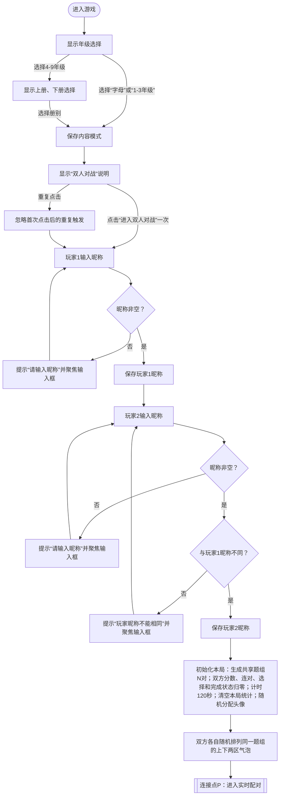
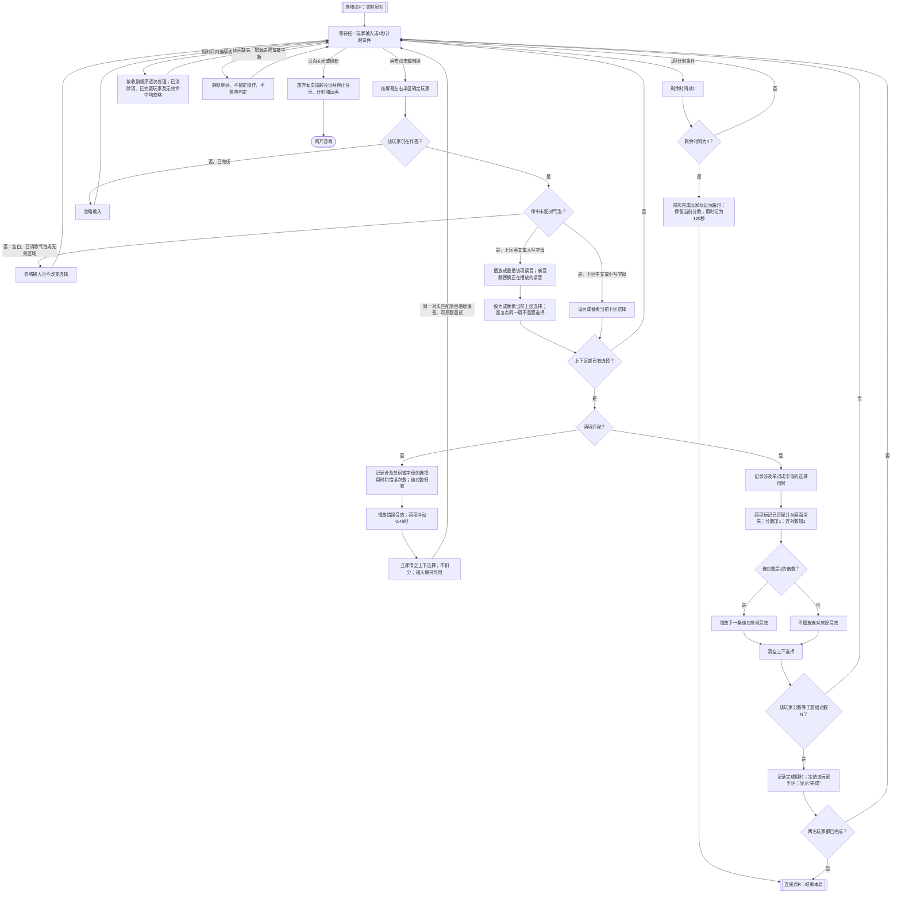
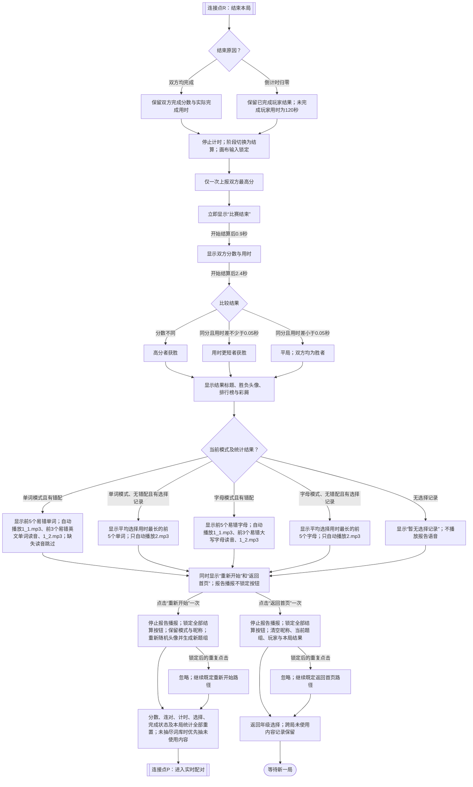

# 《单词匹配》学习游戏 PRD

> 文档基线：2026-08-10，以当前游戏内容与交互为准。玩法流程图是本 PRD 的规则源；完整词条以同目录的 `words_data.js` 为权威内容配置。

## 学习目标

玩家在双人限时配对中完成以下学习行为：

- 字母模式：识别 26 个英文大写字母 `A–Z`，并将其与对应的小写字母 `a–z` 配对；点击大写字母时听辨该字母读音。
- 单词模式：识别所选年级、册别中的英文单词，将英文拼写与配置中的中文释义配对；点击英文单词时听辨其读音。
- 通过保留错配项目并允许立即重试，强化字形—含义或大小写之间的对应关系。
- 结算时按当前模式回顾本场易错单词或字母；若全场无错配，则回顾平均选择用时最长的单词或字母。
- 结算报告自动播报易错项的英文单词或大写字母读音；全场无错时播放知识点全部掌握提示。

## 玩法流程图

### A. 进入与准备流程

### B. 实时配对流程

### C. 结算、重新开始与返回流程

## 游戏 PRD

### 1. 游戏概述

- 游戏名称：单词匹配。
- 一句话玩法：两名玩家在同一屏幕的左右区域内，同时将上区英文与下区对应项配成对，在 120 秒内比拼正确配对数与完成速度。
- 会话结构：一次对局只有一个共享题组，不拆分为连续小题或多轮；题组内全部配对项同时出现并持续移动。
- 操作方式：鼠标点击或触屏点按；不支持拖拽、跳过或暂停。

### 2. 学习内容配置

#### 2.1 内容范围

| 模式键 | 显示范围 | 精确内容范围 | 配置条数 |
|---|---|---|---:|
| `letters` | 字母 | `A–Z` 与对应 `a–z` | 26 |
| `grade1_3` | 1–3年级 | `words_data.js` 中同键全部 `word`—`meaning` 对 | 299 |
| `grade4_up` | 4年级上册 | 同上 | 222 |
| `grade4_down` | 4年级下册 | 同上 | 289 |
| `grade5_up` | 5年级上册 | 同上 | 296 |
| `grade5_down` | 5年级下册 | 同上 | 173 |
| `grade6_up` | 6年级上册 | 同上 | 281 |
| `grade6_down` | 6年级下册 | 同上 | 161 |
| `grade7_up` | 7年级上册 | 同上 | 257 |
| `grade7_down` | 7年级下册 | 同上 | 230 |
| `grade8_up` | 8年级上册 | 同上 | 200 |
| `grade8_down` | 8年级下册 | 同上 | 159 |
| `grade9_up` | 9年级上册 | 同上 | 189 |
| `grade9_down` | 9年级下册 | 同上 | 135 |
|  | **单词合计** | 13 个词库的完整内容 | **2,891** |

不得用概括词表替换 `words_data.js` 中的完整英文拼写和中文释义，也不得在抽题时改写大小写、连字符、撇号或释义文本。

#### 2.2 数据字段与判定

| 字段 | 必填 | 用途 |
|---|---|---|
| `label` | 是 | 年级/册别显示名 |
| `word` | 是 | 上区英文文本、读音文件名和内容唯一标识的来源 |
| `meaning` | 是 | 下区中文文本及单词模式匹配键 |
| 读音资源 | 否 | 字母路径为 `assets/video/words/{字母}.mp3`；单词路径由模式对应文件夹与原始 `word` 拼成 |
| 报告语音 | 是 | `assets/report/1_1.mp3`、`1_2.mp3` 用于易错报告前后提示；`2.mp3` 用于全场无错提示 |

- 字母模式的正确条件：上下项使用同一字母 ID。
- 单词模式的正确条件：上下项的 `meaning` 在去除首尾空白、合并连续空白后完全相同。若同一题组内多个单词共享同一中文释义，任一该释义气泡都可与这些单词判为匹配。
- 每名玩家的干扰项就是本题组内其余配对项；双方使用完全相同的内容，排列与气泡初始位置独立随机。
- 点击上区英文时尝试播放发音。读音资源缺失或浏览器拒绝播放时，必须静默失败，不能阻塞选择、判定或计时。

#### 2.3 题组生成

- 字母模式每局随机抽取 6 个尚未优先使用的字母；未用集合不足时清空该模式的已用记录，再从 26 个字母中补足，单局不得重复。
- 单词模式先依据词库前 80 条（不足 80 条时取全部）的平均英文长度与平均释义长度计算目标数：`floor(9 - 平均英文长度×0.14 - 平均释义长度×0.16)`，并限制在 5–7 对及词库实际数量内。
- 对随机候选词再按实际最长气泡半径校正：半径至少 78 时为 5 对；至少 68 且小于 78 时最多 6 对；否则保留目标数。最终单词题组为 5–7 对。
- 重新开始时优先抽取该模式尚未使用的内容；未用内容不足以组成新题组时重置该模式的已用集合，再补足新题组。

### 3. 页面与关键元素

#### 3.1 年级与模式选择

- 首屏显示：字母、1–3年级、4年级、5年级、6年级、7年级、8年级、9年级。
- 字母与 1–3年级直接进入双人对战确认；4–9年级必须继续选择上册或下册。

#### 3.2 双人准备

- 显示玩家 1 对战玩家 2 及“进入双人对战”按钮。
- 玩家依次输入昵称；昵称去除全部空白后最多保留 4 个字符。
- 两个昵称均必填且不得完全相同。错误时停留在当前玩家输入页，不得开始游戏。
- 两名玩家使用不同的随机头像；同一局中头像与玩家绑定。

#### 3.3 游戏界面

- 画面左右各为一名玩家的独立操作区；上方显示昵称、头像和分数，中间显示共同剩余时间。
- 每个玩家区分为上下两部分：字母模式为“大写字母/小写字母”，单词模式为“英文单词/中文意思”。
- 未匹配气泡持续在所属区域内缓慢移动并相互避让，不得越过玩家半区或上下分区。
- 当前选择必须有可见选中态；已匹配气泡立即不再显示。

#### 3.4 结算界面

- 结算按“比赛结束”→“双方成绩”→最终结果的自动序列呈现。
- 最终结果包含胜负标题、双方分数与用时、排行榜、胜负表情/动画、彩屑，以及与当前模式对应的单词或字母复习板。
- 最终报告出现时自动播报；界面不显示播报按钮，报告播报不锁定“重新开始”或“返回首页”。
- 最终结果提供“重新开始”和“返回首页”；自动结算展示期间不提供可操作按钮。

### 4. 核心玩法

1. 玩家在自己半区选择一个上区项和一个下区项，先点任意一区均可。
2. 同一区再次选择另一项时，新项替换旧项；不触发判定。点击同一个已选上区项会重播发音，但保持原选择时间。
3. 上下区都存在选择时立即判定，不需要提交按钮。
4. 正确时两项消失、该玩家得 1 分并清空选择；错误时不扣分，播放错误反馈、清空选择，两个项目均保留供原题重试。
5. 一名玩家完成全部 N 对后记录实际用时并冻结其半区；另一名玩家继续作答，直到也完成或全局倒计时结束。

### 5. 局次、计分与进度

- 初始值：双方分数 0、连对数 0、选择为空、完成状态为否；全局剩余时间 120 秒。
- 每次正确配对加 1 分；错误配对不加分、不扣分，不限制尝试次数。
- 玩家分数同时表示其已完成配对数，满分等于本局题组对数 N。
- 每连续正确 2 对播放一次庆祝音效；一旦错配，连对数与庆祝音效序列归零。
- 倒计时每秒减 1。时间到后，未完成玩家立即停止作答，保留所得分数，用时统一记为 120 秒。
- 胜负先比较分数；分数相同时比较用时，较短者胜。分数相同且用时差小于 0.05 秒时为平局。
- 结果上报分数为两名玩家分数中的较高值，每局最多上报一次。

### 6. 反馈与操作限制

#### 6.1 正确反馈

- 两个匹配气泡立即消失，分数立即加 1。
- 连对数达到 2、4、6……时按顺序播放一条庆祝音效；普通单次正确不额外播放庆祝音效。
- 玩家完成全部配对时，其半区显示完成与用时，并忽略之后的输入。

#### 6.2 错误反馈

- 播放错误音效，两项以相反相位抖动 0.48 秒。
- 选择在触发反馈时立即清空，输入不锁定；玩家可在抖动期间继续选择。再次错误时以最近一次错误反馈为准。
- 错误不扣分，不移除项目，不改变题组；重试面对同一批未匹配项目。

#### 6.3 音频与重复操作

- 背景音乐以 20% 音量循环播放；报告播报期间降至 8%，播报结束或停止后恢复为 20%。首次用户交互用于解除浏览器自动播放限制。
- 正确/连对音效音量为 80%，错误音效音量为 80%；游戏内单词/字母读音及报告语音音量为 100%。
- 新的上区点击会暂停当前单词/字母读音并从头播放新读音；音频结束与否不控制输入解锁。
- 报告播报开始时停止正在播放的游戏内读音；报告语音按队列逐段播放，当前一段结束后再播放下一段。
- 报告发音资源缺失或加载失败时跳过该段并继续后续语音；报告播报不锁定结算操作。重新开始、返回首页或开始新局时立即停止未结束的报告语音。
- 空白点击、已消除项点击、已完赛玩家输入、非作答阶段的画布输入均被忽略。
- 连续输入按事件到达顺序处理；某次判定使气泡消失后，后续命中该气泡的输入必须忽略，不能重复加分或重复推进。
- 进入对战、重新开始、返回首页等状态切换按钮在首次有效点击后必须立即防重，避免建立多个计时器、重复上报或重复跳转。

### 7. 完成与后续路径

- 完成触发：两名玩家均配完全部 N 对，或全局倒计时归零；每局只能进入一次结算。
- 结算开始后立即停止倒计时、锁定画布输入，并保证结果上报最多执行一次。
- 学习回顾板规则：
  - 有错配时，按错误次数从高到低排列；错误次数相同时，按平均选择用时从高到低；再相同时按首次统计顺序。显示前 5 项。
  - 无错配时，按平均选择用时从高到低排列，再按首次统计顺序；显示前 5 项。
  - 单词模式的标题为“本场易错单词”或“用时最长单词”，每项显示英文单词及中文释义。
  - 字母模式的标题为“本场易错字母”或“用时最长字母”，每项显示大写字母及对应小写字母。
- 报告播报规则：
  - 有错配时自动依次播放 `1_1.mp3`、排序后前 3 个易错项的读音、`1_2.mp3`；单词只播放英文读音，字母只播放大写字母读音，不播放中文释义或小写字母。
  - 无错配且存在选择统计时只播放 `2.mp3`，不追加用时最长项的读音；完全没有选择记录时不播放“全部掌握”提示。
- 重新开始：保留当前模式与两名昵称，重新随机头像和题组；重置双方分数、连对数、计时、选择、完成状态、结果上报锁和本局单词/字母统计，形成干净的新会话。
- 返回首页：清空昵称、当前题组、玩家状态和本局结果，回到年级选择；已用内容记录仍保留，用于后续优先展示未见内容。
- 页面在作答中被关闭或刷新时，本局视为放弃；停止计时、动画和音乐，不生成正常结算。

### 8. 验收要点

1. 从年级选择开始，完成模式/册别选择、双人昵称校验后，能进入双方分数为 0、剩余 120 秒的首个可操作状态。
2. 字母局生成 6 对且无单局重复；单词局依据配置与长度规则生成 5–7 对；双方题目集合相同但排列独立。
3. 任一玩家选择正确上下项后只加 1 分、两项消失并回到可选状态；快速重复点击消失项不得二次加分。
4. 错配后不扣分，两项抖动并保留，选择立即清空；玩家能在同一批项目上继续重试且不会被音效锁住。
5. 点击上区项会播放对应读音；切换上区项会替换当前读音；缺失或失败的读音不影响配对与计时。
6. 一名玩家先完成时，其分数和完成用时冻结、输入无效；另一名玩家仍可正常完成。
7. 双方均完成时只进入一次结算；高分优先、同分比较用时、完全同分同用时时正确显示平局。
8. 倒计时到 0 时未完成玩家保留当前分数且用时为 120 秒，随后只进入一次结算。
9. 结算序列依次显示比赛结束、双方成绩和最终结果；作答画布在整个结算期无效。
10. 单词与字母模式均显示对应复习板：有错配时显示“本场易错单词/字母”，无错配时显示“用时最长单词/字母”；均按规定排序且最多显示 5 项。
11. 有易错项时自动按“`1_1.mp3`→前 3 个易错英文单词或大写字母→`1_2.mp3`”播放；无错且有选择统计时只播放 `2.mp3`；中文、小写字母和用时最长项均不进入播报队列。
12. 背景音乐常规音量为 20%、报告期间为 8%；正确/连对与错误音效均为 80%；游戏读音与报告语音均为 100%，报告结束后背景音乐恢复为 20%。
13. “重新开始”生成干净的新局，保留模式与昵称并优先使用未抽取内容；旧分数、旧计时、旧选择、旧统计、旧报告音频和旧上报锁均不残留。
14. “返回首页”清空玩家与当前局状态并回到年级选择；快速连点任一结算按钮只执行首次操作，进行中的报告播报立即停止。
