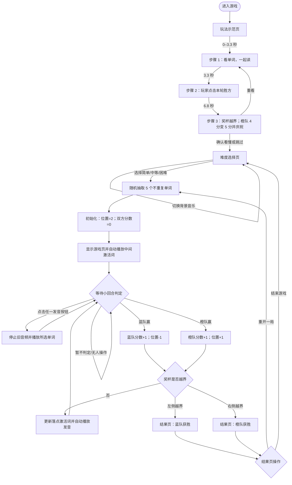

# 《单词拔河》游戏 PRD

## 1. 产品概述

《单词拔河》是一款双人线下英语单词互动游戏。两位学习者分别代表蓝队和橙队，围绕当前单词完成朗读、跟读、辨认或猜拳等活动；玩家点击本回合获胜队伍，奖杯向该队方向移动一格。奖杯越过对方一侧的单词卡边界时，该队获胜。

- 判定方式：线下人工判定。游戏不使用麦克风、键盘或摄像头自动判题。
- 对战形式：蓝队对橙队；不提供单人模式、倒计时、跳题或“答错”按钮。
- 学习目标：通过英文单词、图片和示范发音，建立词形、读音与常用中文含义之间的联系。

## 2. 学习内容

每个词条包含以下字段：

| 字段 | 说明 |
| --- | --- |
| `word` | 页面显示的英文单词，也是词条的唯一标识 |
| `image` | 与词义对应的图片；图片加载失败时浏览器显示替代文本 |
| `audio` | 对应英文单词的示范发音 |
| `difficulty` | `easy`、`medium` 或 `hard`，决定所属词库 |

| 难度 | 本档词库（每局随机抽取 5 个） |
| --- | --- |
| 简单 | `apple` 苹果、`bag` 包、`ball` 球、`banana` 香蕉、`bed` 床、`bird` 鸟、`car` 汽车、`cat` 猫、`cup` 杯子、`egg` 鸡蛋 |
| 中等 | `coat` 外套、`cookie` 饼干、`dress` 连衣裙、`eight` 八、`horse` 马、`lemon` 柠檬、`love` 爱/喜欢、`panda` 熊猫、`white` 白色、`zoo` 动物园 |
| 困难 | `candle` 蜡烛、`chocolate` 巧克力、`dolphin` 海豚、`elephant` 大象、`grandma` 祖母/外婆、`grandpa` 祖父/外公、`kangaroo` 袋鼠、`lollipop` 棒棒糖、`scarf` 围巾、`watermelon` 西瓜 |

- 开局时，系统将所选难度的 10 个单词随机打乱并取前 5 个，保证局内不重复。
- 5 张单词卡从左到右对应位置 `0` 至 `4`；中间位置 `2` 的单词是初始激活词。
- 同一局不会补充或移除单词。奖杯在位置间往返时，落点卡对应的单词成为当前激活词。
- 重开一局会重新随机抽取并排序，因此新一局可与上一局部分或全部重复。

## 3. 页面与功能

### 3.1 玩法示范页

首次进入游戏时展示玩法示范页。现有真人视频仅作为氛围参考，不应承担规则说明的主要职责；页面需要在视频画面上叠加清晰、无声也能看懂的三步教学引导。

#### 规则教学内容

| 步骤 | 视频/动效画面 | 固定短文案 | 玩家应理解的规则 |
| --- | --- | --- | --- |
| 1. 读单词 | 高亮一张单词卡，播放喇叭图标与示范发音 | **看单词，一起读！** | 本回合围绕高亮单词进行朗读、跟读或辨认；需要时可点击喇叭听发音。 |
| 2. 判胜负 | 蓝、橙两队各出现一次获胜示例，玩家点击对应“×队赢”按钮 | **玩家点击这一轮获胜队伍** | 游戏不自动判题；玩家点击对应按钮后才计分。 |
| 3. 拔河获胜 | 规则卡内显示缩小版对局示意：蓝队 2 分、橙队 4 分；奖杯从最右侧单词卡上方继续向右移动并越过边界，橙队分数直接变为 5 分，随后出现“🎉 橙队获胜！” | **再赢 1 分，越过边界获胜！** | 奖杯越过对方一侧边界即结束本局；示意动画同时展示越界、加分和庆祝结果。 |

#### 展示节奏与交互

- 三个步骤按固定时间播放：`0–3.3 秒`显示规则 1，`3.3–6.8 秒`显示规则 2，`6.8 秒后`显示规则 3并保持显示；同一时间只显示当前一张规则卡，前一张消失，不自动跳转。
- 当前步骤必须有明显的 `1/3`、`2/3`、`3/3` 进度标识；规则 3 的媒体卡应完整容纳分数栏、单词卡轨道、奖杯移动、越界提示和庆祝结果。
- 关键状态需要加动画或视觉强调：高亮单词、被点击的胜负按钮、奖杯移动方向、边界和获胜结果，不能仅展示真人猜拳过程。
- 视频内的文字应使用高对比、大字号，并与人物画面错开；规则短文案始终优先于装饰性内容。
- 规则 3 的演示顺序为：蓝队 2 分、橙队 4 分 → 奖杯向右越过边界 → 橙队变为 5 分 → 显示“🎉 橙队获胜！”。
- 点击播放按钮或视频可播放/暂停；“再看一遍”从第一步重新播放。
- 点击“跳过示范”或“看懂了，选择难度”进入难度选择页。
- 播放示范视频时停止背景音乐；离开示范页后，如音乐开关处于开启状态，恢复背景音乐。

### 3.2 难度选择页

- 显示游戏名称及“简单”“中等”“困难”三个入口。
- 点击任一难度后立即开始新一局，不再经过二次确认。
- 页面左上角提供“首页”入口，使用浏览器历史返回上一页。

### 3.3 游戏页

- 显示当前难度、蓝队累计胜场和橙队累计胜场。
- 横向显示 5 张单词卡；每张卡包含图片、英文单词和独立发音按钮。
- 奖杯表示当前拔河位置；当前落点卡以高亮状态显示。
- 页面底部提供“蓝队赢”“橙队赢”两个玩家操作按钮。
- 进入游戏页时，系统自动播放初始激活词（位置 `2`）的示范发音。

### 3.4 结果页

- 奖杯越过左侧边界时显示“蓝队获胜”，越过右侧边界时显示“橙队获胜”。
- 提供“重开一局”和“结束游戏”两个操作。
- “重开一局”保留当前难度并创建新局；“结束游戏”返回难度选择页。

### 3.5 全局背景音乐

- 音乐按钮在所有页面可见，默认处于开启状态。
- 开启时使用网页内生成的循环背景音乐；关闭时停止继续生成新的音乐节拍。
- 音乐开关不影响单词发音、当前难度、分数、奖杯位置或词序。

## 4. 核心玩法与状态规则

### 4.1 初始化

选择难度后初始化一局：

```text
piecePosition = 2
leftScore = 0
rightScore = 0
```

奖杯落在第 3 张卡（位置 `2`），该卡为当前激活词。

### 4.2 小回合判定

1. 学习者围绕当前激活词朗读、跟读、辨认或进行猜拳。
2. 需要示范时，可点击任意单词卡的发音按钮。
3. 蓝队获胜时，玩家点击“蓝队赢”：`leftScore + 1`，`piecePosition - 1`。
4. 橙队获胜时，玩家点击“橙队赢”：`rightScore + 1`，`piecePosition + 1`。
5. 若双方均未完成要求或本回合暂未决出胜方，玩家不点击胜负按钮；当前单词、分数和奖杯位置保持不变，可继续尝试。
6. 奖杯仍位于 `0` 至 `4` 时，落点卡更新为新的激活词；系统同步更新卡片高亮、进度圆点和奖杯位置，并自动播放该词发音。

### 4.3 获胜条件

- `piecePosition < 0`：蓝队获胜。
- `piecePosition > 4`：橙队获胜。
- 因此，从初始位置连续获得 3 个小回合胜利即可获胜：蓝队位置为 `1 → 0 → -1`，橙队位置为 `3 → 4 → 5`。
- 最终胜负只由奖杯越界方向决定；双方分数分别累计，不会因奖杯反向移动而扣除。

## 5. 单词音频规则

- 每张单词卡的发音按钮都可独立触发播放，点击卡片图片、单词文字和轨道不会改变游戏状态。
- 点击某个发音按钮时，先停止并复位已播放的单词音频，再从头播放所选音频。
- 播放期间，选中按钮显示播放中状态；播放结束或播放失败后恢复普通状态。
- 在播放期间点击同一或另一张卡的发音按钮，均从头播放新选音频。
- 音频播放不改变分数和奖杯位置，也不阻止玩家点击胜负按钮。
- 每次有效胜负判定后，系统自动播放奖杯落点对应单词的发音。

## 6. 数据上报

游戏通过 `game-tracker.js` 接入平台数据上报：

- 选择难度并开始一局时，创建并上报 `game_started` 事件。
- 出现结果页时，以上报时的总小回合数（`leftScore + rightScore`）作为分数，创建并上报 `game_finished` 事件。
- 上报会读取链接参数和宿主桥接中可用的学生、门店及线索信息；缺少这些信息或上报失败时，不影响游戏继续运行。

## 7. 玩法流程图



## 8. 验收要点

1. 首次进入时显示玩法示范页，并按 `0–3.3 秒`、`3.3–6.8 秒`、`6.8 秒后`依序展示规则 1、2、3；同一时间只有当前规则卡可见，每一步都有对应画面、短文案和 `1/3` 至 `3/3` 的进度标识。
2. 示范页在静音或暂停状态下，仍能通过叠加文案和动画理解完整规则；规则 3 的示意卡完整显示蓝队 2 分、橙队 4 分、奖杯越界、橙队 5 分和“🎉 橙队获胜！”结果。
3. 规则 3 显示后保持在最终规则卡，不自动跳转；点击重看从第一步开始，点击跳过或确认看懂进入难度选择页。
4. 选择任一难度后，只显示该难度词库中的 5 个不重复单词；双方为 0 分，奖杯和激活态均位于第 3 张卡。
5. 开局和每次奖杯落在有效卡位时，自动播放当前激活词的发音。
6. 从初始状态连续点击 3 次“蓝队赢”，位置依次为 `1、0、-1`，蓝队获胜；连续点击 3 次“橙队赢”，位置依次为 `3、4、5`，橙队获胜。
7. 双方各赢 1 回合后，奖杯回到位置 `2`，双方分数均为 `1`，中间单词再次成为激活词。
8. 任一单词音频播放时点击另一发音按钮，前一音频停止，新音频从头播放；音频结束或失败后按钮恢复，分数和位置不变。
9. 在结果页点击“重开一局”，保持难度但重新抽词，并将双方分数和奖杯位置重置。
10. 在结果页点击“结束游戏”，返回难度选择页，可重新选择任意难度开始新局。
11. 切换背景音乐不改变当前页面或对局状态；播放玩法示范视频时背景音乐停止。
12. 开始和完成一局时分别尝试上报开始、结束事件；平台信息缺失或网络上报失败不阻断游戏。
