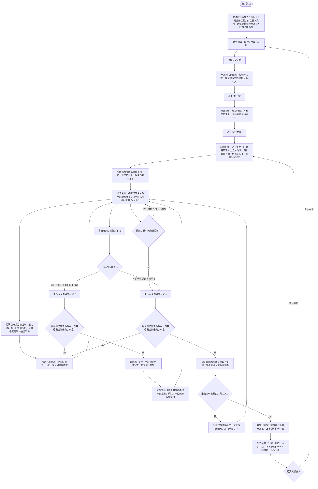

# 《单词炸弹》学习游戏 PRD

## 1. 学习目标

玩家看到中文主题提示后，在 3 秒内口述一个符合主题的英文单词，并避免重复本轮已说过的单词。

- 语义提取：针对“水果、动物、职业、城市”等类别，从英文词汇记忆中快速提取属于该类别的单词。
- 拼写约束：口述满足“含某字母、以某字母开头/结尾、同时含两个指定字母、固定长度、指定后缀或双写字母”等条件的英文单词。
- 口语输出：在限时轮转中清楚说出单词，供现场主持人判定；游戏本身不做语音识别或自动拼写校验。
- 学习成功行为：回答同时满足当前主题、未在本轮重复、且未超过 3 秒。

## 2. 玩法流程图

流程口径：答案正确性、是否重复以及 3 秒超时均由现场主持人判断，界面只记录主持人点击的 `√` 或 `×`。游戏没有自动倒计时、跳过或自动判题分支。

## 3. 游戏 PRD

### 3.1 游戏概述

- 游戏名称：单词炸弹。
- 一句话玩法：2–5 名玩家按顺序围绕随机英文词汇主题限时接词，主持人点击 `√` 加分或点击 `×` 淘汰，最后一名未淘汰者获胜。
- 核心学习维度：英文词汇的语义分类、字母与拼写结构识别、限时口头提取。
- 判定方式：人工判定；产品不配置标准答案、干扰项或语音识别。

### 3.2 学习内容配置

每个主题数据项只包含 `difficulty`、`label` 与 `items[]`。开始一轮时从当前难度的 `items[]` 等概率随机抽取 1 个主题；若该难度至少有 2 项，则不得与该难度上一次抽中的主题相同。主题在整轮淘汰赛中保持不变。

以下内容按当前题库原样保留。

#### 简单（42 项）

1. 水果；2. 动物；3. 交通工具；4. 颜色；5. 职业；6. 运动项目；7. 衣服；8. 文具；9. 家具；10. 球类；11. 食物；12. 蔬菜；13. 身体部位；14. 可以放进口袋里的东西；15. 含字母 q 的英文单词；16. 含字母 w 的英文单词；17. 含字母 e 的英文单词；18. 含字母 r 的英文单词；19. 含字母 t 的英文单词；20. 含字母 y 的英文单词；21. 含字母 u 的英文单词；22. 含字母 i 的英文单词；23. 含字母 o 的英文单词；24. 含字母 p 的英文单词；25. 含字母 l 的英文单词；26. 含字母 k 的英文单词；27. 可以放进冰箱里的东西；28. 含字母 j 的英文单词；29. 含字母 h 的英文单词；30. 含字母 g 的英文单词；31. 含字母 f 的英文单词；32. 含字母 d 的英文单词；33. 含字母 s 的英文单词；34. 含字母 a 的英文单词；35. 含字母 z 的英文单词；36. 可以放进柜子里的东西；37. 含字母 x 的英文单词；38. 含字母 c 的英文单词；39. 含字母 v 的英文单词；40. 含字母 b 的英文单词；41. 含字母 n 的英文单词；42. 含字母 m 的英文单词。

#### 中等（68 项）

1. 海洋动物；2. 鸟类；3. 以 q 开头的英文单词；4. 以 w 开头的英文单词；5. 以 e 开头的英文单词；6. 甜品；7. 以 r 开头的英文单词；8. 以 t 开头的英文单词；9. 以 y 开头的英文单词；10. 以 u 开头的英文单词；11. 饮料；12. 以 i 开头的英文单词；13. 以 o 开头的英文单词；14. 以 p 开头的英文单词；15. 以 l 开头的英文单词；16. 以 k 开头的英文单词；17. 以 j 开头的英文单词；18. 职业；19. 以 h 开头的英文单词；20. 以 g 开头的英文单词；21. 以 f 开头的英文单词；22. 以 d 开头的英文单词；23. 以 s 开头的英文单词；24. 以 a 开头的英文单词；25. 以 z 开头的英文单词；26. 以 x 开头的英文单词；27. 乐器；28. 以 c 开头的英文单词；29. 以 v 开头的英文单词；30. 以 b 开头的英文单词；31. 以 n 开头的英文单词；32. 以 m 开头的英文单词；33. 以 q 结尾的英文单词；34. 以 w 结尾的英文单词；35. 以 e 结尾的英文单词；36. 以 r 结尾的英文单词；37. 运动；38. 以 t 结尾的英文单词；39. 以 y 结尾的英文单词；40. 以 u 结尾的英文单词；41. 以 i 结尾的英文单词；42. 以 o 结尾的英文单词；43. 以 p 结尾的英文单词；44. 国家；45. 以 l 结尾的英文单词；46. 以 k 结尾的英文单词；47. 以 j 结尾的英文单词；48. 以 h 结尾的英文单词；49. 以 g 结尾的英文单词；50. 以 f 结尾的英文单词；51. 以 d 结尾的英文单词；52. 以 s 结尾的英文单词；53. 节日；54. 以 a 结尾的英文单词；55. 以 z 结尾的英文单词；56. 以 x 结尾的英文单词；57. 以 c 结尾的英文单词；58. 以 v 结尾的英文单词；59. 以 b 结尾的英文单词；60. 以 n 结尾的英文单词；61. 以 m 结尾的英文单词；62. 城市；63. 海边会出现的东西；64. 5个字母的单词；65. 方形的东西；66. 圆形的东西；67. 能发出声音的东西；68. 行星。

#### 困难（66 项）

1. 爬行动物；2. 单词里同时有a和t；3. 单词里同时有a和q；4. 单词里同时有a和w；5. 单词里同时有a和e；6. 单词里同时有a和r；7. 单词里同时有a和u；8. 单词里同时有a和y；9. 单词里同时有a和i；10. 单词里同时有a和o；11. 单词里同时有a和p；12. 单词里同时有a和l；13. 单词里同时有a和k；14. 单词里同时有a和j；15. 单词里同时有a和h；16. 单词里同时有a和g；17. 单词里同时有a和f；18. 单词里同时有a和d；19. 单词里同时有a和s；20. 单词里同时有a和a；21. 单词里同时有a和z；22. 单词里同时有a和x；23. 单词里同时有a和c；24. 单词里同时有a和v；25. 单词里同时有a和b；26. 单词里同时有a和n；27. 单词里同时有a和m；28. 以 tion 结尾的英文单词；29. 实验室物品；30. 单词里同时有b和t；31. 单词里同时有b和q；32. 单词里同时有b和w；33. 单词里同时有b和e；34. 单词里同时有b和r；35. 单词里同时有b和u；36. 单词里同时有b和y；37. 单词里同时有b和i；38. 单词里同时有b和o；39. 单词里同时有b和p；40. 单词里同时有b和l；41. 单词里同时有b和k；42. 单词里同时有b和j；43. 单词里同时有b和h；44. 单词里同时有b和g；45. 单词里同时有b和f；46. 单词里同时有b和d；47. 单词里同时有b和s；48. 单词里同时有b和a；49. 单词里同时有b和z；50. 单词里同时有b和x；51. 单词里同时有b和c；52. 单词里同时有b和v；53. 单词里同时有b和n；54. 单词里同时有b和m；55. 会飞的生物；56. 历史建筑；57. 单词里同时有w和s；58. 几何图形；59. 世界首都；60. 乐器；61. 不能用手拿起的东西；62. 单词里同时有g和k；63. 古代发明；64. 学科科目；65. 单词里同时有c和p；66. 包含双写字母（ss、pp、ll...如tell）的单词。

### 3.3 页面与关键元素

#### 难度选择页

- 展示“简单 / 中等 / 困难”三个可点击选项。
- 点击后保存难度并进入人数选择页。

#### 人数选择页

- 初始为 2 人，可通过 `-`、`+` 或数字输入设置 2–5 人。
- 空值或非数字提交时沿用上次有效人数；小于 2 或大于 5 的值提交时分别归一为 2 或 5；小数四舍五入。
- 点击“下一步”进入规则页。

#### 规则页

- 显示当前难度与三条规则：按顺序接词、答案不可重复、卡顿超过 3 秒判负。
- 不提供跳过或返回按钮；点击“游戏开始”进入本轮。

#### 游戏页

- 中央持续显示本轮唯一主题，以及“√ 加分 / × 淘汰”的操作提示。
- 展示 2–5 张玩家卡片；每张含头像、玩家名、分数、`√` 和 `×`。
- 当前玩家用高亮边框标记；只有其两个判定按钮可点击。淘汰玩家卡片灰化且按钮禁用。
- 当前版本不显示自动计时器、总进度条或答案历史。

#### 结算页

- 显示冠军开心头像、其他玩家伤心头像、冠军名、难度与本轮主题。
- 排行榜按分数降序；同分同名次，冠军在同分组中优先展示，其余按玩家编号排列。
- 提供“重新开始”和“返回首页”两个操作。

### 3.4 核心玩法与判定

1. 一轮固定使用一个主题，玩家从玩家 1 开始，按编号循环行动；已淘汰玩家会被跳过。
2. 当前玩家口述一个英文单词。主持人按语义、拼写限制、本轮重复情况及 3 秒规则进行人工判定。
3. 判定正确时，主持人点击当前玩家 `√`：该玩家加 1 分，当前行动权立即移交下一位未淘汰玩家。
4. 回答错误、与本轮已有答案重复或超过 3 秒未答时，主持人点击当前玩家 `×`：该玩家立即淘汰，分数不变。
5. 每次有效点击同步完成状态更新与界面重绘，不设置反馈延迟；下一位玩家的按钮随后立即可用。
6. 系统不保存玩家口述答案，因此“答案未重复”完全依赖主持人或现场玩家共同监督。

### 3.5 轮次、得分与进度

- 一局从点击“游戏开始”或结算页点击“重新开始”开始，到只剩 1 名未淘汰玩家为止；没有固定答题数。
- 每次正确回答 `+1` 分；错误、重复或超时不扣分，但该玩家被淘汰。
- 不记录尝试次数。游戏进度由当前行动玩家、各玩家分数及淘汰状态表示。
- 普通推进：正确后轮转；淘汰后若仍有至少 2 名玩家，则跳到下一位未淘汰玩家。
- 最终推进：一次淘汰导致只剩 1 名玩家时，不再进入下一轮回答，直接结算；冠军不需要再作答。
- 排名为稠密排名：分数相同者名次相同，下一种分数的名次只加 1。

### 3.6 反馈、音频与操作限制

- 正确反馈：当前玩家分数增加 1，当前高亮切换至下一位玩家；没有单独的正确文字、动画或音效。
- 错误/超时反馈：玩家卡片变为灰色淘汰态，按钮禁用；若游戏继续，则下一位玩家高亮；没有单独的错误文字或音效。
- 背景音乐：页面加载时以 35% 音量循环尝试播放；若浏览器限制自动播放，则在首次点击、触摸或按键时再次尝试。播放失败、中断或不可用均不阻塞玩法。
- 操作守卫：只有 `screen=playing`、目标玩家未淘汰且目标等于当前玩家时，`√`/`×` 才能改变状态；其他操作被忽略。
- 重复输入：触摸后 650 毫秒内产生的兼容性鼠标事件被忽略；有效操作触发后立即重绘按钮，旧按钮事件及结算后的重复事件不得造成重复加分、重复淘汰、双重推进或重复上报。
- 游戏没有反馈等待期或全局输入锁；状态更新完成后立即允许下一位玩家操作。

### 3.7 完成、结算与返回

- 完成条件：未淘汰玩家数量从 2 人变为 1 人。
- 完成动作仅执行一次：记录冠军、将对外上报分数设为冠军当前得分、隐藏玩家卡片并调用一次得分上报。
- “重新开始”：保留当前难度和人数，轮次编号加 1；重新随机分配头像，所有玩家分数归零、恢复未淘汰状态，由玩家 1 先手；抽取一个不与该难度上次主题紧邻重复的新主题。
- “返回首页”：返回难度选择页；玩家可重新选择难度和人数后开始新一轮。
- 结算页不会自动退出或自动开始下一轮。

### 3.8 验收要点

1. 选择任一难度和 2–5 人，经过规则页点击“游戏开始”后，必须出现该难度题库中的一个主题，所有分数为 0，玩家 1 为唯一可操作玩家。
2. 当前玩家被判正确后，仅该玩家增加 1 分，行动权只前进一次到下一位未淘汰玩家；主题不变。
3. 当前玩家被判错误、重复或超时后，该玩家灰化并禁用；若仍有至少 2 人存活，行动权只前进一次且跳过已淘汰玩家。
4. 非当前玩家、已淘汰玩家、禁用按钮或状态变更后的重复事件不能改变任何分数、淘汰状态或行动权。
5. 连续正确回答可多次绕圈，分数持续累计，系统不得因无固定题数而提前结算。
6. 当一次淘汰使存活人数变为 1 时，只结算一次；冠军页显示正确的冠军、难度、主题、玩家得分与排名，且不再接受游戏页判定操作。
7. 结算页点击“重新开始”后，分数、淘汰状态、冠军状态和当前玩家全部重置，人数与难度保留，新主题不与该难度上一主题相同。
8. 结算页点击“返回首页”后进入难度选择；重新完成设置并开局时不得带入上一局分数或淘汰状态。
9. 背景音乐因自动播放限制或播放中断而不可用时，设置、游戏、判定与结算流程仍可完整进行。
10. 题库抽样检查应覆盖：语义类别、包含字母、首字母、尾字母、双字母共存、固定长度、指定后缀和双写字母主题；界面展示必须与配置文本一致。

