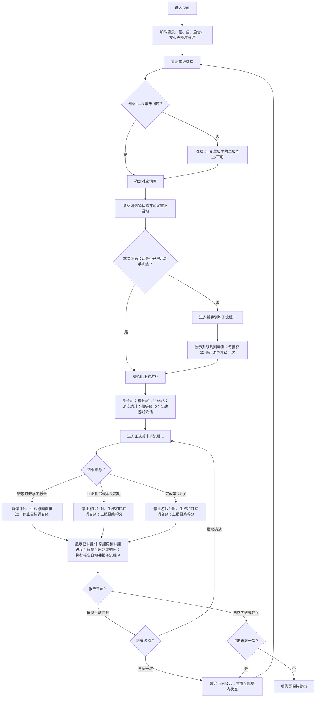
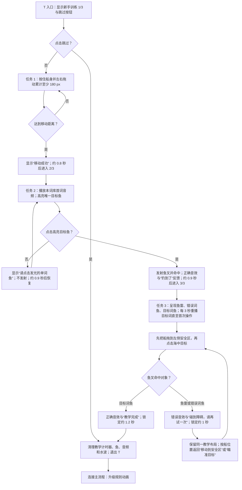
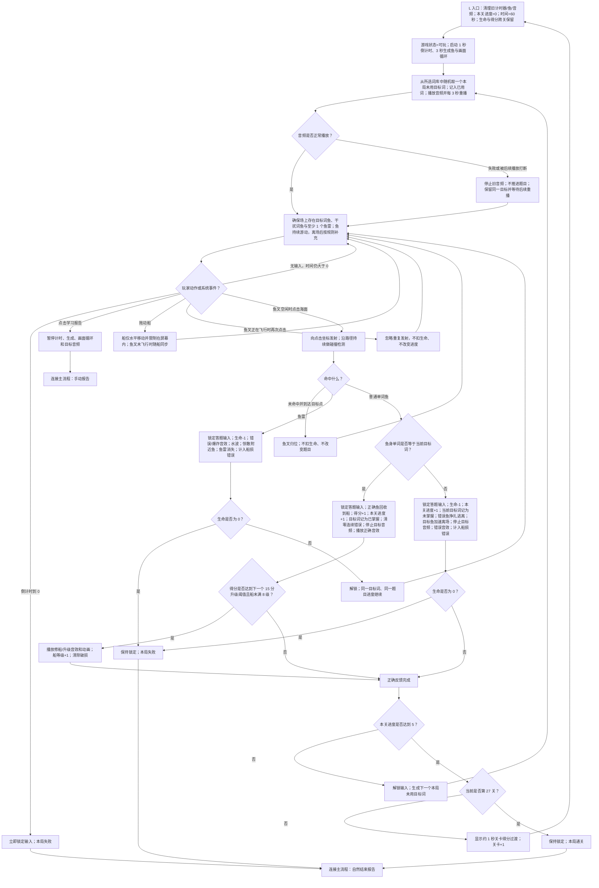
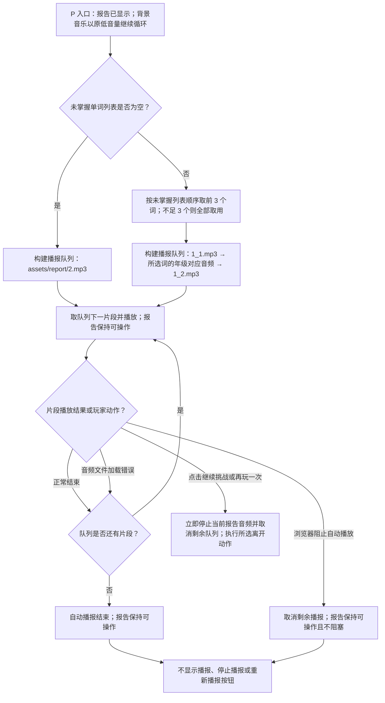

# 《叉鱼游戏》（鱼见愁）学习游戏 PRD

> 基线版本：当前工作区实现（2026-08-10）  
> 文档原则：玩法流程图是规则源；正文用于补充可测试的状态、内容和验收约束。

## 1. 学习目标

玩家从所选年级/学期的英语词库中听取单词发音，在移动的英文单词鱼中识别并捕获与音频一致的单词。

- 学习材料：`words.js` 中 `gradeWordLists` 定义的 13 个词库，每库 145 个唯一英文词；音频文件名与词条文本一致。
- 训练维度：英语单词听音辨词、英文词形识别，以及“听到的发音—屏幕上的字母序列”匹配。
- 报告复习：进入学习报告后，系统自动再次播放最多 3 个未掌握目标词的英文发音，帮助玩家即时复习错误词。
- 玩家行为：听目标词音频，阅读鱼身上的英文单词，判断匹配项并发射鱼叉。
- 当前玩法不训练：中文释义、语境用法、拼写输入、口语跟读或发音评分；不得在验收中把这些能力视为本游戏目标。
- 单局内容分布：玩家选择一个词库后，目标词在整局内随机且不重复；通关 27 关 × 5 题，共评测 135 个目标词，因此每局会有 10 个词未成为目标词。干扰词可重复出现。

## 2. 玩法流程图

### 2.1 主流程

### 2.2 新手训练子流程 T

### 2.3 正式关卡与单题子流程 L

### 2.4 学习报告自动播报子流程 P

## 3. 游戏 PRD

### 3.1 游戏概述

- 游戏名称：《叉鱼游戏》（鱼见愁）（代码页标题当前为 `Fishing Game`）。
- 一句话玩法：听目标英语单词发音，移动渔船并发射鱼叉，捕获写有相同英文词形的鱼，同时避开错误词鱼和鱼雷。
- 成功条件：在生命未耗尽且每关倒计时未归零的前提下，完成第 27 关的第 5 个目标词。
- 失败条件：生命降至 0，或任一正式关卡的 60 秒倒计时归零。

### 3.2 学习内容配置

完整词条以 [`words.js`](./words.js) 的 `gradeWordLists` 为唯一内容源，不在 PRD 中复制第二份清单，以避免词库与音频资源发生双源漂移。

| 选择项 | 词库 ID | 词数 | 音频目录 |
|---|---:|---:|---|
| 1—3 年级 | `1-3` | 145 | `assets/audio` |
| 4 年级上/下册 | `4-1` / `4-2` | 各 145 | `assets/grade4_1` / `assets/grade4_2` |
| 5 年级上/下册 | `5-1` / `5-2` | 各 145 | `assets/grade5_1` / `assets/grade5_2` |
| 6 年级上/下册 | `6-1` / `6-2` | 各 145 | `assets/grade6_1` / `assets/grade6_2` |
| 7 年级上/下册 | `7-1` / `7-2` | 各 145 | `assets/grade7_1` / `assets/grade7_2` |
| 8 年级上/下册 | `8-1` / `8-2` | 各 145 | `assets/grade8_1` / `assets/grade8_2` |
| 9 年级上/下册 | `9-1` / `9-2` | 各 145 | `assets/grade9_1` / `assets/grade9_2` |

每个内容项至少包含以下数据含义：

| 字段 | 规则 |
|---|---|
| `word` | 鱼身显示文本、正确答案和音频文件名；大小写与空格按词库原值保留。 |
| `audio` | `${所选音频目录}/${URL 编码后的 word}.mp3`。 |
| `isTarget` | 当前题是否为目标词；任一鱼的 `word === targetWord` 即判为正确。 |
| `isTorpedo` | 鱼雷没有单词文本，不属于学习内容。 |

目标词按整局去重抽取；135 个目标题完成前不会重置已用列表。场上干扰词从同一词库随机产生，可跨题重复；本关已经正确捕获的词不再在本关生成。

报告播报素材及内容：

| 音频 | 内容或用途 |
|---|---|
| `assets/report/1_1.mp3` | “你已经做得很棒啦，再熟悉一下” |
| 当前年级/学期的单词音频 | 依次朗读未掌握列表前 3 个单词；不足 3 个时按实际数量播放。 |
| `assets/report/1_2.mp3` | “就会更厉害啦！” |
| `assets/report/2.mp3` | “太棒啦，这次的知识点你都掌握啦！”；仅在未掌握列表为空时使用。 |

### 3.3 页面与关键元素

1. 加载页：显示 `Loading...`、波浪动画和进度条；图片加载流程结束后进入年级选择。
2. 年级选择：第一层为 1—3、4、5、6、7、8、9 年级；4—9 年级继续选择上册或下册。1—3 年级不区分学期。
3. 新手训练：显示 `新手训练 1/3` 至 `3/3`、场景内手势/箭头/高亮提示，以及“跳过”按钮。
4. 升级说明：自动演示“捕获 15 条正确的鱼即可升级渔船”，结束后自动进入第一关。
5. 正式游戏 HUD：`Level 当前/27`、`Fish 当前/5`、`Score`、`Time`、5 颗生命，以及“学习报告”按钮。
6. 游戏场景：水平可拖动的船、鱼叉、带英文词的普通鱼、无文字鱼雷、水波与船升级/破损视觉状态。
7. 学习报告：显示去重后的“未掌握单词”“已掌握单词”和 `已掌握数/(已掌握数+未掌握数)`；报告打开后自动执行未掌握词播报，背景音乐继续循环；手动打开时额外提供“继续挑战”。报告不提供播报、停止播报或重新播报按钮。

### 3.4 核心玩法与判定

- 点击船身进入拖动，船只能水平移动；松开、移出画布或触摸结束时停止拖动。
- 点击海面时，若鱼叉空闲则向点击点发射；碰撞沿飞行路径判定，不要求点击坐标正好位于鱼上。
- 鱼叉未命中任何对象时自动归位，不扣生命、不计题目进度。
- 命中目标词鱼：`score + 1`、`fishProgress + 1`，将当前目标词加入已掌握列表。
- 命中非目标普通鱼：`lives - 1`、`fishProgress + 1`，将当前目标词加入未掌握列表；本题不重试，进入下一目标词。
- 命中鱼雷：`lives - 1`，不增加 `fishProgress`，保留同一目标词继续作答。
- `Fish` 实际表示“本关已处理目标题数”，并不等同于正确捕获数；正确与错误普通鱼都会令其加 1。
- 场上没有目标词鱼时，生成循环必须重新补入同一目标词；目标鱼游出屏幕不算跳过或作答。
- 正式关没有主动跳题；无输入只会继续倒计时，倒计时归零后失败。

### 3.5 轮次、计分与成长

- 总关数固定为 27；每关处理 5 个目标词。
- 每关开始将本关进度清零、时间重置为 60 秒；总分、生命、词汇统计、船等级和整局已用目标词跨关保留。
- 单局初始生命为 5。错误普通鱼和鱼雷各扣 1 条生命；第 5 次扣除触发失败。生命不因过关或答对恢复。
- 分数只统计正确目标词，每题 1 分；理论最高分为 135。
- 非最终关完成后显示约 1 秒过渡，再自动进入下一关；最终关完成后直接进入通关报告。
- 每累计达到 15 个正确得分，船升级 1 级，最多 8 级；升级时播放音效与动画并清除船的破损状态。
- 船等级大于 0 时，每累计 2 次连续错误形成一个破损阶段；第一次显示破损，第二次达到破损阶段后船降 1 级并清除破损。答对会清零“连续错误”计数，但不会清除已经形成的第一破损阶段。错误普通鱼和鱼雷都计入该规则。

### 3.6 音频、反馈与操作限制

- 背景音乐使用 `assets/yinxiao/background.mp3`，在可用时以 20% 音量循环播放；进入手动或自然结束报告时不得停止或从头重启，应从游戏过程无缝延续。
- 正式题目标词进入时立即播放，并在未作答期间每 3 秒重播；产生正确、错误或鱼雷判定后停止当前目标音频，避免与反馈音效重叠。
- 报告语音音量为 100%，与低音量背景音乐同时播放。未掌握列表非空时，顺序为 `assets/report/1_1.mp3` → 未掌握列表前 3 个词的年级对应音频 → `assets/report/1_2.mp3`；未掌握词不足 3 个时全部播放，超过 3 个时只播放前 3 个。
- 未掌握列表为空时只播放 `assets/report/2.mp3`，不得播放 `1_1.mp3`、单词音频或 `1_2.mp3`。
- 报告自动播报期间仍允许操作“继续挑战”或“再玩一次”；离开报告时必须立即停止当前报告音频并取消剩余队列。报告音频加载错误时跳过当前片段，浏览器阻止自动播放时取消剩余队列，两种情况均不得阻塞报告操作。
- 音频被下一次播放打断时，旧音频必须停止并归零；音频加载或播放失败不得阻塞画面、计时器或输入，同一目标保留并等待后续重播。
- 正确反馈：目标鱼缩小并回收到船、播放正确音效；如达到阈值，再播放升级动画，然后进入下一题或过关。
- 错误普通鱼反馈：错误鱼晃动并加速逃离、目标鱼加速离场、播放错误音效，约 1 秒后进入下一题或失败。
- 鱼雷反馈：鱼雷消失、产生水波、附近鱼加速离开并播放鱼雷音效；生命未耗尽时继续同题。
- 鱼叉飞行期间的重复点击必须忽略。一次命中成立后到反馈结束、下一题就绪或同题恢复前，必须锁定所有会改变游戏状态的操作，包括再次发射、拖船判定和打开学习报告；锁定期间不得重复扣血、重复加分或重复推进。
- 进入失败、通关或报告状态后必须立即锁定游戏输入，并保证结束流程每局只执行一次。

> 实现基线差异：当前正式题已能忽略“鱼叉飞行期间”的重复发射，但命中后的完整反馈阶段尚无统一输入锁；开发验收应按本节规则补齐。

### 3.7 报告、继续与重玩

- “已掌握单词”是本局答对过的目标词去重集合；“未掌握单词”是本局答错普通鱼时对应目标词的去重集合。鱼雷和未完成的当前题不进入两类列表。
- 报告中的单词必须保持 `words.js` 中的原始英文文本；页面语言标记为中文，已掌握/未掌握词容器必须禁止浏览器自动翻译，不得将 `parent`、`autumn` 等学习词转换为中文释义。
- 手动报告和自然失败/通关报告显示后均自动执行报告播报子流程 P；不提供任何手动播报、停止播报或重新播报按钮。
- 玩家在正式游戏中点击“学习报告”时，暂停计时、生成、目标音频和画面推进；“继续挑战”恢复原关卡、原剩余时间、原目标词与原场景状态。
- 手动报告的“再玩一次”以及自然结束报告的“再玩一次”均返回年级选择，而不是直接用原词库重开。
- 返回年级选择时重置：得分、时间、生命、关卡、关卡进度、目标词、已用词、鱼与水波、船等级/破损、已掌握/未掌握统计和游戏会话。
- 新手训练在同一次页面打开期间只展示一次；报告后再玩不会再次出现，刷新页面后会再次出现。
- 自然失败或通关报告为终态；除“再玩一次”外不继续推进。手动报告不是终态，因为提供“继续挑战”。

### 3.8 验收要点

1. 首次加载后可完成“选词库 → 3 步新手训练（或跳过）→ 升级说明 → 第一关首个可操作目标”的完整路径。
2. 答对普通目标鱼后只加 1 分和 1 个本关进度，正确反馈完成后只生成 1 个新目标；快速重复点击不得双加分或双推进。
3. 答错普通鱼后扣 1 条生命、本关进度加 1、当前目标进入未掌握列表，且下一题使用新的未用目标词。
4. 命中鱼雷后扣 1 条生命但本关进度不变；生命仍大于 0 时必须回到同一目标词。
5. 空叉不扣生命、不改变分数和进度；鱼叉飞行期间的第二次点击不产生第二支鱼叉。
6. 无输入至 60 秒归零时只触发一次失败报告，后续音频、生成和命中回调不得修改报告数据。
7. 第 1—26 关完成第 5 题后自动进入下一关，时间重置为 60 秒且生命不恢复；第 27 关完成第 5 题后只进入一次通关报告。
8. 第 5 条生命被扣除时优先失败，即使该次错误普通鱼同时使本关进度达到 5，也不得过关或通关。
9. 手动报告暂停后“继续挑战”恢复原状态；“再玩一次”返回年级选择并完成全部状态重置。
10. 选定任一词库后，目标音频路径、鱼身文本和正确答案来自同一个词条；一局通关的 135 个目标词不得重复。
11. 音频被打断或加载失败时游戏不得卡死；同一题仍可继续，下一次重播不会与旧音频叠加。
12. 报告中的已掌握数、未掌握数及分母与本局目标题判定记录一致，鱼雷和未作答目标不计入分母。
13. 报告存在 1—3 个未掌握词时，按 `1_1.mp3 → 对应单词音频 → 1_2.mp3` 自动顺序播放；存在 4 个及以上时只播报列表前 3 个，且使用当前所选年级/学期的单词音频目录。
14. 报告没有未掌握词时只自动播放 `2.mp3`；报告页面不得出现“播报”“停止播报”或“重新播报”按钮。
15. 从游戏进入手动、失败或通关报告时，背景音乐以原播放进度和 20% 音量继续循环；报告语音以 100% 音量叠加播放，离开报告时报告语音停止但背景音乐保持正常。
16. 报告中的已掌握和未掌握词始终显示原始英文，不因浏览器页面翻译功能变为中文释义。

## 4. 待确认项

- 当前实现每库有 145 个词，但通关只评测 135 个不重复目标词。需确认产品目标是保留“每局随机覆盖 135/145”，还是把单局完成条件调整为覆盖全部 145 个词；该选择会改变总关卡/每关题数、最高分与完成条件。
