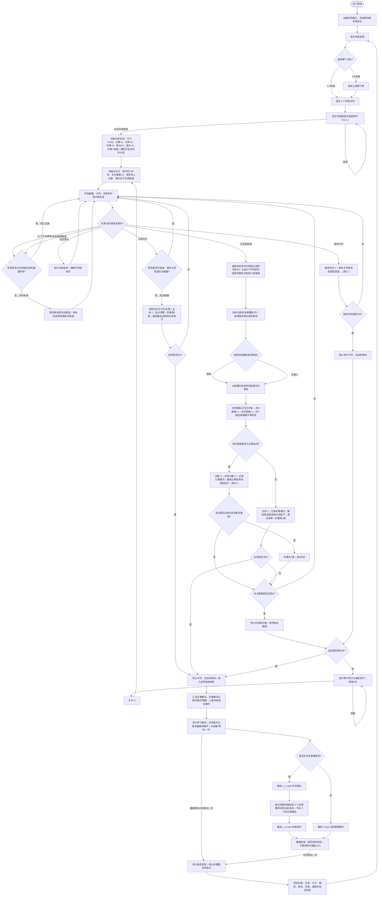
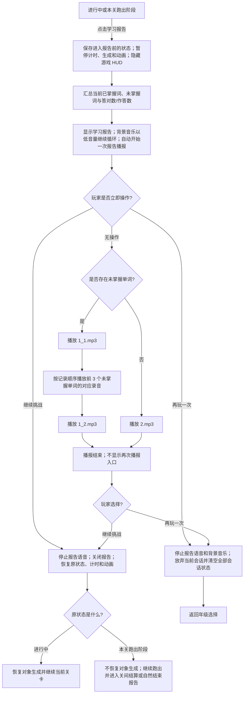

# 《咩了个咩》英语听音辨词学习游戏 PRD

> 文档状态：基于 2026-08-10 项目现有代码与素材整理。玩法流程图是本 PRD 的规则基准；“待确认项”列出会改变产品行为、尚不能仅凭现有实现确定的规则。

## 1. 学习目标

学习者在持续跑酷场景中：

1. 听辨所选年级/册次词包中英语单词的标准录音；每题目标词连续播放 2 次。
2. 在 3 个英文拼写选项中识别与录音一致的单词，并通过切换跑道完成选择。
3. 通过即时对错反馈与局末“已掌握/未掌握”报告，识别需要继续练习的词。

本游戏训练的是“英语单词声音 → 英文拼写”的听辨匹配，不考查中文释义、语境使用、口语录音或主动拼写。

## 2. 玩法流程图

### 2.1 主流程

### 2.2 局中学习报告子流程

## 3. 游戏 PRD

### 3.1 游戏概述

- 游戏名称：咩了个咩。
- 一句话玩法：听目标单词录音，操控小羊切换到写有对应英文单词的跑道，同时躲避石头并完成 28 关挑战。
- 核心成功：角色与单词题相遇时处在正确选项跑道。
- 会话完成：生命降至 0，或第 28 关完成 5 题/倒计时归零后进入学习报告。

### 3.2 学习内容配置

完整词表以 [words.js](./words.js) 为内容配置附件，PRD 不另复制，以避免两份词表失去同步。现有 13 个可选词包如下：

| 词包 ID | 界面名称 | 单词数 | 录音目录 |
|---|---:|---:|---|
| `1-3` | 1-3年级 | 143 | `assets/audio` |
| `4-1` | 4年级上 | 148 | `assets/grade4_1` |
| `4-2` | 4年级下 | 148 | `assets/grade4_2` |
| `5-1` | 5年级上 | 148 | `assets/grade5_1` |
| `5-2` | 5年级下 | 148 | `assets/grade5_2` |
| `6-1` | 6年级上 | 148 | `assets/grade6_1` |
| `6-2` | 6年级下 | 148 | `assets/grade6_2` |
| `7-1` | 7年级上 | 148 | `assets/grade7_1` |
| `7-2` | 7年级下 | 148 | `assets/grade7_2` |
| `8-1` | 8年级上 | 148 | `assets/grade8_1` |
| `8-2` | 8年级下 | 148 | `assets/grade8_2` |
| `9-1` | 9年级上 | 148 | `assets/grade9_1` |
| `9-2` | 9年级下 | 148 | `assets/grade9_2` |

内容数据规则：

| 字段 | 规则 |
|---|---|
| `packId` | 对应上表词包 ID。 |
| `word` | 屏幕显示文本，也是正确答案文本。大小写和空格以词表为准。 |
| `promptAudio` | `${录音目录}/${word}.mp3`；现有 13 个词包均已找到同名录音。 |
| `options` | 3 个不同单词，包含 1 个目标词和 2 个干扰词。 |
| `correctLane` | 将选项随机打乱后，目标词所在的 0/1/2 号跑道。 |
| `correctFeedbackAudio` | `assets/audio/sheepright.mp3`。 |
| `incorrectFeedbackAudio` | `assets/audio/sheepwrong.mp3`。 |
| `collisionFeedbackAudio` | `assets/audio/sheepstone.mp3`。 |
| `backgroundMusic` | `assets/audio/background.mp3`；音量 0.1，循环播放，进入学习报告后继续播放。 |
| `reportIntroAudio` | `assets/report/1_1.mp3`：“你已经做得很棒啦，再熟悉一下”。 |
| `reportWordAudio` | `${录音目录}/${word}.mp3`；有未掌握单词时按记录顺序最多播放前 3 个。 |
| `reportOutroAudio` | `assets/report/1_2.mp3`：“就会更厉害啦！”。 |
| `reportMasteredAudio` | `assets/report/2.mp3`：“太棒啦，这次的知识点你都掌握啦！”。 |

出题与分配规则：

1. 新会话开始时打乱所选词包，并按 28 关分组；每组容量为 `ceil(词包单词数/28)`。
2. 每关最多判定 5 题，每局最多判定 140 题。
3. 同一单词在本局词表尚未耗尽前只能作为正确答案出现一次；可重复充当干扰词。
4. 正确词优先来自当前关卡分组；分组为空或词已用完时，从本局尚未作为正确答案出现的词中补充。
5. 干扰词优先来自所选词包中、不属于当前关卡分组的单词；必须与目标词及另一个干扰词不同。
6. 单词题生成后至少间隔 6 秒才允许生成下一题，且两个单词题之间至少生成一个非答题对象。

### 3.3 页面与关键元素

#### 加载与选择

- 加载页显示小羊动画、进度条和百分比；所有关键素材无论成功或失败均完成一次加载计数，计数结束后进入年级选择。
- 年级选择首层显示“1-3年级”与“4–9年级”；选择 4–9 年级后必须再选择上册或下册。
- 选择词包后显示开始页。开始页提供“开始游戏”及速度减/增控制；速度范围为 0.5–1.1，步长 0.1，默认 0.8。

#### 游戏界面

- 三条跑道、小羊、石头、无害草丛和三选一单词题构成主画面。
- HUD 固定显示“学习报告”、当前关卡/28、累计分数和 5 颗生命心；失去的生命以灰色心表示。
- 键盘支持 `↑`/`W` 上移一条跑道、`↓`/`S` 下移一条跑道；鼠标或触摸可直接指定目标跑道。

#### 关间结算与学习报告

- 非最终关结束后显示累计得分和速度控制，1 秒后自动开始下一关。
- 学习报告显示去重后的“未掌握单词”“已掌握单词”以及“答对数/作答数”。
- 局中手动报告显示“继续挑战”和“再玩一次”；自然结束报告只显示“再玩一次”。
- 学习报告显示后自动播报一次学习结果，不显示“播报”“停止播报”或“重新播报”按钮。
- 学习报告中的背景音乐继续以 0.1 音量循环，报告语音和单词录音以 1.0 音量在其上播放。

### 3.4 核心玩法

1. 每个单词题同时在三条跑道上显示 3 个英文单词，目标词录音连续播放 2 次。
2. 玩家在题目与角色相遇前换道；相遇瞬间所在跑道即为提交答案，不另设确认按钮。
3. 玩家没有操作时，以角色当前跑道作为答案；不存在“跳过”或“不作答”状态。
4. 正确：累计分数和答对数各加 1；生命不变。
5. 错误：累计作答数加 1、生命减 1、分数不变；本题不重试，继续生成下一题。
6. 撞石头：生命减 1，但不增加题目数、作答数或错误词记录；草丛无伤害。
7. 角色正在换道时不判定石头碰撞；换道未完成前的再次换道输入无效。

### 3.5 轮次、进度与状态

| 状态 | 初始/更新规则 |
|---|---|
| 关卡 | 新局为 1/28；普通关结束后加 1。 |
| 本关倒计时 | 每关重置为 60 秒；每秒减 1。 |
| 本关题数 | 每关重置为 0；每判定一个单词题加 1；达到 5 后停止生成并进入跑出阶段。 |
| 分数 | 新局为 0；答对加 1；跨关保留。 |
| 生命 | 新局为 5；答错或撞石头减 1；跨关保留，不自动恢复。 |
| 总作答数 | 新局为 0；每个单词题完成判定后加 1。 |
| 总答对数 | 新局为 0；每次正确判定后加 1。 |
| 连对与形象 | 新局为初始形象；每连续答对 6 题升 1 级，共 6 级；答错或撞石头时连对清零且形象降 1 级，最低为初始级。 |
| 速度 | 基础速度默认 0.8；可在开始页/关间结算按 0.1 调至 0.5–1.1。进行中按 `min(基础速度 + 本关题数/5 × 0.3, 1.1)` 动态调整。 |

推进规则：

- 完成第 1–27 关的 5 题后，角色跑出画面，显示 1 秒结算，再进入下一关。
- 第 1–27 关倒计时归零时立即结束该关并进入相同的关间结算；本关未答题目不补做。
- 第 28 关完成 5 题或倒计时归零时，进入自然结束报告。
- 任何关卡中生命降至 0 时立即进入自然结束报告，不再执行本关完成或下一关逻辑。

### 3.6 反馈、音频与操作限制

- 正确反馈：正确提示音 + 绿色粒子，随后继续同关或进入跑出阶段。
- 错误反馈：错误提示音 + 红色粒子 + 生命心变灰，随后继续下一题或因生命耗尽结束。
- 石头反馈：碰撞提示音 + 红色粒子 + 生命心变灰。
- 报告存在未掌握单词时，语音顺序固定为 `1_1.mp3` → 前 3 个未掌握单词的对应录音 → `1_2.mp3`；未掌握单词少于 3 个时按实际数量播放。
- 报告不存在未掌握单词时，仅播放 `2.mp3`；报告语音每次打开报告只自动播放一次，不提供手动重播入口。
- 报告播报期间背景音乐保持循环播放；离开局中报告时报告语音立即停止，背景音乐不中断；点击“再玩一次”时两类音频均停止并重置。
- 每道题以 `answered/passed` 状态锁定，已判定题不得再次计分、扣血或推进题数。
- 换道期间忽略重复换道输入；处于非游戏状态时，画布点击、触摸和移动键均无效。
- 打开局中报告后暂停计时、对象生成和动画；“继续挑战”必须只恢复一次原状态，不得重复创建计时器、生成器或动画循环。
- 自然结束进入报告后，所有残留定时器和异步关卡回调都不得再次启动游戏或重复上报完成事件。
- 题目音频加载或播放失败时，本题仍保持可作答，不得卡死进度；进入报告时不再启动尚未播放的题目音频。
- 报告中的某一段语音加载失败时跳过该段并继续后续片段；浏览器阻止自动播放时保持报告可操作，不得卡住“继续挑战”或“再玩一次”。

### 3.7 完成与重玩

自然完成条件满足时：

1. 停止当前会话的计时、对象生成和游戏动画。
2. 汇总各关的正确/错误目标词，显示累计答对数/作答数。
3. 每个会话只上报一次完成事件及最终分数；报告保持终态，不自动返回游戏。
4. “再玩一次”会返回年级选择，并清空分数、生命、关卡、倒计时、已使用目标词、对错记录、形象、速度、场景对象及旧会话状态。
5. 新词包选择完成后，必须再次点击“开始游戏”才能创建新会话。

### 3.8 验收要点

1. **开始到首题**：任选词包并开始后，关卡显示 1/28、分数 0、生命 5；出现三选一题且目标录音连续播放 2 次。
2. **正确路径**：进入正确跑道只计 1 分、只增加 1 次作答和 1 次答对；同一题不因持续碰撞重复计分。
3. **错误路径**：进入错误跑道只扣 1 条生命，目标词进入未掌握记录，本题不重试，并能继续下一题。
4. **无输入路径**：玩家不换道时，题目与角色相遇即按当前跑道判定，不得跳过或静默消失。
5. **石头路径**：非换道状态碰撞同跑道石头只扣 1 条生命，不改变题数与作答统计；同一石头不重复扣血。
6. **普通关完成**：第 5 题判定后停止生成，角色跑出，结算停留 1 秒后只推进 1 关；分数和生命保留，倒计时与本关题数重置。
7. **超时路径**：第 1–27 关倒计时归零后进入下一关；第 28 关倒计时归零后进入自然结束报告。
8. **生命耗尽**：答错或撞石头导致生命为 0 时，只进入一次自然结束报告，不再触发关卡结算或下一关。
9. **最终关路径**：第 28 关第 5 题完成后，角色跑出并进入自然结束报告；报告不会自动恢复游戏。
10. **局中报告**：在进行中打开报告后，计时、场景和出题暂停；“继续挑战”恢复原关卡且不会生成重复循环。
11. **重复输入**：换道期间连续按键/点击不改变既定目标跑道；报告或结算状态下的移动输入无效。
12. **重玩重置**：从报告点击“再玩一次”返回年级选择；再次开始时所有会话状态为初始值，旧报告内容和旧异步回调不可残留。
13. **音频异常**：任一单词录音加载失败时，题目仍可判定、计数并推进；不会造成永久输入锁定。
14. **未掌握词播报**：报告含 4 个及以上未掌握单词时，只按记录顺序播报前 3 个；顺序必须为开场提示、3 个单词、结束提示，且界面没有重新播报入口。
15. **不足三个或全部掌握**：报告含 1–2 个未掌握单词时全部播报；没有未掌握单词时只播放全部掌握提示 `2.mp3`。
16. **报告背景音乐**：进入局中或自然结束报告后，`background.mp3` 继续以 0.1 音量循环；同时播放报告语音时两者均可听见。
17. **报告中断路径**：局中报告播报过程中点击“继续挑战”立即停止报告语音并恢复游戏；点击“再玩一次”停止并重置报告语音与背景音乐，返回年级选择。

## 4. 待确认项

1. **词包是否要求单局全覆盖。** 当前每局固定 28×5=140 题，因此 1–3 年级每局随机剩余 3 个词，其余词包每局随机剩余 8 个词。若要求每个词至少考查一次，需要调整关卡数、每关题数或增加补充关。
2. **超时是否应直接跳到下一关。** 当前第 1–27 关超时会保留已有成绩并自动进入下一关，第 28 关超时会直接完成整局；没有失败、重试或补题。若超时代表未完成，本分支需要改为重试当前关或结束本局。
3. **是否需要首局操作教学。** 当前年级选择后直接进入开始页，没有“听录音后切到正确单词跑道”“石头会扣生命”等演示或可跳过说明。若面向首次使用者，需要新增教学及完成/跳过分支，并同步更新主流程图。
