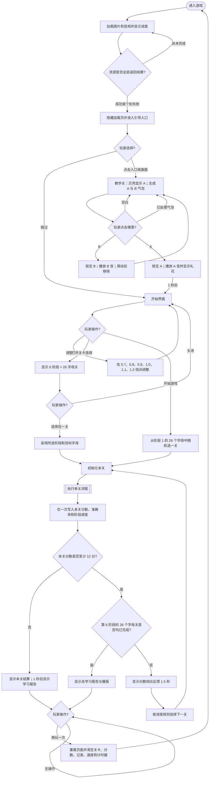

# 《戳泡泡》（Pop ABC）学习游戏 PRD

> 文档状态：基于当前游戏素材与交互整理的开发基线  
> 更新日期：2026-08-06  
> 规则优先级：本文的玩法流程图是行为判定的唯一基准；正文与流程图冲突时，以流程图为准。

## 1. 学习目标

玩家通过观察字形、听字母音频并点击移动气泡，学习并巩固 26 个英文字母 `A–Z` 的以下能力：

- 识别大写字母 `A–Z` 的字形，并从其他大写字母中选出目标字母。
- 识别小写字母 `a–z` 的字形，并从其他小写字母中选出目标字母。
- 听到字母音频后，从同一字母形式的干扰项中选出对应的大写或小写字母。
- 建立同一字母的大写与小写对应关系，例如 `A ↔ a`、`B ↔ b`。
- 听到字母音频后，在大小写混合的选项中识别对应字母；同一字母的大小写均视为正确。

学习内容按 6 个阶段、每阶段 26 个字母关分布，共 156 个关卡配置：

| 阶段 | 关卡 | 学习维度 | 提示 | 正确判定 |
|---|---:|---|---|---|
| 1 | 1–26 | 大写字母字形 | 贝壳显示一个大写字母 | 点击相同大写字母 |
| 2 | 27–52 | 小写字母字形 | 贝壳显示一个小写字母 | 点击相同小写字母 |
| 3 | 53–78 | 大写字母听音辨形 | 贝壳显示喇叭；目标音立即播放并每 3 秒重复 | 点击对应大写字母 |
| 4 | 79–104 | 小写字母听音辨形 | 贝壳显示喇叭；目标音立即播放并每 3 秒重复 | 点击对应小写字母 |
| 5 | 105–130 | 大小写对应与混合辨形 | 贝壳同时显示同一字母的大写和小写 | 点击对应字母，大小写均正确 |
| 6 | 131–156 | 大小写混合听音辨形 | 贝壳显示喇叭；目标音立即播放并每 3 秒重复 | 点击对应字母，大小写均正确 |

## 2. 玩法流程图

### 2.1 主流程



### 2.2 单关流程

```mermaid
flowchart TD
    R0([进入单关]) --> R1[设置 score=0、timeLeft=60、found=0；启动新局记录]
    R1 --> R2[生成序列：20 个目标气泡 + 30 个干扰气泡并随机打乱]
    R2 --> R3[立即生成首个气泡；其余按递减间隔生成；气泡持续上浮并逐步加速]
    R1 --> A0{是否为阶段 3、4、6?}
    A0 -- 是 --> A1[0.5 秒后播放目标字母音；之后每 3 秒重复]
    A0 -- 否 --> R4[显示目标字形]
    A1 --> R5[显示喇叭提示]
    R4 --> R6[开放操作]
    R5 --> R6
    R3 --> R6

    R6 --> R7{发生什么?}
    R7 -- 打开学习报告 --> RP1[暂停倒计时、生成、移动、目标音和背景音乐；锁定画布输入]
    RP1 --> RP2[显示已记录项目及掌握进度；播报最多 3 个低于 60% 的薄弱字母]
    RP2 --> RP3{玩家操作?}
    RP3 -- 继续挑战 --> RP4[关闭报告；恢复同一关、同一批气泡和原有状态]
    RP4 --> R6
    RP3 -- 再玩一次 --> RP5[重载页面并清空全部会话状态]
    RP5 --> ENDREPLAY([返回游戏入口])

    R7 -- 点击空白 --> RI1[忽略；分数和气泡不变]
    RI1 --> R6
    R7 -- 重复点击已处理气泡 --> RI2[忽略；不得重复计分或重复反馈]
    RI2 --> R6
    R7 -- 点击未处理气泡 --> R8[立即锁定该气泡]
    R8 --> R9{是否为目标字母?}

    R9 -- 是 --> RC1[score+1；found+1；播放该字母名称音]
    RC1 --> RC2[显示鲸鱼与星星约 0.4 秒；约 0.5 秒后气泡飞向美人鱼并消失]
    RC2 --> R6

    R9 -- 否 --> RW1{当前是否为听音阶段 3、4、6?}
    RW1 -- 是 --> RW2[播放错误音效]
    RW1 -- 否 --> RW3[播放所点干扰字母的名称音]
    RW2 --> RW4[气泡晃动后移除；不扣分、不补发该气泡]
    RW3 --> RW4
    RW4 --> R6

    R7 -- 无输入且气泡越过顶部 --> RM1[该气泡消失；目标气泡漏点则失去该得分机会]
    RM1 --> R6
    R7 -- 倒计时归零 --> RE1[锁定本关并停止全部本关计时器与音频循环]
    R7 -- 生成是否结束且无未处理目标气泡? --> RD{条件成立且 found 大于 0?}
    RD -- 否 --> R6
    RD -- 是 -->|等待 1 秒；期间只允许触发一次| RE1
    RE1 --> RE2([返回主流程结算])
```

## 3. 游戏 PRD

### 3.1 游戏概述

- 游戏名称：戳泡泡（Pop ABC）。
- 一句话玩法：根据贝壳中的字母字形或字母音，在不断上浮的气泡中戳中目标字母。
- 单关成功标准：满分 20 分，获得至少 12 分视为通过本关。
- 总体完成标准：第 6 阶段的 26 个字母关均产生过一次结算记录后，进入总学习报告。

### 3.2 学习内容配置

每个关卡至少包含以下数据字段：

| 字段 | 规则 |
|---|---|
| `stage` | 1–6，决定学习维度、提示形式与错误音频 |
| `targetLetter` | 当前目标字母；阶段 1、3、5、6 使用 `A–Z`，阶段 2、4 使用 `a–z` |
| `acceptedForms` | 阶段 1–4 仅接受题面指定大小写；阶段 5–6 接受同字母的大小写两种形式 |
| `distractorPool` | 除目标字母及其可接受形式外的其他字母；阶段 5–6 混合大小写 |
| `showShellLetter` | 阶段 1、2、5 为是；阶段 3、4、6 为否 |
| `promptAudio` | `assets/{大写字母}.mp3`；阶段 3、4、6 用作循环题音，所有阶段在正确点击时播放 |

每关固定生成 50 个气泡：

- 20 个目标气泡，每个代表 1 个可得分机会。
- 30 个干扰气泡，从当前关的干扰池随机抽取，可重复。
- 50 个气泡在开始前随机打乱类型顺序。
- 阶段 5、6 中，每个目标气泡独立随机显示大写或小写；两种形式均正确。
- 初始生成间隔为 `800ms ÷ 倍速`，每生成一个气泡减少 20ms，最低 400ms。
- 初始上浮速度为 `2 × 倍速`；每 `5000ms ÷ 倍速` 增加 0.6，最高 10。

### 3.3 页面与关键元素

#### 加载与引导

- 加载页显示资源加载百分比；单个图片失败不阻止进入游戏。
- 引导入口提供“跳过”；跳过后直接进入开始界面。
- 教学关固定使用目标 `A`、正确气泡 `A`、干扰气泡 `B`，用贝壳光晕、箭头和手势提示点击目标。
- 教学关错误点击不结束教学；正确点击后播放字母音和礼花，1 秒后进入开始界面。

#### 开始与关卡选择

- 开始界面包含“开始游戏”、速度控制和关卡选择入口。
- “开始游戏”从阶段 1 的 26 个字母关中随机选择一关。
- 速度可选 `0.7×、0.8×、0.9×、1.0×、1.1×、1.2×`，默认 `1.0×`；速度影响倒计时速率、生成间隔和气泡移动速度。
- 关卡选择展示全部 156 个关卡；选择后立即开始所选关卡。关闭选择器返回开始界面。

#### 游戏界面

- 画面主体包含贝壳提示、上浮气泡、美人鱼和戳泡泡动效。
- HUD 显示 `Level`（本次页面生命周期内已开始的关数）和 `Score`（当前关得分）。
- “学习报告”按钮仅在游戏进行中显示；气泡需绕开按钮所在区域，避免遮挡。
- 进行中不显示速度控制或关卡选择入口。

#### 结算与报告

- 结算显示最终分数；按 0–11、12–15、16–17、18–20 四档展示对应画面和音效。
- 学习报告按字母与阶段展示掌握进度 `round(score ÷ 20 × 100%)`，低于 60% 的记录标红。
- 报告条目按准确率降序排列，同分按字母升序。
- 报告播报规则：没有记录时不播报；所有记录均达到 60% 时播放“全部掌握”；否则按准确率从低到高播报最多 3 个薄弱字母。

### 3.4 核心玩法与判定

1. 本关开始时，将 `score`、`found` 重置为 0，将 `timeLeft` 重置为 60，并创建新的单关记录会话。
2. 字形阶段直接显示目标字母；听音阶段隐藏目标字母并显示喇叭，目标音在 0.5 秒后首次播放，随后每 3 秒播放一次。
3. 玩家可以点击任意可见气泡；命中后立即将该气泡设为“已处理”。
4. 目标气泡使 `score + 1`、`found + 1`。同一个气泡只能计分一次。
5. 干扰气泡不扣分；反馈结束后移除，且不生成替代气泡。
6. 点击空白、重复点击已处理气泡均被忽略。
7. 未点击气泡越过顶部后直接消失；漏掉目标气泡会降低本关可获得的最高分。
8. 字母音频播放不锁定整局输入；反馈期间玩家仍可点击其他未处理气泡。
9. 同一字母音频再次触发时从头播放；音频播放失败不得阻断游戏。
10. 本关只能结算一次。首次满足以下任一条件时锁定本关并停止本关计时器：
    - 倒计时归零；
    - 50 个气泡已全部生成、所有未点击目标气泡均已离场或被处理，且本关至少点中过 1 个目标气泡。

本游戏没有“跳过本关”操作，也没有对错误气泡的原题重试；玩家在同一关继续处理剩余气泡。

### 3.5 轮次、计分与进度

- 单关满分 20 分；错误点击不扣分。
- `accuracy = score ÷ 20 × 100%`。
- `score ≥ 12`（准确率至少 60%）为通过；自动进入后续关卡。
- `score ≥ 17`（准确率至少 85%）记为一次高正确率；低于 17 分会清空连续高正确率计数。
- 阶段 1–5 中，连续 3 关达到 17 分后升至下一阶段，并从新阶段随机选择一个字母关；阶段 6 不再自动升阶。
- 未触发提前升阶时，按当前阶段字母顺序推进；到达阶段末尾后从该阶段尚未完成或未通过的字母继续。
- 每个“字母 × 阶段”仅保留最近一次得分，用于学习报告。
- 手动关卡选择会改变当前阶段和目标字母，但不会清除已有学习记录。
- `score < 12` 时，本次连续挑战停止并进入学习报告；玩家只能选择“再玩一次”开始全新会话。

### 3.6 反馈、音频与操作限制

| 事件 | 视觉反馈 | 音频反馈 | 状态变化 | 后续状态 |
|---|---|---|---|---|
| 点击目标气泡 | 鲸鱼与星星约 0.4 秒；气泡约 0.5 秒后飞向美人鱼 | 播放目标字母音 | 分数与命中数各加 1；气泡锁定 | 继续同一关 |
| 点击干扰气泡（阶段 1、2、5） | 气泡晃动后消失 | 播放所点字母音 | 不加分、不扣分；气泡锁定 | 继续同一关 |
| 点击干扰气泡（阶段 3、4、6） | 气泡晃动后消失 | 播放错误音效 | 不加分、不扣分；气泡锁定 | 继续同一关 |
| 点击空白 | 无 | 无 | 无 | 继续同一关 |
| 重复点击 | 无新增反馈 | 无新增音频 | 无；不得重复计分 | 继续同一关 |
| 无输入 | 气泡继续上浮并可能离场 | 听音阶段继续周期播题音 | 漏点目标失去相应得分机会 | 继续至结算条件 |
| 打开学习报告 | 报告覆盖游戏画面 | 停止背景音乐，按报告规则播报 | 暂停倒计时、生成、移动和周期题音；锁定画布 | 继续挑战或再玩一次 |

报告暂停的恢复要求：

- “继续挑战”必须恢复同一关，不重置分数、剩余时间、气泡序列、已处理状态或当前速度。
- 关闭报告后恢复背景音乐、倒计时、生成、移动和周期题音。
- 报告打开期间的重复点击不得穿透到画布。
- “再玩一次”立即停止报告播报并重载页面，清空所有游戏状态。

### 3.7 完成与重玩

- 普通通过：显示分数档位反馈 1.5 秒，然后自动进入下一关；过渡期间不接受会导致重复推进的输入。
- 未通过：显示本关结算，1 秒后进入学习报告；此路径不自动进入下一关。
- 总完成：第 6 阶段 26 个字母关均已有结算记录后进入总学习报告，不再自动生成下一关。
- 结束报告中的“再玩一次”执行整页重载，并重置当前阶段、当前关、分数、字母记录、阶段进度、关数、倍速、音频和全部计时器，然后重新进入加载与引导流程。
- 若玩家不选择“再玩一次”，完成报告保持终态。

### 3.8 数据记录

- 每次单关开始生成新的游戏会话标识并记录 `game_started`。
- 每次单关首次结算记录一次 `game_finished` 和本关最终分数。
- 网络上报失败只记录警告，不阻断本地结算与后续流程。
- 同一关不得因重复定时回调产生多次结算或多次完成上报。

### 3.9 验收要点

1. 资源加载完成或个别资源失败后，均可从引导入口到达教学关或开始界面。
2. 教学关点击 `B` 后仍可继续；点击 `A` 后只进入一次开始界面。
3. 点击“开始游戏”后，必须从阶段 1 随机选择目标字母并进入首个可操作气泡。
4. 每关生成且只生成 20 个目标气泡和 30 个干扰气泡；顺序在每关开始时重新打乱。
5. 阶段 1、2、5 显示字形提示；阶段 3、4、6 隐藏字母、显示喇叭并按规定重复目标音。
6. 每个目标气泡最多加 1 分；快速连点同一气泡不得重复计分、重复推进或重复上报。
7. 错误点击不扣分；对应的晃动、字母音或错误音效与阶段规则一致，并继续同一关。
8. 点击空白无反馈；无输入时气泡正常离场，倒计时最终保证关卡可结束。
9. 达到气泡结束条件或倒计时归零时，本关只结算一次，所有计时器和周期题音停止。
10. 得分 12–20 分时显示正确档位反馈并自动进入下一关；得分 0–11 分时进入学习报告且不自动推进。
11. 连续 3 关得分至少 17 分时，阶段 1–5 只提升一个阶段；任何低于 17 分的关卡都会重置连续计数。
12. 普通关与第 6 阶段最后一个未完成字母关必须分流：前者继续下一关，后者进入总学习报告。
13. 游戏中打开学习报告后，倒计时、气泡生成和移动均暂停；“继续挑战”恢复原状态，不丢失或重复气泡。
14. 报告期间点击画布无效；关闭报告后输入恢复，且不会发生双提交或双推进。
15. 薄弱项播报最多包含 3 个低于 60% 的字母；关闭报告或重玩会立即停止播报。
16. 完成报告保持终态；点击“再玩一次”后所有会话状态清零，并从加载与引导流程开始干净的新会话。

### 3.10 规则收敛说明

当前游戏代码中“通过”“高正确率升阶”和“总完成”存在多组交叉条件。为保证流程可实现、可完成且无结算断路，本 PRD 统一采用以下基线：

- 12/20 是单关通过线。
- 17/20 是高正确率线，连续 3 关仅升 1 个阶段。
- 第 6 阶段 26 个字母关均结算后触发总完成。
- 所有结束与自动推进均必须具备单次触发保护。

