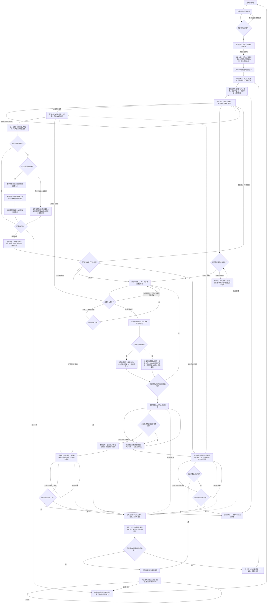

# 《火车快跑》学习游戏 PRD

## 1. 学习目标

玩家通过听取英语单词音频，在候选字母车厢中识别组成该单词的全部字母，并借助正确反馈巩固单词的字母构成与发音对应关系。

- 学习维度：英语单词听辨、字母识别、单词拼写构成。
- 作答行为：听到目标词后，从 4 或 5 个字母选项中选出目标词所需的 3 或 4 个字母。
- 顺序规则：玩家不需要按拼写顺序点击；阶段成功后，火车按正确拼写顺序展示完整单词。
- 不在本游戏内教学：中文释义、语境用法、口语录音与发音评分。

### 1.1 学习内容与轮次分配

每个关卡固定包含 3 个阶段，依次使用下表中的单词；共 27 关、81 个词。

| 关卡 | 阶段 1（3 字母） | 阶段 2（3 字母） | 阶段 3（4 字母） |
| --- | --- | --- | --- |
| 1 | cat | dog | bird |
| 2 | red | yes | four |
| 3 | six | one | five |
| 4 | cut | two | blue |
| 5 | eat | egg | pear |
| 6 | big | arm | hand |
| 7 | who | how | foot |
| 8 | sun | she | moon |
| 9 | run | bag | love |
| 10 | leg | sit | face |
| 11 | pen | old | book |
| 12 | hat | can | head |
| 13 | let | the | desk |
| 14 | man | are | tree |
| 15 | nod | car | feed |
| 16 | sea | sky | like |
| 17 | toy | sad | milk |
| 18 | USA | hen | kite |
| 19 | cap | bed | long |
| 20 | hop | bus | look |
| 21 | fat | pig | rice |
| 22 | row | map | cake |
| 23 | zoo | cup | nose |
| 24 | cow | dad | many |
| 25 | fly | see | jump |
| 26 | box | mom | find |
| 27 | mix | ten | have |

## 2. 玩法流程图

流程图是本 PRD 的规则源。`当前关卡`表示一组 3 个单词，`当前阶段`表示其中一个单词。

## 3. 游戏 PRD

### 3.1 游戏概述

- 游戏名称：火车快跑。
- 一句话玩法：听英语单词，从字母车厢中选出组成该词的全部字母，让载有正确单词的火车驶离站台。
- 单局完成目标：在累计 5 次阶段错误前掌握全部 81 个单词。
- 教学说明：当前版本不提供独立教程或可跳过演示；资源完成后直接显示“开始游戏”。

### 3.2 学习内容配置

每个单词应以数据项配置，至少包含：

| 字段 | 规则 |
| --- | --- |
| `level` | 1～27；首关随机，之后递增，27 后回到 1。 |
| `phase` | 1～3；同一关内固定按 1、2、3 推进。 |
| `word` | 正确单词文本；显示时保留约定大小写，如 `USA`。 |
| `letters` | 正确字母序列，用于生成正确选项和最终规范拼写。 |
| `promptAudio` | 与单词对应的英语发音音频。 |
| `wrongPool` | 不属于本题答案的候选字母池；每阶段抽取 1 个干扰字母。 |

生成规则：

1. 阶段 1、2 各展示 4 个选项，其中 3 个是正确字母、1 个是干扰字母。
2. 阶段 3 展示 5 个选项，其中 4 个是正确字母、1 个是干扰字母。
3. 正确字母与干扰字母随机分布在当前阶段的固定车厢位置；相同字母按出现次数分别配置，例如 `egg`、`foot`、`tree`。
4. 进入一关时，以该关最新一次表现覆盖该关之前的掌握记录；其他关的掌握记录保留。

### 3.3 页面与关键元素

#### 加载与开始界面

- 显示加载文字、进度条和百分比；资源完成后显示背景、半透明遮罩与“开始游戏”按钮。
- 开始按钮只响应一次；点击后移除，创建新会话并进入首关。

#### 游戏界面

- 画布显示背景、当前火车、候选字母车厢、选中字母和反馈动画。
- 顶部 HUD 显示累计分数、当前关剩余秒数、5 颗心和“学习报告”按钮。
- 心的可见强度表示剩余容错次数；每次失败阶段消耗 1 颗心。
- 背景音乐循环播放；目标词音频、错误音效与火车音效按流程图触发。

#### 关卡结算与学习报告

- 每关结束显示 1 秒表现图，表现档位取决于会话累计分数：`score ≥ 9`、`6 ≤ score < 9`、`score < 6`。
- 学习报告列出玩家实际点击参与过的阶段所对应的单词，并分为“已掌握”和“未掌握”。
- 掌握进度显示“已掌握的参与单词数 / 参与单词总数”。
- 报告打开后自动播报学习结果；界面不显示播报按钮、重播按钮或“已播报”状态文字。
- 存在未掌握单词时，按报告中的排列顺序最多播报前 3 个，使用每个单词原有的英语发音音频。
- 未掌握单词的播报顺序为：`report/1_1.mp3`（“你已经做得很棒啦，再熟悉一下”）→ 前 1～3 个未掌握单词音频 → `report/1_2.mp3`（“就会更厉害啦！”）。
- 已有参与单词且全部掌握时，播放 `report/2.mp3`（“太棒啦，这次的知识点你都掌握啦！”）；尚未参与任何单词时不播报学习结果。
- 主动报告提供“继续挑战”和“再玩一次”；自然结束报告只提供“再玩一次”。

### 3.4 核心玩法

1. 当前阶段火车到位后，系统播放一次目标词；播放完整结束后才允许选择字母。
2. 可作答期间，系统每 3 秒重播当前目标词，直到阶段进入判定或玩家打开学习报告。
3. 玩家点击候选字母后，该选项立即变为不可重复选择；点到画面外、已选项或当前不可用区域不改变任何状态。
4. 玩家需完成与目标词长度相同的选择次数：阶段 1、2 各 3 次，阶段 3 为 4 次。
5. 所有选择均为正确字母时，阶段成功；点击顺序不参与判定，成功展示时按规范拼写顺序排列。
6. 任一选择为干扰字母时，本阶段在选满规定数量后失败；当前单词不原题重试，完成纠错反馈后进入下一阶段，或在阶段 3 后结束当前关卡。
7. 阶段判定一旦触发，立即锁定全部字母输入，防止连续提交、隐藏选项点击和重复推进。

### 3.5 轮次、计时与进度

- 会话首关从 1～27 随机选择；此后按编号递增，27 后回到 1，直到满足自然结束条件。
- 每关开始时将倒计时设为 60 秒；阶段切换不重置时间。
- 除主动查看报告和无法播放首次提示音频外，倒计时在提示、作答、反馈和火车动画期间持续运行。
- 倒计时归零会立即终止当前关，不增加错误次数、不额外扣心；已完成阶段获得的分数与掌握记录保留。
- 每个无错误完成的阶段得 1 分并把该词标记为已掌握；失败阶段得 0 分。
- 错误次数按“失败阶段”计数，而不是按错误字母点击次数计数；达到 5 次立即自然结束。
- 完成条件为掌握 81 个词；由于失败阶段不原题重试，未掌握词要等关卡循环后再次出现。
- 当前代码没有跳过题目、局中重新开始或返回开始页入口。

### 3.6 反馈、音频与操作限制

#### 正确反馈

- 正确字母选项消失并加入火车。
- 阶段全对后，剩余干扰项消失，完整单词按正确顺序显示，再播放 1 次目标词。
- 输入保持锁定；目标词播放结束后，火车音效与向右离场动画开始。

#### 错误反馈

- 干扰字母与车厢晃动后消失，并加入当前火车的临时字母序列。
- 选满规定数量后，锁定输入并播放错误音效；随后显示绿色完整单词、闪动文字、黑烟效果，并连续播放目标词 3 次。
- 纠错音频结束后火车向左离场；错误未达 5 次时继续下一阶段或当前关结算，达到 5 次时进入正式学习报告。

#### 音频异常与重复操作

- 首次提示音频播放失败或被系统中断时，不允许在缺少提示的情况下作答；暂停倒计时并自动重试当前音频，成功完整播放后恢复计时并解锁。
- 正确或错误反馈音频播放失败时，保留视觉反馈并在不重复计分、不重复推进的前提下继续既定转场。
- 学习报告开始播报时暂停背景音乐，播报完整结束后恢复；播报过程中离开报告时立即停止报告音频，避免与恢复后的挑战音频重叠。
- 报告播报音频加载或播放失败时保持报告可操作，不阻塞“继续挑战”或“再玩一次”。
- 反馈锁定期间的字母点击与重复提交全部忽略。
- 主动打开报告会暂停倒计时、当前词音频和动画；“继续挑战”必须恢复打开报告前的精确子状态，而不是重新生成题目或重复计分。

### 3.7 完成、报告与重玩

- 自然完成条件：`已掌握词数 = 81` 或 `错误次数 = 5`。
- 自然结束时停止所有游戏输入、倒计时、单词音频和动画，并提交一次最终分数。
- 正式报告保持终态；不自动进入新关卡，也不提供“继续挑战”。
- 现有游戏明确提供“再玩一次”：点击后重新加载页面，清空分数、错误次数、心数、掌握词、参与关卡、参与阶段、当前关卡、计时与临时动画状态，回到加载／开始流程。
- 主动报告中的“再玩一次”先结算当前会话，再执行同样的全量重置。

### 3.8 验收要点

1. 资源加载完成后，点击“开始游戏”能进入一个随机关卡的阶段 1；60 秒倒计时、分数、5 颗心和报告入口均可见。
2. 首次目标词音频结束前点击字母无效；音频结束后可作答，并每 3 秒重播一次。
3. 阶段 1 或 2 全选正确时只加 1 分、只记录 1 次掌握，完整单词按规范顺序显示，随后进入下一阶段且倒计时不重置。
4. 阶段 3 全选正确时只加 1 分，并在反馈与火车离场后进入关卡结算，不会重复触发结算。
5. 任一阶段选入干扰字母后，选满规定数量只记 1 次阶段错误；输入锁定，纠错音频播放 3 次，且不重试同一题。
6. 第 1～4 次阶段错误完成纠错后可继续；第 5 次完成纠错后直接进入正式报告。
7. 倒计时在任一阶段归零时立即结束当前关；不扣心、不增加错误次数，1 秒结算后进入下一关。
8. 关卡按随机首关、随后递增、27 后回到 1 的规则推进；累计状态跨关保留，每关时间重置为 60 秒。
9. 连续快速点击、反馈期间点击和同一区域重复点击不会造成多次计分、重复扣心或跳过阶段。
10. 主动报告能暂停挑战；“继续挑战”恢复原题、原剩余时间和原反馈／动画状态，不重新计分。
11. 掌握 81 词或累计 5 次错误后，正式报告保持终态；只有点击“再玩一次”才回到干净的开始流程。
12. 重玩后分数为 0、错误次数为 0、心数为 5、掌握与参与记录为空，并重新随机选择首关。
13. 报告存在 1～3 个未掌握词时，自动依次播放 `1_1`、全部未掌握词的原发音、`1_2`；存在 4 个及以上未掌握词时只播报列表中的前 3 个。
14. 已参与单词全部掌握时只自动播放 `2.mp3`；尚无参与单词时不播放学习结果音频。
15. 报告界面不出现播报／重播按钮和播报状态文字；报告播报期间背景音乐暂停，播报结束或继续挑战后正确恢复。

## 4. 待确认项

- 当前实现只对部分关卡显式检查阶段 2、3 的“首次音频播放完成后才能作答”。本 PRD 按一致教学规则定义为全部 27 关、全部 3 个阶段均锁定到首次提示音频完整结束；需要确认后续实现是否按此统一。
