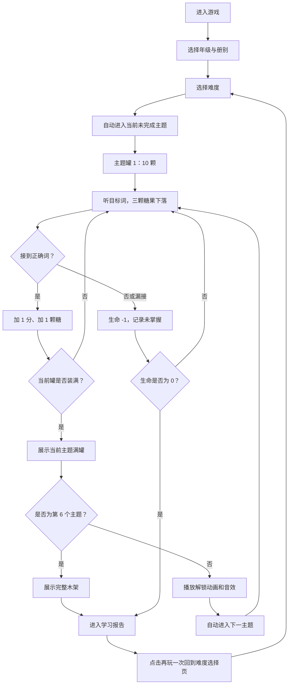

# 《糖果罐游戏》学习游戏 PRD

> 版本：2026-08-11。本文以当前游戏实现为准。

## 学习目标

玩家听辨英语单词音频，并在三个下落糖果显示的英文词形中，移动糖果罐接住正确答案。游戏训练单词发音与书面词形的对应识别，不考查中文释义、拼写输入或口语评分。

所选年级/册别的词库来自 `play.js`（1–3 年级）或 `grade_words.js`（4–9 年级），对应音频存放于 `grade_audio/`。

## 开局与收集规则

- 开局分两步：
  1. 使用联动滚轴选择年级和册别；1–3 年级仅显示“1–3年级”和“全册”。
  2. 使用按钮选择简单、中等或困难并开始游戏。
- 六个主题按固定顺序自动解锁并挑战：蜜糖软糖、薄荷糖、可可夹心、彩虹果冻、西瓜泡泡、葡萄软糖。初始从第一个未完成主题开始；一个主题只收集一个罐子，收满当前主题罐后先展示当前罐子，再播放下一个主题的解锁动画并自动进入下一个主题。
- 每个册别从 `assets/photo` 的 10 个罐子素材中随机分配 6 个不同罐子，保证同一册别内不重复；木架始终显示六个主题的空罐、锁定罐或已完成满罐。
- `assets/photo` 中的糖果素材按 `candy1.png` 到 `candy15.png` 加载。初始开放 3 种糖果；每首次通过一个此前未通过的主题，新增 3 种糖果。重复通过已完成主题不会继续解锁新糖果。
- 主题容量按固定顺序为：10、14、18、22、26、30 颗糖果。
- 前 5 个主题收满后播放满罐展示动画，随后播放下一个主题的解锁动画与 `assets/yinxiao/unlock.mp3`，并自动进入下一个主题；第 6 个主题收满后才展示完整木架，再进入学习报告。终局报告中的“再玩一次”返回难度选择页。

## 单题与难度

1. 进入新罐时，空罐先入场，再生成第一题。
2. 每题播放一个目标单词音频；约 0.24 秒后生成三颗糖果：1 个目标词和 2 个不同干扰词。
3. 玩家可使用鼠标移动、点击画布或触摸拖动，让糖果罐水平跟随。
4. 接住目标词：得 1 分、记为“已掌握”，并向当前罐加入 1 颗糖。
5. 接住干扰词或三颗糖果全部落出画面：记为“未掌握”、生命减 1，并进入下一题。
6. 初始生命为 5。生命耗尽时直接进入学习报告。
7. 难度影响下落速度曲线；简单、中等、困难的最高速度倍率分别为 1.45、1.75、约 2.135。第 1 个主题理论最慢下落速度为 170px/s，后续主题每个递增 18px/s；全游戏理论最快下落速度不超过 615px/s。
8. 没有关卡、每关题数或倒计时限制；题目持续出现，直至收满当前主题罐或生命耗尽。

## 界面与报告

- HUD 显示生命、学习报告入口、当前主题对应的罐编号（`x/6`）、当前糖果数/本罐容量和分数；右侧木架始终显示六个主题罐的收藏与解锁进度，未解锁罐子显示锁定效果。
- 仅 `playing` 状态响应糖果罐移动；罐子入场、满罐仪式、收藏展示和报告期间均锁定玩法输入。
- 学习报告显示“已掌握”和“未掌握”列表；列表为空时直接显示“无”。局中打开报告可继续挑战；终局报告只提供“再玩一次”，返回难度选择页。
- 报告会自动播报：有未掌握词时播放 `1_1.mp3`、前 3 个未掌握词音频、`1_2.mp3`；没有未掌握词时仅播放 `2.mp3`。

## 验收要点

1. 进入开局后依次显示“年级与册别”“难度”两步；不再显示主题选择页。
2. 开始后 HUD 显示当前主题的罐编号与容量；每个主题对应一个收集罐，容量按 10、14、18、22、26、30 逐级递增。
3. 连续正确达到当前主题罐容量后，当前罐进入收藏进度；前 5 个主题会先展示当前罐子，再播放下一个主题的解锁动画与 `assets/yinxiao/unlock.mp3`，然后自动进入下一主题，不展示主题选择页。
4. 第 6 个主题收满后展示完整木架，再进入学习报告。
5. 点击“再玩一次”回到难度选择页，再次开始时自动进入当前未完成主题。
6. 糖果种类初始为 3 种；首次通过一个未通过主题后增加 3 种，最多使用 15 种；重复通过已完成主题不增加糖果种类。
7. 罐内和陈列架中的糖果须分层铺放，小罐中不得出现大块糖果遮挡罐体的情况。
8. 接错或漏接只扣 1 点生命、只推进一次题目；第 5 次失误后进入报告且不生成新题。
9. 局中报告关闭后，恢复原题、原下落位置和原罐子进度；重新开始会清空分数、生命、题序、当前局报告数据，但保留该册别已完成主题、解锁进度与糖果种类解锁数。
