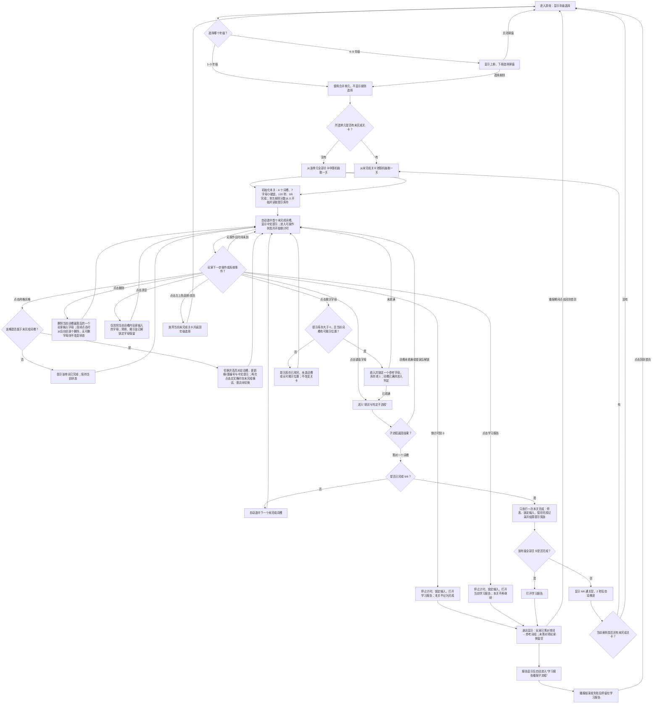
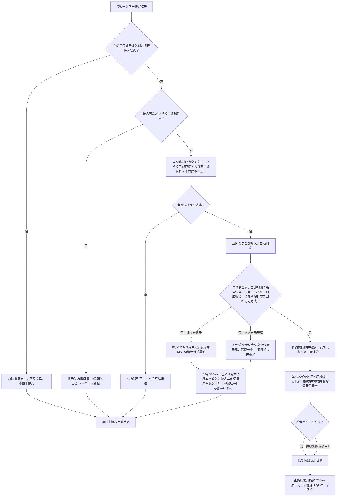
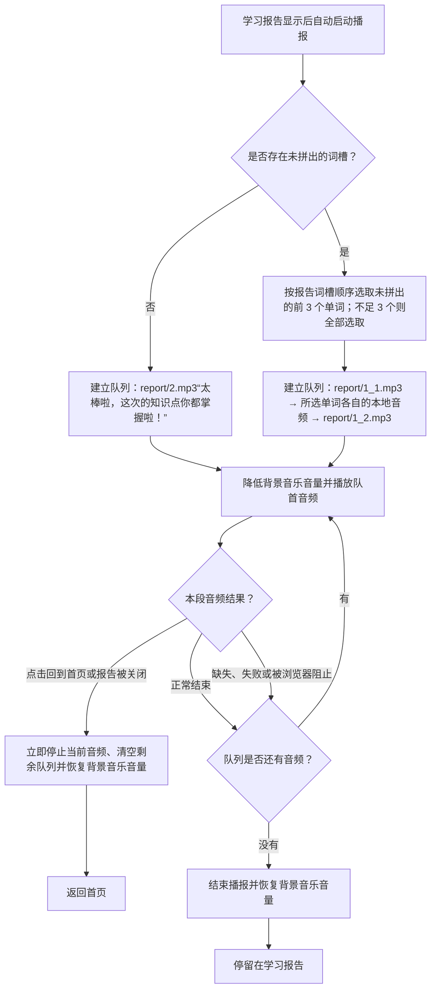

# 《Word Bloom · 词花纵横》游戏 PRD

## 学习目标

- 让学生根据中文提示和交叉字母，从七字母小键盘中按顺序选择字母，完成英语单词拼写。
- 训练字母顺序、单词长度、交叉位置约束及词义提取能力；同一字母允许重复使用。
- 单词答对后播放对应发音，在拼写完成后强化词形与读音的联系；音频不可用时不影响继续游戏。
- 学习范围覆盖 1–9 年级词库：1–3 年级合并为一个学习单元，不分册；4–9 年级分上、下册。
- 当前内容规模为 144 关、每关 6 个横/竖词槽，共 864 个词槽；词库含 2,831 条分册记录、1,931 个不重复单词。完整词表、释义、提示与发音以同目录的 `word-data.js`、`word-meanings.js`、`word-clues.js` 为准，关卡分布以 `level-data.js` 为准。

## 玩法流程图

### 主流程

### 填词与判定子流程

### 学习报告播报子流程

## 游戏 PRD

### 1. 游戏概述

- **游戏名称：** Word Bloom · 词花纵横。
- **一句话玩法：** 点击右侧七字母小键盘，把字母直接填入左侧纵横网格的当前词槽，完成一组互相交叉的英语单词。
- **核心成功条件：** 在 120 秒内完成本关全部 6 个词槽。
- **主要设备：** 平板浏览器，优先适配触控与横屏；同时支持竖屏、手机和桌面窗口自适应。

### 2. 学习内容配置

#### 2.1 关卡分布

| 学习单元 | 关卡数 |
| --- | ---: |
| 1–3 年级（合并、不分册） | 22 |
| 四年级上册 / 下册 | 14 / 18 |
| 五年级上册 / 下册 | 21 / 6 |
| 六年级上册 / 下册 | 20 / 5 |
| 七年级上册 / 下册 | 10 / 7 |
| 八年级上册 / 下册 | 6 / 3 |
| 九年级上册 / 下册 | 8 / 4 |
| **合计** | **144** |

#### 2.2 单关内容

- 每关固定包含 6 个互相交叉的横词或竖词槽，以及一个共享的七字母小键盘；其中 1 个蓝色按键表示所有答案必含的中心字母。
- 一关内的所有参考答案只能使用该键盘中的字母，并且都必须包含蓝色必选字母；同一字母按键可重复使用。
- 每个词槽至少配置：编号、方向、长度、网格坐标、参考答案和中文提示。词条可另含中文释义、所属年级/册别及本地发音。
- 中文提示优先使用词条提示；缺失时使用“这是一个由 N 个字母组成的单词。”作为兜底。
- 玩家答案不必与参考答案完全相同；满足词盘、中心字母、词长、词库及交叉可完成性约束的其他单词也可接受。学习报告保留玩家答案与参考词组的对照。
- 答案优先按当前年级/册别词库分类；主词库中存在的跨年级有效词可作为可接受答案，并在正确提示中显示其词库分类。

#### 2.3 关卡生成与复用

- 每个册别应在可组成合法七字母共享词盘和交叉网格的前提下，尽可能生成更多关卡，不设置人为的固定上限。
- 同一册内优先使用尚未出现的单词；只有剩余新词不足以组成完整的 6 词关卡时，才允许在该册最后一关少量复用。
- 除上述收尾关外，同册不同关卡不得主动复用单词；不同册别按各自内容池独立计算。
- 七个字母按键在每次进入关卡时打乱显示顺序；蓝色必选字母随其他按键一起排列，打乱不改变本关可用字母及参考词组。

### 3. 页面与关键元素

#### 3.1 年级与册别选择

- 首页只显示年级入口。1–3 年级共用一个入口，点击后直接开始；4–9 年级点击后弹出上册、下册选择。
- 进入学习单元时优先随机抽取未完成关卡；若该单元已经全部完成，则可从该单元全部关卡随机抽取。
- 已完成的年级或册别显示完成状态，但不增设独立的“重玩”按钮。

#### 3.2 游戏界面

- 顶部显示品牌/首页入口、学习报告、揭示字母剩余次数、当前运行累计分和本关剩余秒数。
- 横屏游戏区按 **网格 60%：词盘 40%** 左右排列，两区上下边缘对齐。词盘区贴近可用区域右侧，不能人为保留明显空白。
- 两个区域均保留低对比但可辨认的边界，边框强度和视觉重量相近；不能让词盘区边界过重或完全消失。
- 竖屏或宽度小于 700px 时改为提示、网格、词盘上下排列；所有区域随视口宽高缩放，不产生关键内容遮挡或横向溢出。
- 网格若原始行数大于列数，显示时转置 90°，让长边保持水平方向；横/竖标签随显示方向同步转换。
- 左侧只呈现网格、活动词槽高亮和当前词槽提示；右侧呈现七个独立字母按键及“删除”“清空”。正常游戏中不显示连线轨迹、不显示正在拼写的完整单词，也不显示已解单词列表。
- 字母键按 3+4 两行居中排列，使用适合平板触控的矩形圆角按键；必选字母持续显示为蓝色，其余按键平时为白色。界面不提供圆盘和旋转交互。
- 当前活动格和字母按键按下瞬间的反馈使用蓝色系；非必选字母在反馈结束后立即恢复白色，红色只保留给真正的错误反馈。

#### 3.3 学习报告与通关层

- 学习报告按词槽顺序展示“玩家拼出的单词 → 参考词组”；未答对词槽的玩家答案留空。
- 手动打开报告或超时都会结束当前关卡、停止倒计时并锁定输入；报告只提供“回到首页”，不提供返回本关继续作答。
- 学习报告显示后自动开始播报，不显示播报按钮。有未拼出单词时，依次播放 `report/1_1.mp3`、按报告顺序排列的未拼出单词前 3 个的对应单词音频、`report/1_2.mp3`；不足 3 个时全部播放。
- 没有未拼出单词时，自动播报 `report/2.mp3`。点击“回到首页”或报告被关闭时，立即停止当前音频、取消剩余队列并恢复背景音乐音量。
- 普通通关层显示“全部拼对了”和 `6 / 6`，停留 2 秒后自动推进。

### 4. 核心玩法

1. 进入关卡后自动选中编号最前的未完成词槽，并显示其横/竖编号及中文提示。
2. 点击普通网格格子会选中它所属的未完成词槽；在同一交叉格上再次点击，会在该格关联的未完成横词与竖词之间切换。
3. 点击小键盘任一字母，包括蓝色必选字母，都会把该字母直接写入当前活动格并前移到下一个可编辑空格；同一按键可重复点击使用。
4. 点击已有的可编辑格后再点字母，可直接覆盖该格。预填字母、揭示字母和已答对词槽产生的交叉字母不可覆盖。
5. 当前词槽填满后自动提交，不另设提交按钮。判定期间锁定所有输入。
6. 遇到其他已完成单词提供的交叉字母时，该格始终视为已经填写，输入焦点自动跳到下一个空格。此后每次字母点击只写入当前可编辑格并前移一次，不得吞掉点击、回头覆盖前一格或自动重新排列输入。
7. 有效答案必须同时满足：词长匹配、只由本关键盘字母组成、包含蓝色必选字母、被词库收录、与已锁定交叉字母一致，并且填入后剩余网格仍至少存在一种合法完成方案。
8. 答对后锁定该词槽及其交叉字母；答错反馈结束后自动清除当前词槽本次输入，并恢复其他未完成单词原先写在交叉格中的字母。
9. 点击“删除”只移除当前词槽最靠后的一个本词槽输入字母；连续点击时按词槽顺序从后向前逐个删除。没有可删除字母时不改变状态。
10. 点击“清空”一次移除当前词槽内全部本词槽输入；“删除”和“清空”均不得移除其他词槽输入、预填、揭示或已答对交叉字母。

### 5. 轮次与进度

- **单关时限：** 120 秒，从关卡可操作时开始倒计时；选择词槽、错误反馈及正确发音期间均不暂停。
- **单关进度：** 以已完成词槽数计算，目标为 6/6；已答对词槽通过绿色锁定状态直接呈现在网格中。
- **计分：** 每个首次答对并锁定的词槽 +1 分；答错不加分、不扣分。同一册自动进入下一关时累计分保留；返回首页、切换年级/册别或刷新页面后必须归零。
- **重试：** 在时间未到前不限次数；不显示尝试次数，也不因答错更换词槽或题目。
- **提示：** 初始拥有 1 次“揭示字母”。每使用一次，在当前词槽填入并锁定一个参考字母，库存减 1；每完成 2 关奖励 1 次。可用本地保存时，关卡完成状态与提示库存写入本地记录。
- **普通推进：** 答对一个非最终词槽后，自动选择编号最前的下一个未完成词槽。
- **册内推进：** 通关后若当前册仍有未完成关卡，2 秒后随机进入其中一关；当前册已完成但整个年级尚未完成时，返回年级选择。
- **年级完成：** 1–3 年级的 22 关全部完成，或某个 4–9 年级的上、下册全部完成时，直接打开学习报告。

### 6. 反馈与操作限制

#### 6.1 正确反馈

- 词槽变绿并锁定，Score +1。
- 轻提示显示玩家答出的英文大写单词及“本年级词库”或“全部词库”分类。
- 若存在本地发音，则播放该单词发音并暂时降低背景音乐音量；播放结束、失败或被新音频打断后都要恢复背景音乐音量。
- 正确反馈启动约 250ms 后推进；发音不得阻塞词槽推进和后续操作。

#### 6.2 错误反馈

- 词库未收录时显示“你的词库中没有这个单词”。
- 单词本身有效但会使交叉网格无合法完成方案时，显示“这个单词会使交叉位置无解，请换一个”。
- 两类错误均让当前词槽显示错误状态并触发网格震动；输入锁定 340ms 后恢复。
- 错误反馈结束后自动清除当前词槽本次输入并停留在同一词槽；其他词槽已有字母、预填、揭示和已锁定交叉字母必须保留。

#### 6.3 无效及连续操作

- 未选中可编辑词槽时点击字母，显示“请先选择一个单词”，不写入任何格子。
- 点击只属于已完成词槽的格子，提示该单词已完成，不改变当前活动词槽。
- 提示库存为 0、当前无词槽或无可揭示位置时，只显示对应提示，不消耗库存。
- 判定、错误反馈、完成结算或报告打开期间，所有字母点击、删除、清空、揭示和重复提交均被忽略，确保一个词槽只结算一次、整关只完成一次。
- 发音缺失、自动播放受限或播放报错时，不显示阻断弹窗，不影响计分、推进和完成。
- 报告播报中的单段音频缺失、失败或被浏览器阻止时，跳过该段并继续队列；播报结束或中止时必须恢复背景音乐音量，不能重复启动多个播报队列。

### 7. 完成

- 当第 6 个词槽首次判定正确时触发本关完成；立即停止倒计时、锁定输入、关闭词盘操作并保存本关 6 个玩家答案。
- 结算提示奖励：每完成第 2、4、6……关时“揭示字母”库存 +1；其他关提示距离下次奖励还差 1 关。
- 若整个年级已经完成，显示学习报告；否则先显示 6/6 通关层，再按主流程进入同册下一未完成关或返回首页。
- 超时、手动打开学习报告或点击首页都不视为通关，不发放通关奖励。
- 游戏不提供局中重新开始按钮，也不在通关层或学习报告中增加显式重玩入口。

### 8. 验收要点

1. 在平板横屏进入任意关卡，网格与字母键盘按 6:4 左右对齐显示；键盘位于右侧并利用可用空间。旋转设备或调整窗口后布局立即重排，网格和控件保持完整可点。
2. 1–3 年级点击后直接开局；4–9 年级必须先选择上、下册，关闭册别弹窗后回到年级选择。
3. 每关显示 6 个交叉词槽和 7 个词盘字母；网格纵向长于横向时自动转置，提示中的横/竖方向与屏幕显示一致。
4. 七个独立按键按 3+4 居中排列；轻点可连续填词，同一字母可重复使用。界面不出现圆盘、旋转、连线轨迹、候选拼写串或已解单词列表。
5. 填满词槽后只触发一次判定。快速连点或反馈期间继续点按不会产生额外字母、重复加分或跳过词槽。
6. 合法答案变绿、锁定、加 1 分并播放可用发音；发音失败不阻塞。非最终词槽完成后自动进入下一未完成词槽。
7. 对含已有交叉字母的词，确认焦点会自动越过锁定格；随后连续点击两个不同字母时，第一个字母保留在当前格，第二个字母必须出现在后一个格，不能回头覆盖第一个字母。
8. 无效单词与交叉无解单词显示不同提示，震动 340ms 后自动清空当前词槽本次输入并解锁；其他词槽原有交叉字母保持不变。
9. “删除”连续点击时从当前词槽最后一个本词槽输入字母开始向前逐个移除；“清空”一次移除当前词槽全部本词槽输入。两者均不影响锁定字母或其他词槽输入。
10. 当前格和键盘按下瞬间的反馈均为蓝色；必选字母持续为蓝色，其他字母反馈结束后恢复白色，只有错误词槽使用红色。返回首页或刷新后 Score 为 0，同册自动续关时 Score 保留。
11. “揭示字母”只在成功揭示时扣 1 次并锁定该字母；每完成两关只奖励一次提示。
12. 120 秒无输入或未完成时，倒计时到 0 后只打开一次学习报告并禁止继续填写；“回到首页”返回年级选择。
13. 第 6 个词槽答对后只结算一次并显示 6/6；有同册未完成关时 2 秒后进入下一关，无同册未完成关时按年级完成状态进入报告或首页。
14. 学习报告逐项正确显示玩家已接受答案与参考词组，未完成项玩家侧为空；报告中不存在继续本关或重玩按钮。
15. 报告打开后无需点击即自动播报；有未完成项时，队列严格为 `1_1.mp3 → 前 3 个未拼出单词的对应音频 → 1_2.mp3`，未完成项少于 3 个时全部播报，全部完成时只播放 `2.mp3`。关闭报告停止、单段失败跳过均不得产生重叠音频，结束后恢复背景音乐；界面不得出现播报按钮。
16. 关卡数据检查应满足：同册新词优先，只有该册最后一关可因新词不足而复用；所有参考答案均能由本关七字母键盘组成并包含蓝色必选字母。
