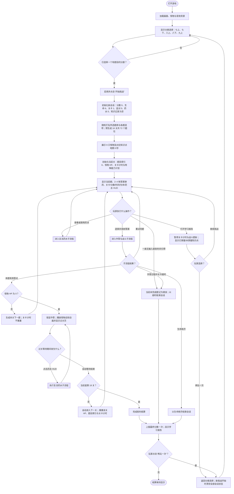
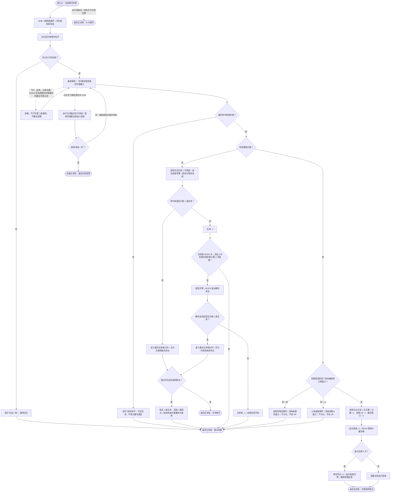
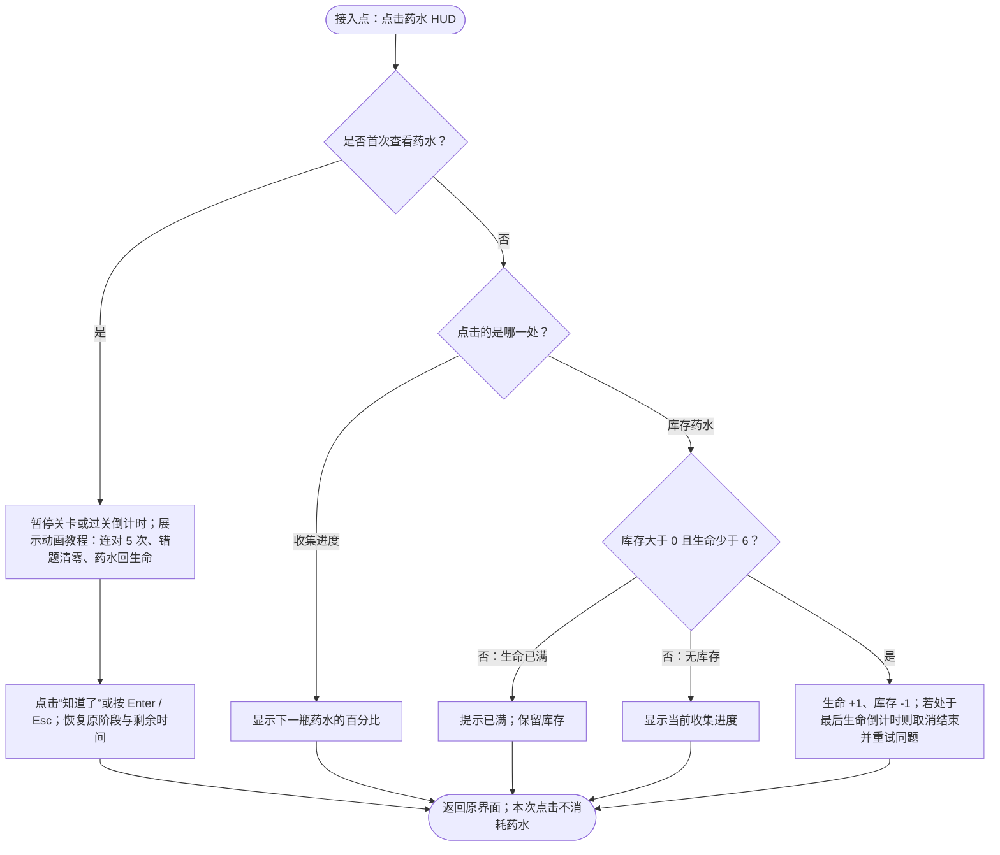

# 《语法猎魔人》游戏 PRD

> 文档类型：现状规则 PRD  
> 对应游戏版本：1.5.0  
> 更新日期：2026-08-06  
> 规则来源：现有游戏界面、运行逻辑与题库；下方玩法流程图为规则冲突时的判定依据。

## 1. 学习目标

玩家从所选初中英语分册的语法选择题中，阅读英文句子或对话，判断空缺处应使用的单词、短语或词形，并从 2–4 个候选答案中选择唯一正确答案。

具体学习内容如下：

| 分册 | 题量 | 本游戏覆盖的语法内容 |
| --- | ---: | --- |
| 七年级上册 | 62 | `there be句型be动词的选用`；`there be的句型结构`；`wh-特殊疑问句`；`一般将来时`；`一般现在时的用法`；`一般过去时的用法`；`人称代词`；`名词性物主代词`；`含be动词的一般现在时结构`；`含实义动词的一般现在时结构`；`含实义动词的一般过去时结构`；`形容词性物主代词`；`形容词的功能`；`形物代和名物代的辨析`；`条件状语从句`；`频度副词` |
| 七年级下册 | 84 | `few/a few/little/a little`；`how短语特殊疑问句`；`many/much`；`反身代词`；`否定祈使句`；`基础连词`；`定冠词`；`情态动词`；`感叹句`；`方位介词`；`方位介词表示在......上/下`；`方位介词表示在......前/后`；`方位介词表示在......旁/间`；`时间状语从句`；`现在进行时和一般现在时的辨析`；`现在进行时的句型结构`；`现在进行时的用法`；`肯定祈使句` |
| 八年级上册 | 56 | `have gone to/have been to/have been in`；`副词`；`副词与形容词`；`副词比较级最高级`；`基数词`；`复合不定代词`；`序数词`；`形容词副词同形`；`形容词副词的同级比较`；`形容词最高级的用法`；`形容词比较级的用法`；`条件状语从句`；`现在完成时句式变换`；`现在完成时表示过去持续的动作或状态`；`瞬间动词和持续动词的现在完成时` |
| 八年级下册 | 62 | `-ed/-ing结尾的形容词`；`It's+形容词+of/for sb. to do sth.`；`because, because of辨析`；`too + 形容词;(not +) 形容词 + enough`；`一般将来时的被动语态`；`一般现在时的被动语态`；`一般过去时的被动语态`；`不定式作宾语`；`不定式作状语`；`不定式作补语`；`动名词作主语`；`动名词作宾语`；`常⻅省略to的不定式`；`形容词的功能`；`情态动词`；`时间状语从句`；`疑问词+不定式`；`过去进行时的用法` |
| 九年级上册 | 77 | `how短语特殊疑问句`；`wh-特殊疑问句`；`what常考句型`；`一般疑问句`；`关系代词引导的定语从句`；`定语从句注意事项`；`感叹句`；`特殊疑问句`；`系动词`；`让步状语从句`；`语法-宾语从句的引导词`；`语法-宾语从句的时态`；`选择疑问句`；`陈述句` |

学习行为限定为“阅读理解 + 语法辨析 + 选择作答”。当前版本不考查听力辨音、口语输出或完整句子书写。

完整的 341 道题目文本、正确答案、干扰项和知识点标签以 `grammar_questions.js` 为唯一内容源；PRD 不改写或删减题目。九年级下册题库当前为空，因此开始界面不提供该分册。

## 2. 玩法流程图

### 2.1 主流程

### 2.2 作答与战斗子流程

### 2.3 复活药水子流程

## 3. 游戏 PRD

### 3.1 游戏概述

- 游戏名称：语法猎魔人。
- 一句话玩法：玩家把正确的语法答案当作弹药，用弹弓命中怪物，在关卡时限和生命耗尽前完成 18 关。
- 核心成功条件：在每一关的独立倒计时结束前，以正确答案对当前怪物造成足量有效伤害；完成第 18 关即胜利。
- 失败条件：任一关倒计时归零，或 6 条初始生命全部耗尽。

### 3.2 学习内容配置

每道题至少包含以下字段：

| 字段 | 必填 | 规则 |
| --- | --- | --- |
| `question` | 是 | 展示给玩家的英文句子或对话；可含空缺线及需要斜体展示的作品名 |
| `correctOption` | 是 | 唯一正确答案 |
| `wrongOptions` | 是 | 1–3 个干扰项；与正确答案合并后形成 2–4 个选项 |
| `knowledgePoint` | 是 | 用于怪物地图和学习报告的语法知识点标签 |

内容分配规则：

1. 玩家选择分册后，仅使用该分册题库。
2. 新会话先随机打乱题库，再为 18 关预生成 72 个题位；每道题的答案选项也独立打乱。
3. 题库不足 72 题时，取完一轮后重新打乱并继续取题，因此七上、八上、八下会在一次完整通关中出现重复题；七下与九上在一次完整通关中不重复。
4. 每一题在本次会话内保留固定选项顺序；错误、未命中或元素能力拦截后重试同题，不重新随机选项。
5. 9 只怪物各对应连续两关；知识地图展示这两关已预生成题目的去重知识点标签。

### 3.3 页面与关键元素

#### 开始界面

- 显示有题目的分册按钮：七上、七下、八上、八下、九上。
- 未选分册时，主按钮禁用并显示“选择年级”；选择后变为可用的“开始挑战”。
- 显示简要操作提示：选择答案弹药、向左后方拖动、松手发射。

#### 怪物知识地图

- 开始挑战后展示 9 只怪物及其对应知识点。
- 地图自动横向巡览并在 6 秒后进入第一关；当前版本没有跳过入口。

#### 战斗界面

- 题目区：当前英文题干。
- 答案区：2–4 枚答案弹药。
- 战斗区：弹弓、轨迹、护盾、怪物、血条与命中特效。
- HUD：学习报告、药水进度、药水库存、关卡 `Level x/18`、怪物/BOSS 状态、分数、剩余秒数、6 格生命。
- 第一关持续显示两步操作说明；瞬时反馈以文本、动画和音效共同呈现。

#### 学习报告

- 战斗中点击“学习报告”时暂停计时和战斗更新。
- “未掌握知识点”：该知识点在本会话出现过任意错误，或没有正确记录。
- “已掌握知识点”：该知识点至少答对 1 次且从未出现错误。
- 预览报告提供“继续挑战”和“再玩一次”；结算报告仅提供“再玩一次”。

### 3.4 核心玩法规则

1. 玩家点击一枚答案弹药完成装填，可在发射前换选另一枚。
2. 玩家必须向弹弓左后方拉动达到最小拉力后松手；拉力或方向不足时只提示并归位，不结算答案。
3. 发射后，只有命中怪物护盾才判断答案；飞出场外视为未命中，同题重试且不扣生命。
4. 错误答案命中时，该知识点错误数 +1、连对进度清零、生命 -1；题目、分数和怪物 HP 不变。
5. 正确答案只有在未被本题元素能力拦截时才有效：知识点正确数 +1、分数 +1、怪物 HP -1，并推进到下一题或过关。
6. 分数无负分，理论最高分为 72。
7. 游戏不提供主动跳题；当前题必须有效答对，或由超时/生命耗尽结束会话。

### 3.5 关卡、计时与特殊规则

| 关卡 | 所需有效答对数 | 血条阶段 | 关卡时间 | 特殊规则 |
| --- | ---: | ---: | ---: | --- |
| 1–5 | 每关 3 | 1 | 每关 60 秒 | 普通关 |
| 6 | 6 | 2 | 120 秒 | BOSS；每 3 次错弹触发额外攻击 |
| 7–11 | 每关 3 | 1 | 每关 60 秒 | 每关随机 1 题触发一次风能力 |
| 12 | 9 | 3 | 180 秒 | BOSS + 随机 1 题风能力 |
| 13–17 | 每关 3 | 1 | 每关 60 秒 | 每关随机 1 题触发一次火能力 |
| 18 | 12 | 4 | 240 秒 | BOSS；两个不同题位分别触发风、火能力，顺序随机 |

- 普通怪物每 2 关更换一次，共 9 只怪物。
- 每关拥有独立计时；进入下一关时重置为该关完整时长。
- 发射、反馈、怪物动画和普通重试不会重置计时。
- 打开学习报告或首次药水教程时暂停计时，关闭后按进入前剩余时间继续。
- 每击破 3 点 BOSS HP 切换一段血条颜色。
- BOSS 错弹计数在造成一次有效伤害后归零。第 3 次错弹除本次错误本身扣 1 条生命外，还触发一次额外攻击并再扣 1 条生命；若已进入最后生命保护流程，则转入可用药水挽救的倒计时。
- 风/火能力只拦截安排题位的第一次正确命中；触发后能力被消耗，保持同题重试，且该次不计分、不扣 HP、不写入正确记录。

### 3.6 生命与复活药水

- 新会话初始生命为 6，生命跨关保留，普通过关不自动恢复。
- 每次有效答对使连对进度 +1；累计 5 次后获得 1 瓶库存药水，并将连对进度归零。
- 错误答案命中使连对进度立即归零；未命中、无效拖拽和元素能力拦截不改变连对进度。
- 药水库存跨关保留且可累积；生命未满时，每瓶恢复 1 条生命。
- 生命已满时点击库存药水只提示并保留药水。
- 当错误或 BOSS 攻击威胁最后一条生命时，游戏先播放结束前反馈；玩家可在最终结束触发前使用库存药水，取消结束并重试同题。

### 3.7 反馈、音频与输入限制

| 情况 | 视觉/文字反馈 | 声音反馈 | 状态变化与下一步 |
| --- | --- | --- | --- |
| 装填答案 | 弹药移至弹弓，提示向后拉动 | 选择音 | 等待拖拽 |
| 拖拽不足 | 提示拉远，弹药归位 | 无强制音效 | 同题、同选项重试 |
| 未命中 | 弹道飞出，提示重新瞄准 | 发射音 | 不扣生命，同题重试 |
| 错误命中 | 护盾反弹、怪物怒吼、错误文字 | 反弹、怒吼、错误音 | 记录错误、清空连对、扣生命，同题重试或结束 |
| 正确命中 | 护盾破碎、怪物受伤、粒子效果 | 命中、怪物受伤、正确音 | 分数与进度 +1，进入下一题或过关 |
| 风/火拦截 | 龙卷风吹回或弹药化灰 | 风声或火焰声 | 不结算答案，同题重试 |
| BOSS 第 3 次错弹 | 警告、怒吼与攻击动画 | 怒吼、错误音 | 额外扣生命后同题重试或结束 |
| 连对 5 次 | 药水点亮、库存数量更新 | 奖励音 | 药水 +1，连对归零 |
| 过关 | 怪物消散、STAGE CLEAR 或 BOSS 警告 | 命中/受伤音 | 自动进入下一关；最终关进入结算 |

输入规则：

- 弹药飞行、反弹、元素能力、BOSS 攻击、怪物退场和题目切换期间，新的作答输入被忽略，避免双发、双结算和双推进。
- 过关页忽略作答输入，但仍允许查看药水状态或使用库存药水。
- 战斗中的学习报告和可用药水属于 HUD 操作，可中断当前交互；报告/教程关闭后恢复原题及剩余时间，不创建第二次结算。
- 音频加载失败或浏览器阻止自动播放时，不阻塞进入游戏或任何状态推进；后续用户交互可再次尝试播放背景音乐。
- 鼠标与触屏执行同一套选择、拖拽和松手规则。

### 3.8 完成、结算与重玩

- 胜利：第 18 关怪物 HP 降至 0，过关展示结束后触发一次胜利结算。
- 超时：任一关剩余时间降至 0，当前尚未完成的题记为错误并立即结束。
- 生命耗尽：最后生命保护流程结束且未用药水挽救时结束。
- 每个会话只上报一次最终分数；网络上报失败不影响本地结算页。
- 结算显示所选分册、已掌握与未掌握知识点，并提供“再玩一次”。
- “再玩一次”先返回分册选择。再次开始挑战时，分数、生命、关卡、题目分配、计时、连对、药水、BOSS 状态、知识记录和结算标记全部重新初始化。

### 3.9 验收要点

1. 未选分册时不能开始；选择任一有题分册后，能经 6 秒知识地图进入第一道可操作题。
2. 正确答案命中且未被能力拦截时，只增加 1 分、只扣 1 HP、只推进 1 题；快速重复点击不能造成双结算。
3. 错误答案命中后扣 1 条生命、连对归零、知识点记错，并以相同题目和相同选项顺序重试。
4. 弹药未命中或拖拽不足时不扣生命、不换题、不改分数。
5. 第 7–12 关的风能力、第 13–17 关的火能力及第 18 关的两种能力，均只拦截对应题位第一次正确命中；重试正确后能正常造成伤害。
6. BOSS 自上次有效伤害后第 3 次错误命中会额外攻击；一次有效伤害后错弹计数清零。
7. 连对 5 次恰好增加 1 瓶药水并把连对进度归零；任意错误命中立即清零进度。
8. 生命不满时药水恢复 1 条且库存 -1；生命已满时库存不变；最后生命倒计时中使用药水能取消结束并返回同题。
9. 普通关第 3 次有效答对进入下一关；第 6、12、18 关分别在第 6、9、12 次有效答对后过关，不应提前或重复推进。
10. 任一关超时均只完成一次结算；无输入也能通过超时路径到达结算。
11. 第 18 关完成后只触发一次胜利结算，不再生成第 19 关。
12. 学习报告和首次药水教程期间计时暂停；关闭后题目、生命、分数、药水与剩余时间保持一致。
13. 结算页保持终态直到玩家点击“再玩一次”；点击后返回分册选择，新会话不继承上局任何状态。
14. 背景或效果音不可播放时，加载、答题、过关和结算流程仍可完整执行。
