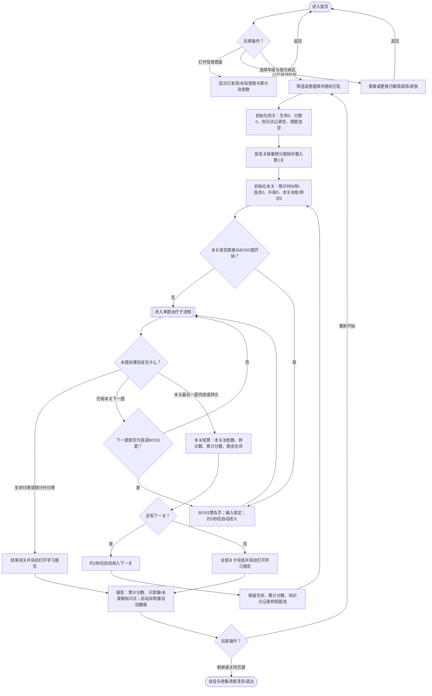
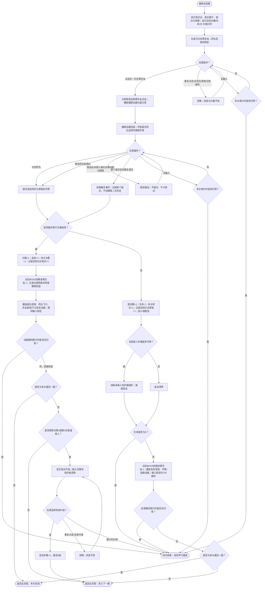
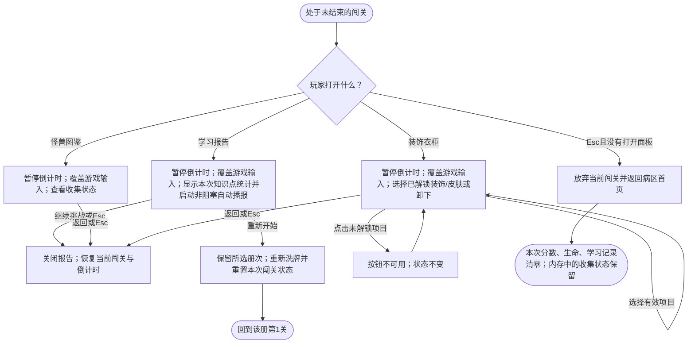
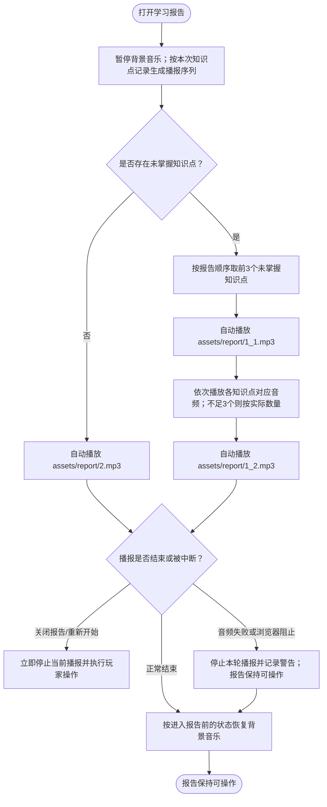

# 《语法怪兽医院》学习游戏 PRD

## 1. 学习目标

玩家在限定时间与生命值内完成初中英语语法单项选择题：阅读英文句子或对话，根据题目所属知识点判断空缺或整句中的正确语法形式，并从英文选项中选出答案。游戏训练的是语法辨析与阅读判断，不要求口语、听力或拼写输入。

覆盖七年级上册、七年级下册、八年级上册、八年级下册、九年级上册，共 496 道题、102 个“册次内知识点”配置项。每道题保留原题干、英文选项、正确选项与知识点标签；完整题目文本以 `src/game/content/questions.json` 为内容源。

具体学习维度如下：

- 七年级：特殊疑问句，一般现在时、一般过去时与一般将来时，there be 句型，代词与物主代词，形容词、频度副词，祈使句、感叹句、现在进行时，情态动词，冠词、连词、方位介词，条件与时间状语从句，以及数量词辨析。
- 八年级：不定代词，基数词与序数词，形容词/副词的比较等级，现在完成时，条件状语从句，过去进行时，动名词与不定式，被动语态，情态动词及原因表达辨析。
- 九年级上册：一般疑问句、选择疑问句、特殊疑问句、陈述句、感叹句、系动词，让步状语从句、定语从句和宾语从句。

## 2. 玩法流程图

以下流程图是玩法规则的源文件；后续 PRD 与其不一致时，以流程图为准。

### 2.1 主流程：从选病区到本次闯关结束

### 2.2 单题治疗子流程

### 2.3 局中面板与中断恢复子流程

### 2.4 学习报告自动播报子流程

报告播报是非阻塞反馈：播报期间不锁定报告按钮；背景音乐或报告音频被浏览器阻止、播放失败或中断时，不得卡住输入、计时恢复或后续流程。

## 3. 游戏 PRD

### 3.1 游戏概述

- 游戏名称：《语法怪兽医院》。
- 一句话玩法：选择年级册次，找到怪兽身上的语法寄生虫，再点击或拖入正确英文药丸，在 5 颗爱心与每关 90 秒限制内完成整册语法闯关。
- 核心成功条件：处理完所选册次分配到各关的全部题目；答错题允许转诊并继续，生命归零或任一关倒计时归零则提前结束。

### 3.2 学习内容配置

#### 3.2.1 题库分布

| 病区 | 题量 | 知识点数 | 关数 | 各关初始题量 |
|---|---:|---:|---:|---|
| 七年级上册 | 83 | 18 | 13 | 6×5关，7×5关，8×2关，末关初始2题 |
| 七年级下册 | 113 | 25 | 16 | 6×5关，7×5关，8×6关 |
| 八年级上册 | 96 | 19 | 14 | 6×5关，7×5关，8×3关，末关初始7题 |
| 八年级下册 | 83 | 22 | 13 | 6×5关，7×5关，8×2关，末关初始2题 |
| 九年级上册 | 121 | 18 | 17 | 6×5关，7×5关，8×5关，第16关9题，末关初始7题 |

“初始题量”指开局洗牌后首次分配的题量。最后一关容量有空缺时，系统从此前答错且未在末关出现的题中随机补题；没有足够错题时，末关保持缩短状态。

#### 3.2.2 精确知识点清单

- 七年级上册（83题）：if引导条件状语从句(7)、there be的句型结构(2)、there be句型be动词的选⽤(7)、wh-特殊疑问句(7)、含be动词的一般过去时结构(3)、含be动词的一般现在时结构(4)、含实义动词的一般过去时结构(6)、含实义动词的一般现在时结构(3)、名词性物主代词(3)、频度副词(6)、形容词的功能(2)、形容词性物主代词(5)、形物代和名物代的辨析(3)、一般过去时的⽤法(3)、一般将来时be going to(6)、一般将来时will(9)、一般现在时的⽤法(2)、⼈称代词(5)。
- 七年级下册（113题）：as soon as引导时间状语从句(8)、few/a few/little/a little(5)、how短语特殊疑问句(2)、How感叹句(3)、many/much(3)、until/till引导时间状语从句(2)、What感叹句(3)、when引导时间状语从句(4)、while/as引导时间状语从句(3)、定冠词(7)、反⾝代词(5)、否定祈使句(4)、基础连词(5)、肯定祈使句(6)、情态动词can(7)、情态动词may/might(1)、情态动词must和have to(9)、情态动词used to(5)、现在进⾏时的句型结构(6)、现在进⾏时的⽤法(7)、现在进⾏时和一般现在时的辨析(2)、⽅位介词in/on/under(3)、⽅位介词表⽰在……旁/间(6)、⽅位介词表⽰在……前/后(4)、⽅位介词表⽰在……上/下(3)。
- 八年级上册（96题）：have gone to/have been to/have been in(3)、if引导条件状语从句(11)、some/any(3)、unless引导条件状语从句(8)、复合不定代词(5)、副词(1)、副词与形容词(4)、副词⽐较级最⾼级(3)、基数词(8)、瞬间动词和持续动词的现在完成时(3)、现在完成时表⽰过去持续的动作或状态(5)、现在完成时表⽰过去对现在造成影响(2)、现在完成时句式变换(3)、现在完成时与一现、一过的辨析(5)、形容词副词的同级⽐较(7)、形容词副词同形(3)、形容词最⾼级的⽤法(7)、形容词⽐较级的⽤法(8)、序数词(7)。
- 八年级下册（83题）：because, because of辨析(3)、-ed/-ing结尾的形容词(4)、It's+形容词+of/for sb. to do sth.(3)、too + 形容词；(not +） 形容词 + enough(2)、when引导时间状语从句(4)、while/as引导时间状语从句(3)、被动语态概述(1)、不定式作宾语(4)、不定式作补语(4)、不定式作状语(2)、常⻅省略to的不定式(5)、动名词作宾语(11)、动名词作主语(2)、过去进⾏时的结构(1)、过去进⾏时的⽤法(6)、情态动词had better(3)、情态动词should(5)、形容词的功能(1)、一般过去时的被动语态(5)、一般将来时的被动语态(4)、一般现在时的被动语态(4)、疑问词+不定式(6)。
- 九年级上册（121题）：how短语特殊疑问句(17)、How感叹句(3)、how特殊疑问句(11)、what常考句型(5)、What感叹句(3)、wh-特殊疑问句(7)、宾语从句的否定前移(1)、陈述句(7)、定语从句注意事项(4)、关系代词that/which引导的定语从句(8)、关系代词who/whom引导的定语从句(3)、让步状语从句(7)、系动词(7)、选择疑问句(8)、一般疑问句(7)、语法-宾语从句的时态(9)、语法-宾语从句的引导词(8)、语法-宾语从句的语序(6)。

#### 3.2.3 单题数据字段

| 字段 | 规则 |
|---|---|
| id | 题目唯一标识；同一题在首次分配中只出现一次 |
| grade / term | 决定题目所属病区 |
| knowledge | 学习报告归类标签，必须原样保留 |
| stem | 英文题干；连续下划线表示病灶，若没有下划线则追加“整句待诊”病灶；`*作品名*`按斜体显示 |
| options | 仅显示英文选项文本，不向玩家显示内部 A/B/C/D 键 |
| correctOption | 仅供系统判定，不在作答前暴露 |

#### 3.2.4 学习报告音频配置

| 内容 | 资源与规则 |
|---|---|
| 未掌握开场 | `assets/report/1_1.mp3` |
| 未掌握知识点 | `assets/report_point` 目录中的对应 MP3（共 94 个）；文件与知识点的对应关系以该目录的 `知识点.txt` 为准 |
| 未掌握结尾 | `assets/report/1_2.mp3` |
| 全部掌握 | `assets/report/2.mp3` |

知识点标签匹配须兼容题库中的等价字形。存在多个未掌握知识点时，只播报报告顺序中的前 3 个；少于 3 个时按实际数量播报。

### 3.3 页面与关键元素

#### 首页

- 显示 5 个病区卡片；每张卡片展示册次、题数和关数，点击即开始。
- 提供怪兽图鉴与装饰衣柜入口；打开后不创建闯关。

#### 游戏界面

- 顶部固定显示当前关/总关、累计分数、剩余秒数、5 格生命，以及学习报告、图鉴、衣柜入口。
- 诊断卡显示知识点、题干、病灶、普通病人序号或 BOSS 阶段。
- 治疗区显示怪兽、寄生虫、阶段提示和药丸选项。未锁定寄生虫前药丸区不可作答。
- BOSS 阶段额外显示已清除/总寄生虫数。

#### 结算与报告

- 关卡结算显示本关治愈、转诊、累计分数、剩余生命；有下一关时 2 秒后自动前进。
- 自动结束报告显示累计分数、练习知识点数、已掌握和未掌握知识点，只提供“重新开始”。
- 手动打开报告时额外提供“继续挑战”；关闭后恢复当前游戏。
- 报告打开后直接自动播报，不显示“播放”按钮或知识点“待播报”标记。

### 3.4 核心玩法规则

1. 载入题目后，玩家先点击怪兽身上的任意一只可见寄生虫。首个点击发生后，全部寄生虫立即失去交互，直至捕获动画完成。
2. 捕获完成后显示全部英文药丸。玩家可直接点击药丸，或把药丸拖到题干病灶。拖动距离小于 12 像素按点击提交；超过该距离但未落入病灶则取消。
3. 系统用药丸的内部选项键与 `correctOption` 做一次判定。首次有效提交立即锁定输入；反馈阶段的重复提交不得再次判分、扣命或推进。
4. 答对：分数、连击、本关治愈数、对应知识点正确次数各加 1；更新收集进度；完成成功动画后再推进。
5. 答错：尝试数、本关转诊数、对应知识点错误次数各加 1，生命减 1，题目进入错题池；本题不重试，反馈后直接进入下一题。BOSS 题答错同样视为处理掉当前寄生虫。
6. 无独立“跳过”按钮。玩家无输入时保持当前题，直到本关倒计时归零。

### 3.5 关卡、BOSS、进度与升级

- 普通关容量 = 4 道普通题 + BOSS 题数；BOSS 题数为 `2 + floor((关卡号 - 1) / 5)`，即第 1–5 关 2 题、第 6–10 关 3 题、第 11–15 关 4 题，此后每 5 关增加 1 题。
- 实际 BOSS 题数不得超过本关实际题量。最后一关不足容量且错题补充不足时，普通病人可少于 4 位；当实际题量不超过 BOSS 题数时，本关直接从 BOSS 警告开始。
- 进入首道 BOSS 题前展示约 2 秒警告，随后自动开放寄生虫定位。每道 BOSS 题对应 1 只剩余寄生虫，答对或答错都会减少 1；只有最后一只被处理后才完全恢复怪兽外观。
- 每答对 1 题得 1 分。分数跨关累计；生命跨关保留；学习报告记录和错题池跨关保留。
- 每关倒计时从 90 秒开始，本关治愈/转诊数、连击、最高连击、升级状态均重置；升级不跨关。
- 玩家答对第 2 或第 4 位普通病人后，出现急诊升级。当前仅有“连击护盾”，每关最高 2 级；本病人首次答错时消耗保护效果，仅防止连击清零，不免除扣命或转诊。进入下一位病人后护盾可再次保护。

### 3.6 反馈、计时与操作限制

#### 正确反馈

- 播放成功音效；药丸飞向病灶，出现冲击波、黏液粒子、闪光与怪兽恢复动画。
- 连击达到 2 及以上时显示连续治疗提示。
- 治愈首次出现的怪兽或达到装饰/皮肤阈值时，右上角显示一次汇总解锁提示。

#### 错误反馈

- 播放失败音效；画面震动/闪光，寄生虫显示坏笑并逃跑；状态文案显示生命减 1 与转诊。
- 反馈约 720 毫秒，期间输入锁定。生命降至 0 时不等待转诊推进，直接结束并打开报告。

#### 计时与中断

- 倒计时在普通题、BOSS 警告、捕获/治疗反馈和升级选择期间均继续。
- 手动打开学习报告、怪兽图鉴或衣柜时暂停倒计时；关闭面板后继续。
- 倒计时在任一活动阶段归零都只触发一次闯关结束；随后到达的动画完成事件必须被忽略，不能二次推进。
- 音频是增强反馈，不参与判定。自动播放受限或音频中断时，动画、输入解锁与关卡推进仍须正常执行。
- 报告播报开始前暂停背景音乐；播报正常结束或失败后，仅在背景音乐进入报告前正在播放时恢复。关闭报告或重新开始会立即停止当前播报。

### 3.7 学习报告与完成规则

- 已掌握知识点：本次闯关中该标签至少答对 1 次，且错误次数为 0。
- 未掌握知识点：本次闯关中该标签错误次数大于 0；即使同标签也答对过，仍归入未掌握。
- 触发自动报告的条件：生命归零、任一关倒计时归零、全部关卡处理完成。
- 自动报告为本次闯关终态，不提供“继续挑战”；现有游戏明确提供“重新开始”，故保留重玩路径。
- 报告打开即自动播报。存在未掌握知识点时，顺序为 `1_1.mp3` → 前 3 个未掌握知识点对应音频 → `1_2.mp3`；全部掌握时只播放 `2.mp3`。
- “重新开始”沿用当前年级册次，重新洗牌并重置分数、生命、计时、连击、升级、知识点记录和错题池；图鉴、累计治愈数、已解锁装饰/皮肤及当前穿戴在同一页面会话内保留。
- 返回病区首页会放弃当前闯关并重置闯关数据，但同一页面会话内保留收集状态；刷新或关闭页面会清空全部状态。

### 3.8 收集与外观规则

- 怪兽随关卡逐步开放：第 1–2 关 2 种，此后每通过 2 关增加 1 种，第 15 关起最多 9 种。第 3、5、7、9、11、13、15 关新开放怪兽的出现权重为其他怪兽的 1.25 倍。
- 首次答对并治愈某种怪兽时将其收入图鉴。累计治愈按每道答对题增加 1，包括 BOSS 的每个阶段。
- 装饰解锁：3 次急诊勋章、8 次治愈王冠、14 次幸运星环；皮肤解锁：5 次薄荷、12 次落日、20 次星云。新解锁外观自动启用，之后可在衣柜更换、卸下或恢复原皮肤。
- 未解锁衣柜项不可点击；装饰与皮肤只改变医生头像，不改变怪兽与答题判定。

### 3.9 验收要点

1. 从首页选择任一病区后，系统完成洗牌与初始化，第一题可看到知识点、题干和可点击寄生虫；药丸尚不可用。
2. 点击寄生虫后连续快速点击其他寄生虫，只触发一次捕获；捕获完成后药丸区仅解锁一次。
3. 点击或有效拖放正确药丸，只加 1 分并记录 1 次正确；成功动画结束后只推进 1 题。
4. 选择错误药丸后生命只减 1、题目进入错题池且不重试；约 720 毫秒后进入下一题。
5. 答错至生命归零时立即自动打开报告，后续失败动画回调不得推进到下一题。
6. 在任意待操作状态不输入，倒计时持续；归零时仅结束一次并打开报告。
7. 打开报告、图鉴或衣柜 3 秒，倒计时数值不变；关闭后从原数值继续。
8. 答对第 2、4 位普通病人后分别可把护盾升至 1、2 级；护盾保留连击但仍扣 1 条生命并跳过错题。
9. 从普通病人进入 BOSS 时先出现约 2 秒警告；BOSS 每处理一题只减少 1 只寄生虫，最后一只结束后再完成本关。
10. 普通关最后一题处理完后只进入一次结算；有下一关时约 2 秒自动前进，分数和生命保留，倒计时恢复 90 秒，升级清零。
11. 最后一关题量不足时只从此前错题补充，且不复制末关已有题；没有足够错题时仍能以缩短题量完成。
12. 全部关卡完成后自动报告为终态，不显示继续按钮；点击重新开始后同册次以全新闯关状态开始，收集与外观状态保留。
13. 报告存在 1–3 个未掌握知识点时，打开后无需点击即可依次播放 `1_1.mp3`、对应的 1–3 个知识点音频和 `1_2.mp3`；超过 3 个时只播报报告顺序中的前 3 个。
14. 报告没有未掌握知识点时，打开后只自动播放 `2.mp3`；界面不显示播放按钮或“待播报”标记。
15. 报告播报期间关闭报告或重新开始，当前音频立即停止；播报正常结束或失败后按进入前状态恢复背景音乐。
16. 音频自动播放被浏览器阻止或播放中断时，报告操作、作答、反馈完成、输入解锁和关卡推进均不受影响。
17. 快速重复药丸点击、反馈期间再次提交、无效拖放、未解锁衣柜项点击均不改变分数、生命或题目索引。
