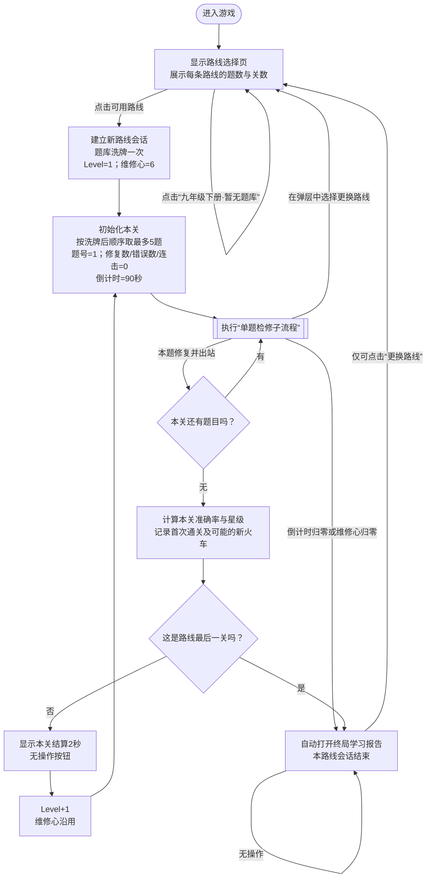
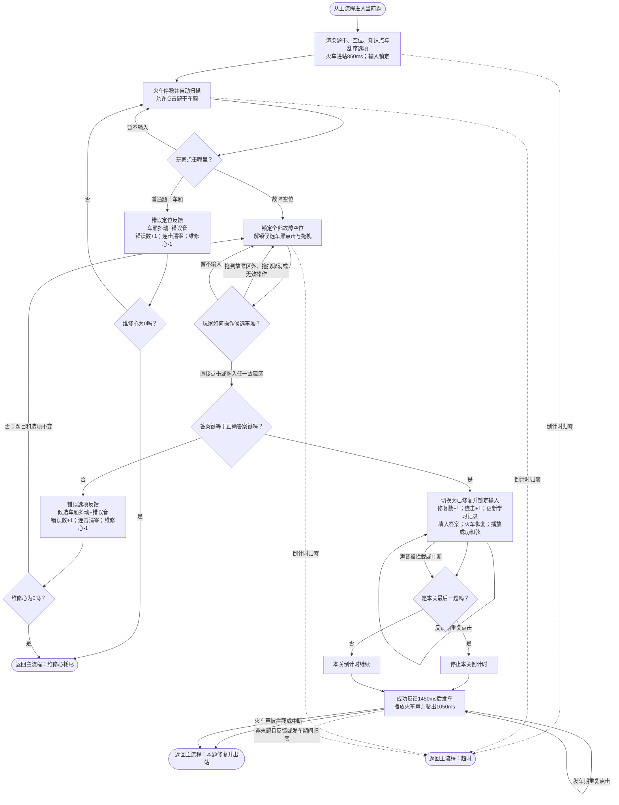
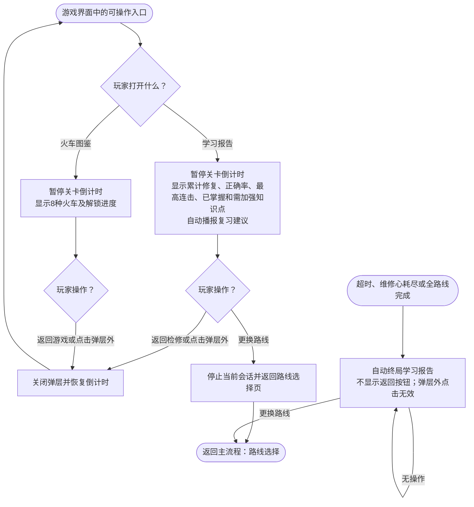

# 《语法火车修理》游戏 PRD

> 版本：1.0  
> 依据：当前游戏实现、`游戏说明.txt` 与已校验题库（234 道可玩选择题）  
> 规则优先级：本文流程图是玩法状态与分支的最终依据。

## 1. 学习目标

玩家需要阅读初中英语句子或对话，先定位题干中需要修复的空位，再从 3～4 个候选答案中选择符合语法、语义与上下文的词、短语或结构。正确答案被装入对应车厢后，本题才算完成。

本游戏训练的可观察学习行为包括：

- 阅读单句或双轮对话，并识别 1～3 个空位所在位置；
- 根据句意、上下文和目标语法点判断正确的词形、时态、语态、代词、介词、连词或句式；
- 对双空、三空题按答案内部顺序，将以分号或逗号分隔的答案映射到各空位；
- 通过错误记录与学习报告识别已掌握和需加强的具体语法知识点。

题库共 234 题，按路线随机排列后分关。完整题干、选项、答案与知识点必须原样保留在 `src/data/questions.json` 中，不得在玩法层改写答案含义。

| 路线 | 题数 | 关数 | 学习内容及题量 |
| --- | ---: | ---: | --- |
| 七年级上册 | 35 | 7 | if引导条件状语从句（5）；there be 句型 be 动词的选用（1）；wh-特殊疑问句（6）；含实义动词的一般过去时结构（4）；含实义动词的一般现在时结构（2）；名词性物主代词（1）；频度副词（3）；形容词性物主代词（5）；一般过去时的用法（1）；一般将来时 be going to（3）；一般将来时will（1）；⼈称代词（3） |
| 七年级下册 | 57 | 12 | as soon as 引导时间状语从句（4）；few/a few/little/a little（1）；How 感叹句（3）；many/much（2）；What感叹句（2）；when引导时间状语从句（2）；定冠词（3）；反⾝代词（2）；否定祈使句（1）；基础连词（6）；肯定祈使句（3）；情态动词 must 和 have to（7）；情态动词 used to（7）；情态动词can（1）；现在进⾏时的句型结构（5）；现在进⾏时的用法（2）；⽅位介词 in/on/under（1）；⽅位介词表⽰在 …… 旁 / 间（3）；⽅位介词表⽰在 …… 前 / 后（1）；⽅位介词表⽰在 …… 上 / 下（1） |
| 八年级上册 | 42 | 9 | have gone to/have been to/have been in（1）；if 引导条件状语从句（15）；unless 引导条件状语从句（1）；复合不定代词（4）；副词（1）；副词与形容词（1）；副词⽐较级最⾼级（2）；基数词（2）；瞬间动词和持续动词的现在完成时（1）；现在完成时表⽰过去持续的动作或状态（3）；形容词副词的同级⽐较（3）；形容词副词同形（1）；形容词最⾼级的用法（2）；形容词⽐较级的用法（4）；序数词（1） |
| 八年级下册 | 36 | 8 | It's+ 形容词 +of/for sb. to do sth.（2）；when 引导时间状语从句（3）；不定式作宾语（1）；不定式作状语（2）；动名词作宾语（9）；动名词作主语（1）；过去进⾏时的结构（2）；过去进⾏时的用法（1）；情态动词 had better（1）；一般过去时的被动语态（3）；一般将来时的被动语态（4）；一般现在时的被动语态（3）；疑问词 + 不定式（4） |
| 九年级上册 | 64 | 13 | how 短语特殊疑问句（6）；How 感叹句（2）；how 特殊疑问句（6）；wh- 特殊疑问句（6）；what 常考句型（2）；What 感叹句（4）；宾语从句的否定前移（1）；宾语从句的时态（6）；宾语从句的引导词（6）；宾语从句的语序（4）；定语从句注意事项（1）；关系代词 that/which 引导的定语从句（7）；关系代词 who/whom 引导的定语从句（4）；让步状语从句（4）；选择疑问句（4）；一般疑问句（1） |
| 九年级下册 | 0 | 0 | 暂无题库，路线票据禁用 |

## 2. 玩法流程图

### 2.1 主流程

### 2.2 单题检修子流程

### 2.3 学习报告与火车图鉴子流程

## 3. 游戏 PRD

### 3.1 游戏概述

- 游戏名称：语法火车修理。
- 一句话玩法：扫描由英语题干组成的故障火车，点击空位定位故障，再点击或拖入正确候选车厢，让火车修复并出站。
- 单局范围：玩家选择的一条年级/册次路线；从第 1 关开始，直至该路线全部完成、任一关超时或 6 颗维修心耗尽。
- 成功条件：在倒计时与维修心仍有效时，依次答对本关全部题目；完成路线最后一关即通关该路线。

### 3.2 学习内容配置

每个题目对象必须包含以下字段：

| 字段 | 规则 |
| --- | --- |
| `id` | 全题库唯一题号 |
| `grade` | `7`、`8` 或 `9` |
| `term` | `上册` 或 `下册` |
| `knowledge` | 学习报告聚合使用的具体知识点标签 |
| `stem` | 完整题干；用连续 8 个下划线标记每个空位 |
| `options` | 3～4 个 `{key, text}` 候选答案 |
| `answer` | 与唯一正确选项 `key` 完全相同 |

内容与出题规则：

1. 选择路线时，将该路线全部题目随机洗牌一次；同一次路线会话中不重复洗牌。
2. 洗牌后按顺序每 5 题切为一关；末关不足 5 题时按实际题数出题。
3. 每题显示候选答案前再次打乱选项顺序，但正确性始终按 `key` 判定。
4. 单空题直接把正确选项文本填入空位。多空题优先按分号、中文分号、逗号或中文逗号拆分；拆分段数等于空位数时按顺序逐一填入。
5. 多空答案若无法按空位数拆分，第一空显示完整选项文本，其余空位显示“✓”；该兜底不改变判定结果。
6. 双轮对话仅有一轮包含空位时，含空位的一轮显示在火车上；另一轮若在前则显示于上方云朵框，若在后则显示于下方草丛框。
7. 作品名 `Charlie and the Chocolate Factory`、`My Heart Will Go On`、`The Wandering Earth`、`Mulan` 以斜体显示。

### 3.3 页面与关键元素

#### 路线选择页

- 显示游戏名、总可用题数、六条路线票据、每条可用路线的关数与题数，以及“自动扫描—定位故障—选择零件—发车”简要说明。
- 九年级下册无题库时显示“暂无题库”并禁用，不得建立空会话。

#### 游戏页

- 顶部固定显示当前路线、`Level：当前关/总关数`、本关剩余秒数、`已修复：本关已答对题数/本关题数`、火车图鉴解锁数、剩余维修心和当前状态文案。
- 中部显示题干火车、故障空位、扫描动画及对话补充文本。
- 底部显示当前知识点、操作提示和候选替换车厢。
- “学习报告”和“图鉴”在游戏中可打开；弹层打开期间暂停关卡倒计时并阻断底层点击。只暂停倒计时，不暂停已经开始的进站、成功反馈或发车动画；关闭弹层后显示届时的最新题目状态。

#### 关卡结算页

- 显示关卡完成状态、1～3 星、修复数、准确率、最高连击，以及本关触发的新火车解锁奖励。
- 普通关完成后停留 2 秒，无操作按钮，随后自动进入下一关。

#### 学习报告

- 手动打开时显示“返回检修”和“更换路线”；点击弹层外等同返回检修。
- 超时、维修心耗尽或路线通关后自动打开时，只显示“更换路线”；点击弹层外无效。
- 显示当前路线的累计修复、累计正确率、累计最高连击、已掌握知识点与需加强知识点。
- 报告打开后自动播放语音：有需加强知识点时，依次播放 `report/1_1.mp3`、按列表顺序取准确率最低的前 3 个知识点对应音频、`report/1_2.mp3`；没有需加强知识点时播放 `report/2.mp3`。关闭报告或更换路线时停止播报。

#### 火车图鉴

- 显示 8 种火车、已解锁数量和距下次解锁所需的首次通关关数。
- 已解锁火车正常显示，未解锁火车使用遮罩并标记“未解锁”；列表允许纵向滚动。
- “返回游戏”或点击弹层外关闭图鉴并恢复倒计时。

### 3.4 核心玩法

1. 进入题目时火车进站 850ms；此时题干与选项输入均锁定。
2. 火车停稳后自动进入扫描状态，不设置独立扫描按钮。
3. 扫描状态只接受题干车厢点击：点击普通题干车厢记一次错误；点击任一故障空位后，全部故障空位同时锁定为目标并解锁候选车厢。
4. 定位故障后，玩家可直接点击候选车厢，或按住并拖入任一故障区域。多空题拖入任一空位即可提交整组选项。
5. 拖拽移动距离不足 8px 时按普通点击处理；形成拖拽后，只有在故障区外扩 30px 的接收范围内释放才提交。
6. 拖到接收范围外、拖拽取消、定位前操作候选车厢，以及不符合当前阶段的点击均不计错、不改状态。
7. 错误定位或错误选项都使错误数加 1、当前连击归零、维修心减 1，并更新该知识点的错误记录；题目不更换，玩家继续处理同一题。
8. 正确选项使本关修复数加 1、连击加 1并更新最高连击，同时更新该知识点的正确记录。输入随即锁定，避免重复提交或重复推进。
9. 正确后显示修复内容、去除故障外观、播放成功和弦；1450ms 后火车驶出并播放火车声，1050ms 后进入下一题或本关结算。
10. 音频播放被浏览器拦截、中断或不可用时，不得阻断反馈动画、状态更新或题目推进。
11. 游戏不提供跳题；无输入时题目保持当前状态，直至玩家操作或倒计时归零。

### 3.5 轮次、计时与进度

- 每关最多 5 题，每关独立获得 90 秒；进入下一关时重置为 90 秒。
- 倒计时在学习报告或图鉴打开期间暂停，关闭弹层后继续；切换路线时停止旧计时器。
- 剩余 15～6 秒显示警示状态，5～0 秒显示紧急状态。
- 除本关最后一题答对后立即停止计时外，倒计时在进站、扫描、答题、正确反馈与发车期间均继续。
- 非末题的正确反馈或发车期间若倒计时归零，超时分支优先，当前路线会话结束且不得再推进题号。
- 本关进度条在新题出现时显示 `当前题索引/本关题数`，答对后更新为 `(当前题索引+1)/本关题数`。
- 维修心初始为 6，跨关保留，不因进入下一关恢复；选择任一新路线（包括重新选择原路线）时恢复为 6。

### 3.6 反馈、统计与操作限制

#### 错误反馈

- 错误定位：被点题干车厢短暂抖动，状态文案提示“这里运转正常，维修心 -1”，播放错误音。
- 错误选项：候选车厢短暂抖动，状态文案提示“零件不匹配，维修心 -1”，播放错误音。
- 若扣减后仍有维修心，保持同一道题、相同选项和当前阶段：定位错误返回扫描；选项错误保持故障已定位。
- 若扣减后维修心为 0，立即锁定输入、停止倒计时，约 650ms 后打开终局学习报告。

#### 正确反馈

- 故障位显示正确文本与“已修复”，火车由故障态切为修复态，播放成功和弦。
- 正确反馈和发车阶段所有再次点击或提交均被忽略，不得二次累计、二次扣心或跳过下一题。

#### 准确率与星级

- 本关尝试次数 = 本关答对次数 + 错误定位次数 + 错误选项次数。
- 本关准确率 = `本关答对次数 ÷ max(1, 本关尝试次数) × 100%`，四舍五入为整数。
- 完成本关且准确率 ≥95% 为 3 星；80%～94% 为 2 星；低于 80% 为 1 星。
- 本关最高连击只统计连续答对题数；任何错误都会将当前连击清零。

#### 学习报告口径

- 学习报告按路线累计，且选择新路线会话时不清空历史学习数据。
- 累计尝试数与本关口径一致；累计正确率 = 累计修复数 ÷ `max(1, 累计尝试数)`。
- 某知识点至少答对 1 次且正确率 ≥75% 时归入“已掌握”。
- 某知识点有错误，且尚未满足“已掌握”条件时归入“需加强”。
- “需加强”知识点按正确率从低到高排列；正确率相同时按错误次数从高到低、再按知识点名称排序。自动播报取该列表的前 3 项，并按 `report_point/知识点.txt` 中的 `repair-编号：知识点` 映射播放对应音频。
- 浏览器整页刷新后清空答题、报告、关卡成绩、解锁、路线、计时与维修心记录。

### 3.7 火车解锁

- 共 8 种火车，首次进入时按随机解锁顺序默认开放第 1 种。
- 每首次通过 2 个不同的“路线+关号”组合，按已保存的随机顺序解锁 1 种新火车；最多 8 种。
- 重复通过已记录关卡不重复计数。
- 每关从已解锁火车中分配题目样式；最新解锁样式的随机权重为普通样式的 1.35 倍。
- 当已解锁数量不超过本关题数时，本关应至少出现每种已解锁样式一次，其余题目再按权重随机补足。

### 3.8 完成与退出

- 普通关全部题目答对后进入关卡结算；2 秒后自动进入下一关。
- 路线最后一关全部题目答对后，不显示普通关结算页，直接打开“路线通关”终局学习报告。
- 超时或维修心耗尽同样进入终局学习报告，并结束当前路线会话。
- 终局报告不提供“重新挑战本关”或“再玩一次”按钮，只允许“更换路线”。玩家回到路线页后可以重新选择原路线；这会建立干净的新路线会话并重置关卡、题序、计时和维修心，但保留累计学习报告与火车解锁记录。

### 3.9 验收要点

1. 从路线选择页点击任一可用路线后，首关以 6 颗维修心和 90 秒进入第一题，并在进站后自动扫描；禁用路线无响应。
2. 点击正确故障位并选择正确答案后，只累计 1 次修复与 1 次正确记录；反馈期连续点击不会重复累计，火车最终进入下一题。
3. 点击普通题干车厢会扣 1 颗心并保留扫描状态；选择错误候选会扣 1 颗心并保留已定位状态，两种错误都保持同一道题。
4. 拖到故障区外或取消拖拽不会提交、扣心或改变题目；多空题拖入任一故障位只提交一次并同时修复全部空位。
5. 最后一题答对后立即停止倒计时，且只触发一次关卡完成；普通关结算 2 秒后进入下一关，维修心不恢复。
6. 任一未结束状态倒计时归零后停止输入与推进，自动进入终局学习报告；报告只显示“更换路线”。
7. 第 6 次错误使维修心归零时不再允许继续作答，并自动进入终局学习报告。
8. 最后一关完成后直接进入路线通关学习报告，不出现重玩按钮；“更换路线”可回到路线页并重新建立会话。
9. 手动打开学习报告或图鉴时倒计时暂停；关闭后继续，选择更换路线时旧倒计时不再运行。
10. 音频被浏览器阻止或播放中断时，视觉反馈和题目推进仍能完整结束。
11. 学习报告的累计修复、尝试、正确率、最高连击及知识点分类与实际操作记录一致。
12. 同一关首次通关可计入解锁进度，重复通关不得重复计数；每累计 2 个不同已通关关卡最多解锁 1 种新火车。
13. 打开学习报告后自动播报：有需加强项时只播报准确率最低的前 3 项及前后提示音；无须加强项时播放掌握鼓励音；关闭报告后立即停止播报。
