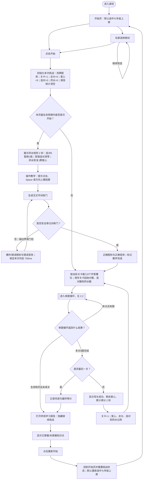
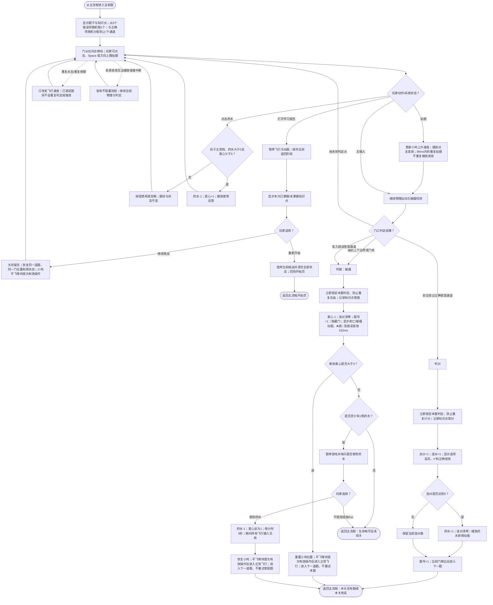

# 《语法跑酷》游戏 PRD

> 文档状态：依据 2026-08-06 当前可运行版本整理；玩法流程图为规则源。

## 1. 学习目标

玩家通过阅读英语语法单项选择题，判断句子或对话中空缺位置的正确词形、结构或语法表达，并控制小鸡穿过标有正确选项的通道。游戏训练的是英语语法辨析与阅读判断，不包含单词听辨、口语、拼写输入或自由写作。

学习范围严格取自 `grammar-question-bank.js` 中当前可选择的 5 个题库，共 495 道有效题、101 个“册别内知识点”（同名知识点在不同册别中分别统计）：

- 七年级上册：83 题，18 个知识点，涵盖特殊疑问句、一般现在时、频度副词、形容词、there be、一般将来时、条件状语从句、一般过去时及代词。
- 七年级下册：113 题，25 个知识点，涵盖冠词、连词、现在进行时、反身代词、方位介词、数量词、情态动词、感叹句、祈使句和时间状语从句。
- 八年级上册：96 题，19 个知识点，涵盖不定代词、数词、形容词比较等级、条件状语从句、现在完成时及副词。
- 八年级下册：82 题，21 个知识点，涵盖不定式、动名词、分词形容词、被动语态、形容词句型、情态动词、过去进行时及原因表达。
- 九年级上册：121 题，18 个知识点，涵盖各类疑问句、感叹句、系动词、让步状语从句、宾语从句及定语从句。

完成一次所选册别挑战后，玩家应能在学习报告中区分：

- 已掌握：该知识点至少答对 1 次，且从未答错；
- 未掌握：该知识点至少答错 1 次，无论是否也答对过；
- 未出现：本次尚未作答该知识点，不进入以上两类。

## 2. 玩法流程图

### 2.1 主流程

### 2.2 单题、报告与复活子流程

流程约束：游戏没有独立的“跳过”或答题倒计时。正常飞行时持续无输入会因重力造成边界/门柱碰撞，按答错处理；题目门完全移出仍未形成有效通过时也按碰撞答错处理。答错后的下一题，以及从学习报告或复活后回到游戏时，小鸡保持平飞，直至玩家首次点击飞行区、按 Space 或方向上键；该首次操作立即恢复正常拍翅与重力飞行。

## 3. 游戏 PRD

### 3.1 游戏概述

- 游戏名称：语法跑酷。
- 一句话玩法：玩家阅读英语语法选择题，通过拍翅控制小鸡穿过标有正确答案的上方或下方通道。
- 单题成功条件：小鸡未碰边界或门柱，并完整穿过正确答案通道。
- 册别完成条件：完成该册别的全部关卡；每关固定 9 个作答槽位。
- 失败条件：爱心降至 0，且没有药水、拒绝使用药水或按 Esc 放弃续关。

### 3.2 学习内容配置

#### 3.2.1 题目数据字段

每道有效题必须包含以下字段：

| 字段 | 规则 |
|---|---|
| `stem` | 完整题干或对话，必须非空；界面显示原文并按标点自动换行 |
| `correctOption` | 唯一正确选项，必须非空 |
| `wrongOptions` | 至少 1 个错误选项；当前题库每题配置 3 个，单次展示时随机抽取 1 个 |
| `knowledgePoint` | 报告统计标签；缺失时显示并统计为“综合语法” |

题干、正确答案与全部错误项的逐题原文以 `grammar-question-bank.js` 为唯一内容源，PRD 不改写其 495 道原始题目。九年级下册当前为空且开始页没有入口，不属于本版本范围。

#### 3.2.2 册别与关卡分布

| 册别 | 原始题数 | 知识点数 | 关卡数 | 实际作答槽位 | 最后一关补足 |
|---|---:|---:|---:|---:|---:|
| 七年级上册 | 83 | 18 | 10 | 90 | 7 |
| 七年级下册 | 113 | 25 | 13 | 117 | 4 |
| 八年级上册 | 96 | 19 | 11 | 99 | 3 |
| 八年级下册 | 82 | 21 | 10 | 90 | 8 |
| 九年级上册 | 121 | 18 | 14 | 126 | 5 |
| 合计 | 495 | 101（册别内） | 58 | 522 | 27 |

开始挑战时，所选册别的题目整体随机洗牌一次。普通关卡按洗牌顺序连续取 9 题。最后一关不足 9 题时，按以下顺序补足：

1. 先保留最后一段尚未出场的题；
2. 再从本次挑战中尚未答对、且尚未进入该关的题目随机补入；
3. 若仍不足 9 个槽位，则从尚未答对题目中随机重复，直至 9 个槽位。

因此，“完成册别”指完成所有关卡槽位，不保证每个原始题只出现一次；补题优先强化尚未答对的内容。

#### 3.2.3 完整知识点清单

- 七年级上册（83 题）：wh-特殊疑问句 7；含实义动词的一般现在时结构 3；含be动词的一般现在时结构 4；频度副词 6；一般现在时的用法 2；形容词的功能 2；there be的句型结构 2；there be句型be动词的选用 7；一般将来时will 9；一般将来时be going to 6；if引导条件状语从句 7；一般过去时的用法 3；含be动词的一般过去时结构 3；含实义动词的一般过去时结构 6；人称代词 5；形容词性物主代词 5；名词性物主代词 3；形物代和名物代的辨析 3。
- 七年级下册（113 题）：定冠词 7；基础连词 5；现在进行时的用法 7；现在进行时的句型结构 6；现在进行时和一般现在时的辨析 2；反身代词 5；方位介词in/on/under 3；方位介词表示在 ......上/下 3；方位介词表示在 ......前/后 4；方位介词表示在 ......旁/间 6；many/much 3；how短语特殊疑问句 2；few/a few/little/a little 5；情态动词can 7；情态动词 may/might 1；情态动词must和have to 9；What感叹句 3；How感叹句 3；肯定祈使句 6；否定祈使句 4；when引导时间状语从句 4；while/as引导时间状语从句 3；as soon as引导时间状语从句 8；until/till引导时间状语从句 2；情态动词 used to 5。
- 八年级上册（96 题）：复合不定代词 5；some/any 3；序数词 7；基数词 8；形容词最高级的用法 7；形容词比较级的用法 8；if引导条件状语从句 11；形容词副词的同级比较 7；现在完成时表示过去对现在造成影响 2；现在完成时表示过去持续的动作或状态 5；现在完成时句式变换 3；have gone to/have been to/have been in 3；瞬间动词和持续动词的现在完成时 3；现在完成时与一现、一过的辨析 5；unless引导条件状语从句 8；副词 1；副词与形容词 4；形容词副词同形 3；副词比较级最高级 3。
- 八年级下册（82 题）：不定式作宾语 4；不定式作补语 4；不定式作状语 2；疑问词 +不定式 6；常⻅省略 to的不定式 5；动名词作主语 2；动名词作宾语 11；-ed/-ing结尾的形容词 4；一般现在时的被动语态 4；一般过去时的被动语态 5；一般将来时的被动语态 4；形容词的功能 1；too + 形容词; (not +) 形容词 + enough 2；It's+形容词 +of/for sb. to do sth. 3；情态动词 should 5；情态动词 had better 3；过去进行时的用法 6；when引导时间状语从句 4；过去进行时的结构 1；while/as引导时间状语从句 3；because, because of辨析 3。
- 九年级上册（121 题）：陈述句 7；一般疑问句 7；wh-特殊疑问句 7；what常考句型 5；how特殊疑问句 11；how短语特殊疑问句 17；选择疑问句 8；What感叹句 3；How感叹句 3；系动词 7；让步状语从句 7；语法 -宾语从句的引导词 8；宾语从句的否定前移 1；语法 -宾语从句的语序 6；语法 -宾语从句的时态 9；关系代词 that/which引导的定语从句 8；关系代词 who/whom引导的定语从句 3；定语从句注意事项 4。

### 3.3 页面与关键元素

#### 开始页

- 提供七上、七下、八上、八下、九上 5 个单选册别按钮，默认七上。
- 册别按钮只改变待开始题库；“开始”按钮才创建本次挑战并初始化状态。

#### 首次规则与教学

- 本页面生命周期第一次开始时，药水规则自动展示 2 秒，无手动跳过按钮。
- 随后进入一次飞行教学：首次拍翅后生成无答案训练门；失败时重置小鸡并重试同一个训练目标，直至成功。
- 返回开始页再开一局时不重复规则和教学；刷新页面后重新视为首次。

#### 游戏页

- 顶部 HUD：学习报告、关卡号、题号/9、5 格爱心、药水数、连对进度/5、累计分数。
- 题目面板：知识点标签与题干。
- 飞行区：小鸡、上/下答案、移动门柱、操作提示和即时反馈图标。
- 药水按钮：只在主游戏、药水大于 0 且爱心少于 5 时可用。

#### 学习报告

- 主游戏中打开：暂停飞行，可“继续挑战”恢复原题，也可“重新开始”回到开始页。
- 生命耗尽或完成最后一关后打开：隐藏“继续挑战”，只保留“重新开始”。
- “重新开始”会清空题库顺序、关卡、得分、生命、连对、药水和报告统计，并回到默认选中七上的开始页。

### 3.4 核心玩法

1. 每题显示题干、知识点及两个答案：1 个正确项、1 个从错误项中随机抽取的干扰项。
2. 正确项随机出现在上方或下方；通道布局按“上移、下移、居中、上移、下移”循环变化。
3. 正常飞行时，玩家点击飞行区、按 Space 或方向上键拍翅；重力持续使小鸡下落。答对后切换下一题时保持正常飞行；答错后切换下一题时，小鸡先平飞等待首次有效操作。学习报告关闭或复活后回到游戏时同样先平飞等待。
4. 小鸡所在画面的上半区代表选择上方答案，下半区代表选择下方答案。
5. 只有完整穿过正确答案通道且没有碰撞才判对；选对文字但碰到门柱或边界仍判错。
6. 判对或判错后本题只结算一次。普通题不提供同题重试，题号都会加 1。

### 3.5 轮次、计分与进度

- 每关 9 题；关卡数为原始题数除以 9 向上取整。
- 不设置独立“尝试次数”计数器；每个作答槽位只有 1 次判定，碰撞或选错同样会消费该槽位。
- 初始爱心 5，跨关卡保留；答错或碰撞扣 1，最低为 0。
- 每答对 1 题总分加 1；答错不加分也不扣分，总分跨关卡累计。
- 每答对 1 题连对加 1；任何答错立即把连对清零。
- 连对达到 5 时获得 1 瓶药水，并把连对清零；药水可累计且跨关卡保留。
- 主游戏中主动使用药水：药水减 1、爱心加 1，但爱心不能超过 5。
- 爱心归零且有药水时，答错题已被消费；接受续关后以 1 颗爱心进入下一题。
- 非最终关完成后展示 2 秒关卡结果，再自动进入下一关；最终关完成后直接进入终局报告。

### 3.6 反馈、音频与操作限制

| 场景 | 可观察反馈 | 输入规则 |
|---|---|---|
| 拍翅 | 小鸡向上、点击音效 | 连续拍翅有效；90ms 内不重复触发音效 |
| 答对 | 选项正确高亮、✅、正确音效、分数/连对更新 | 本题判定立即锁定，不能重复计分；门移出后直接以正常飞行进入下一题 |
| 答错选项 | 错误高亮、❌、错误音效、小鸡死亡动画 | 520ms 内飞行输入无效；下一题小鸡平飞，首次有效操作后恢复正常飞行 |
| 碰撞 | 💥、错误音效、命中/死亡动画 | 与答错相同，扣 1 颗爱心；下一题小鸡平飞等待首次有效操作 |
| 获得药水 | 药水获得动画、药水数+1、连对归零 | 不阻塞后续推进 |
| 主动用药 | 使用动画和点击音效、药水-1、爱心+1 | 条件不满足时按钮禁用或操作无效 |
| 被动续关 | 模态确认；确认后显示 3、2、1 倒计时 | 倒计时与弹窗期间飞行输入无效；恢复后小鸡平飞，首次有效操作后恢复正常飞行；重复确认不重复扣药 |
| 学习报告 | 飞行画面暂停、报告覆盖显示 | 报告打开期间飞行输入无效；关闭后恢复同一游戏状态，小鸡平飞等待首次有效操作 |

- 背景音乐循环播放；点击、正确、错误等前景音效不会等待播放结束，因此音频播放失败、中断或重叠不能阻塞判定与推进。
- 题目没有倒计时和跳过操作。
- `resolved` 状态必须保证同一题只能触发一次知识点统计、加分、扣血和题号推进。
- 弹窗、报告、死亡、倒计时和终局阶段的无效拍翅必须忽略。

### 3.7 完成与重新开始

- 成功完成：最终关第 9 个槽位结算后触发一次完成记录，并打开终局学习报告。
- 失败完成：生命归零且无法或拒绝续关时触发一次结束记录，并打开终局学习报告。
- 终局报告是当前挑战的终态，不能回到刚结束的挑战继续作答。
- 现有游戏明确提供“重新开始”：玩家点击后回到开始页并建立干净的新挑战；不会保留上局分数、爱心、药水、连对、题序或报告统计。
- 返回开始页后，首次规则动画和飞行教学在同一页面生命周期内保持已完成状态，不重复出现。

### 3.8 验收要点

1. 选择任一有题册别并点击开始后，首次进入者依次看到 2 秒药水说明、可重复直至成功的训练门，以及该册别第 1 题；非首次进入者直接到第 1 题。
2. 每题只显示正确项和随机 1 个错误项，且正确项在上/下通道出现概率相同。
3. 安全穿过正确通道时仅加 1 分、仅推进 1 题；在反馈期间快速点击不能重复统计或跳过下一题。
4. 穿过错误通道、撞门柱、碰上下边界或正常飞行时持续无输入导致坠落，均判错：扣 1 颗爱心、连对清零、推进到下一题，不重试本题；答错后的下一题小鸡保持平飞，直到玩家首次有效飞行操作。
5. 连续答对第 5 题时药水恰好加 1 且连对归零；中间任意答错均使未满 5 的连对归零。
6. 爱心少于 5 且有药水时可主动用药，恰好恢复 1 颗；满爱心、无药水或非主游戏阶段不能用药。
7. 爱心归零且有药水时必须暂停并出现选择：确认只扣 1 瓶、恢复到 1 颗爱心、倒计时后进入下一题并平飞等待首次有效操作；拒绝或按 Esc 进入终局报告。
8. 主游戏中打开报告会暂停门和小鸡；继续后恢复同一道题及原状态，不重新生成选项、不重复计题；小鸡平飞等待首次有效操作。
9. 第 1 至倒数第 2 关完成后显示 2 秒结果并进入下一关；分数、爱心、连对和药水保持连续。
10. 最后一关不足 9 个原始题时按“尚未答对优先”的规则补足；第 9 个槽位结算后只进入一次终局报告。
11. 报告分类满足：有任何错误记录即为未掌握；只有正确记录且无错误才为已掌握；未作答知识点不显示。
12. 终局报告不显示继续按钮；点击重新开始清空全部挑战状态并回到默认七上的开始页。
13. 正确/错误音效无法播放或播放被中断时，视觉反馈、状态更新和下一题推进仍正常完成。
14. 5 个册别分别生成 10、13、11、10、14 关；每关 HUD 始终显示 9 个作答槽位，最终均可到达终局报告。
